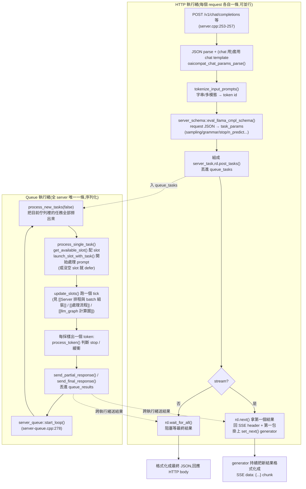

#note

# API 請求生命週期:從 HTTP JSON 到回應文字

> 對應原始碼(commit `17252c7`,2026-08-29):`tools/server/server.cpp`、`server-http.cpp`、`server-common.cpp`、`server-schema.cpp`、`server-chat.cpp`、`server-queue.cpp`、`server-context.cpp`、`server-stream.cpp`,以及 `common/sampling.cpp`。
>
> 這篇是最外層——一個 HTTP request 從進來到回應文字送出的完整旅程。中間「一個 tick 怎麼組 batch、`n_batch` 怎麼切」見 [[Server 排程與 batch 組裝]];「一次 `llama_decode()` 內部怎麼切 ubatch、怎麼用 KV cache」見 [[處理流程]];「compute graph 怎麼建、怎麼算」見 [[llm_graph 計算圖]]。這篇不重複那三篇的細節,只在對應的步驟上連過去。

---

## 一、總覽



> 直覺:整個 server 其實是兩種執行緒在合作——HTTP 執行緒(多條,httplib 的 thread pool)只負責「把使用者的 JSON 翻譯成 `server_task`」和「把最終結果翻譯回 JSON/SSE」,真正跑模型的事(排 slot、跑 decode、取樣)全部序列化在**唯一一條** queue 執行緒上。這樣設計是因為 GPU/KV cache 是共享資源,不能真的並行跑多個 `llama_decode()`;但 tokenize、JSON parse 這種 CPU-bound 但與模型無關的工作丟給 HTTP 執行緒並行做,不用擠在這條關鍵路徑上。

---

## 二、HTTP 層:JSON 怎麼變成 `server_task`

**1. Chat template 套用(只有 `/v1/chat/completions` 這條路徑要做)**

`oaicompat_chat_params_parse()`(`server-common.cpp:1133`)做的事:
- 解析 `messages` 陣列(含多模態 `image_url`/`input_audio`/`input_video`,轉成 media marker + 另存 `raw_buffer`)、`tools`、`tool_choice`、`response_format`。
- 呼叫 `common_chat_templates_apply()`(jinja 引擎),把 messages/tools 套進模型自帶的 chat template,**攤平成單一一段 prompt 字串**(`chat_params.prompt`)——這一步之後,「這是一輪對話」的結構就消失了,剩下的處理管線看到的只是一段文字。
- 如果有 tool-calling,jinja template 同時回傳一份**自動產生的 grammar**(`chat_params.grammar`)用來約束輸出格式,連同 `grammar_triggers`(lazy grammar 何時開始生效)一起塞回 `llama_params` JSON,後面統一走第 4 步的 schema 解析。

沒有 chat template 這一步的路徑(`/completion`、`/v1/completions`)則是直接把 `prompt` 欄位(字串、token id 陣列、或字串/token 混合陣列)原樣往下傳。

**2. Tokenize**

`tokenize_input_prompts()`(`server-common.cpp:998`)把 prompt(可能是字串、已經是 token id、或混合)轉成 `server_tokens`(內部 token 序列 + 多模態 chunk 資訊的包裝型別)。這一步在 HTTP 執行緒上做,所以多個並行 request 的 tokenize 不會互相卡。

**3. Sampling / 生成參數解析**

`server_schema::eval_llama_cmpl_schema()`(`server-schema.cpp:515`)用一份**宣告式 schema**(一串 `field_num`/`field_str`/`field_bool`/`field_json` 物件,`server-schema.cpp:23` 起)把 request JSON 的每個欄位讀出來、做範圍檢查、寫進 `task_params`。這些欄位就是後面「選哪種策略」的開關,包含:

| 欄位 | 影響 |
|---|---|
| `temperature`/`top_k`/`top_p`/`min_p`/`repeat_penalty`/`dry_*`/`mirostat*`/`seed` | 決定 `common_sampler` 的取樣鏈長什麼樣 |
| `grammar` / `json_schema` / `response_format` | 是否套用 grammar-constrained decoding(見第七節) |
| `stop` | 額外的停止字串(`task_params.antiprompt`) |
| `n_predict`(別名 `max_tokens`) | 生成 token 數上限 |
| `stream` | 決定第三節的分岔 |
| `n_probs`(別名 `logprobs`)、`logit_bias` | 輸出機率、強制封鎖/偏好某些 token |
| `cache_prompt`、`n_cache_reuse`、`id_slot` | 影響第五、六節的 slot 選擇與 prompt 重用策略 |

沒填的欄位用 server 啟動時的全域預設(`params_base.sampling` 等)。

**4. 組 `server_task`、送進佇列**

`handle_completions_impl()`(`server-context.cpp:4230`)把 tokens + params 包成 `server_task`,配一個 `task.id`;如果 `n_cmpl > 1`(要求同一個 prompt 生成多個候選),額外建立 child task 們(共用 parent 的 prompt 處理,各自獨立生成與取樣)。所有 task 一起丟進 `rd.post_tasks()`(`server-queue.cpp:525`),進入 `queue_tasks`。

---

## 三、Stream 與否,決定 HTTP 執行緒接下來怎麼等

`handle_completions_impl()` post 完 task 後立刻分岔(`server-context.cpp:4321`):

- **非 stream**:呼叫 `rd.wait_for_all()`,HTTP 執行緒直接**阻塞**在這裡,直到 queue 執行緒把這個 task(以及所有 child task)跑完、結果送進 `queue_results`,才把 `content`/`choices` 等組成一個 JSON object 回傳。
- **stream**:只呼叫 `rd.next()` 拿**第一個**結果就回應(HTTP header + 第一個 SSE chunk),接著掛上一個 `set_next()` callback 當 generator——之後每次 httplib 要送下一塊資料,就呼叫這個 generator 去 `queue_results` 拿新結果、格式化成 `data: {...}\n\n`(依 API 種類走 `format_oai_sse`/`format_anthropic_sse`/`format_oai_resp_sse`),直到收到 final 結果為止。

> 直覺:OpenAI API 的行為是「stream 模式下,第一個錯誤要當非 stream 錯誤處理」(直接回 4xx,不是回一個錯誤 SSE 事件)——這也是為什麼程式碼特地先 `rd.next()` 等第一包,檢查是不是 error,才決定要不要切換成 `text/event-stream`。

---

## 四、Queue 執行緒:任務什麼時候真正被接進 slot

`server_queue::start_loop()`(`server-queue.cpp:278`)的主迴圈,每一輪依序做兩件事:

```cpp
while (true) {
    if (process_new_tasks(false)) break;   // 1. 先把佇列裡「現在有的」任務全部處理掉
    callback_update_slots();               // 2. 才跑一次 update_slots() tick
}
```

**`process_new_tasks(false)`**(`server-queue.cpp:138`)把 `queue_tasks` 佇列**清空**——對每個任務呼叫 `callback_new_task` → `process_single_task()`(`server-context.cpp:2348`):
- `get_available_slot(task)` 配一個 slot(見第五節)。
- 配到就 `launch_slot_with_task()`(見第六節)開始處理這個 task 的 prompt。
- 沒空 slot、或指定的 slot 正忙,就 `queue_tasks.defer()`——放回去,下一輪 `process_new_tasks` 再試。

> 這一步跟 [[Server 排程與 batch 組裝]] 裡「`pre_decode()` 是唯一檢查佇列的地方」的說法對不上——那是舊版程式碼結構的理解,這個 commit 的實際佇列排空與 slot 分配(`process_new_tasks` → `process_single_task`)發生在 `update_slots()`**之前**、由 `server_queue::start_loop()` 直接呼叫,`update_slots()` 內的 `pre_decode()` 這個 tick 本身**不查詢佇列**,只處理已經在 slot 裡的 context-shift 和組 batch。真正決定「新請求能不能搭上這一輪」的,是 queue 主迴圈的這一次 `process_new_tasks` 落在哪個時間點——概念上等價(還是「以迴圈為單位」),但物理位置在 `update_slots()` 外面一層。

**只有處理到 prompt/生成的每個 token 之間**,`queue_tasks.yield_to_queue()`(server-queue.cpp:222)才會允許 queue 執行緒「臨時」再處理一批新任務(不阻塞太久)——例如 speculative decoding 讓草稿模型算草稿時就是這樣借用時間。

---

## 五、`get_available_slot()`:三層優先序

`server-context.cpp:1536`,依序:

1. **明確指定 `id_slot`**:request JSON 帶了就直接用那個 slot(還是會走下面的 cache 檢查)。
2. **Longest-Common-Prefix 相似度**(`slot_prompt_similarity` 門檻,預設關閉):比較這個新 task 的 token 序列跟每個閒置 slot「目前 KV cache 裡還留著的」token 序列,找**共同前綴最長**、且超過門檻的 slot——目的是盡量把同一個對話(或共用長 system prompt 的不同對話)導到已經算過那段 KV 的 slot 上,省掉重算。
3. **LRU 後備**:上面沒選到,退回選最久沒用的閒置 slot。

選定後,如果這個 slot 原本裝的 prompt 跟新 task 的重疊很少(`f_keep < 0.5`),且 server 開了 RAM-backed 的 `prompt_cache`,會先把 slot 目前的 KV 狀態存進 `prompt_cache`(`prompt_save`),再嘗試把新 task 匹配得到的舊狀態換進來(`prompt_load`)——**這是 KV cache 內容在 GPU 顯存和主機 RAM 之間的換入換出**,跟 slot 本身的指派是兩件事。

**KV cache 重用其實有三層,成本/彈性依序遞減**

「用不同 prompt 就把 KV cache 洗掉」不是必然——如果同一組 prompt 會反覆出現,系統(或使用者自己的部署設定)有三種漸進的方式避免重算,本質上都是同一個念頭「算過的 KV 別浪費」的不同成本權衡:

| 層級 | 機制 | 能存幾組 | 代價 |
|---|---|---|---|
| **1. Slot 常駐**(GPU 顯存) | 把 `n_parallel` 開到 ≥ 你固定會輪流出現的 prompt 組數,讓每組各自佔一個 slot、KV 一直留在 GPU,靠 `get_available_slot()` 的 LCP 比對(或明講 `id_slot`)持續導到同一個 slot | 上限 = `n_parallel` | 顯存被平分:`n_ctx_seq = n_ctx / n_parallel`(第二節、[[Server 排程與 batch 組裝]] 都提過)——組數變多就要拉高 `-c`,否則每組能用的上下文變短 |
| **2. RAM prompt_cache**(本節上面提的) | `struct server_prompt_cache`(`server-task.h:612`,`--cache-ram-mib` 控制上限):一份 `std::list<server_prompt_cache_state>`,存 `{prompt token 序列, 序列化的 KV 狀態}`。slot 快被重疊率很低的新 prompt 蓋掉前,先 `prompt_save` 進這個 list;之後任何 slot 收到匹配得到的 prompt,就 `prompt_load` 讀回來取代重算 | 不受 `n_parallel` 限制,只受 RAM 預算(`limit_size`/`limit_tokens`)限制 | 換入換出要付一次 RAM↔GPU 的資料搬移,比重算 prefill 便宜很多,但比 slot 常駐(零延遲)慢 |
| **3. 手動 save/restore**(`llama_state_seq_save/load_file`) | client 端自己呼叫 `/slots/{id}?action=save`/`?action=restore`(`SERVER_TASK_TYPE_SLOT_SAVE/RESTORE`,`server-context.cpp:2518/2568`),需開 `--slot-save-path`,狀態存成檔案 | 不受記憶體限制,受硬碟空間限制,且可跨 server 重啟 | 延遲最高(硬碟 I/O),但完全由 client 控制時機,沒有自動比對匹配的邏輯 |

> 直覺:你想的「開兩倍 KV cache」就是第一層最直接的做法——把 slot 數量開到等於你固定會出現的 prompt 組數,讓每組永久佔一份 GPU 上的 KV cache。如果組數會變多、或不是每組都同時活躍,第二層(RAM cache)通常更划算:用一次搬移延遲換取不用整組永久佔顯存。

---

## 六、`launch_slot_with_task()` → prompt 端的策略分岔

Slot 狀態變成 `SLOT_STATE_STARTED` → `SLOT_STATE_PROCESSING_PROMPT` 後(`server-context.cpp:3108` 起),依序:

**1. 邊界檢查**:空 prompt 直接回空結果並釋放 slot;prompt 超過 `n_ubatch`(且模型不支援切分)或超過 `n_ctx` 直接回錯誤。

**2. Prompt 前綴重用(`cache_prompt = true` 時,預設開)**

```
n_past = slot.prompt.tokens.get_common_prefix(input_tokens)
```
跟這個 slot 現有 KV cache 裡的內容比對共同前綴,**只有前綴之後的 token 需要重新過模型**——這是「同一個對話連續打好幾輪」時,舊的 system prompt / 歷史訊息不用每次重算的關鍵。

**3. `n_cache_reuse`(選用,預設關):非前綴位置的區塊重用**

如果新 prompt 跟 slot 快取內容在前綴之後,某段 ≥ `n_cache_reuse` token 的內容原封不動地出現在別的位置(常見於「中間插了一段新內容,後面大段文字沒變」),會直接把那段 KV 對應的 cell **平移**(`seq_rm` + `seq_add` 位置偏移)到新位置,不用重算——比單純前綴匹配更激進的重用。

**4. Context checkpoint 還原(SWA / hybrid/recurrent 記憶體)**

如果模型用的是 sliding-window attention 或 recurrent 記憶體,KV cache 不是單純的「前面都留著」的 ring buffer,一旦 `n_past` 要求的位置超出目前 attention window 涵蓋範圍,就沒辦法只靠 `find_slot`/`seq_rm` 精準回退。此時會找一份先前存的 **checkpoint**(`slot.prompt.checkpoints`,定期存整段 state)回復;找不到可用的 checkpoint 就整段作廢、`n_past = 0`,強制從頭重跑整個 prompt。

**5. 真正送進 decode**

`n_past` 之後的 token(`slot.prompt.tokens.keep_first(n_past)` 保留前面、其餘作為待處理),依 [[Server 排程與 batch 組裝]] 描述的方式,依 `n_batch` 分批塞進 `batch`,呼叫 `llama_decode()`——內部 ubatch 切分、KV cache 寫入見 [[處理流程]],compute graph 見 [[llm_graph 計算圖]]。

**6.（獨立於上面,發生在每個 tick 開頭)Context shift**

`pre_decode()`(`server-context.cpp:2882`)裡,對**正在生成**(非 prompt 階段)且 token 數快頂到 `n_ctx` 的 slot:保留前 `n_keep` 個 token,從中間丟掉 `n_discard` 個(預設丟一半),後面 token 的 position 往前平移補上——讓生成可以在固定 context 大小下「無限」進行,但代價是丟失中間那段的資訊。這個機制受 `--ctx-shift` 開關控制,且對多模態、有 child task 共用 prompt 的情況不支援(直接回錯誤)。

---

## 七、Sampling:一個 token 怎麼被選出來

Decode 拿到這個位置的 logits 後,`common_sampler_sample()`(`common/sampling.cpp`)套用**在 slot 啟動時就建好**的取樣鏈(依 `task.params.sampling` 組裝):

- 一般情況:penalties(repeat/dry)→ top-k/top-p/min-p 篩選 → temperature → 依機率抽樣(或 `seed` 固定)。
- **Grammar-constrained**:如果有 `grammar` 或 `json_schema`(直接指定,或第二節提到 tool-calling 時 chat template 自動產生的),取樣鏈裡插入一個 grammar sampler(`llama_sampler_init_grammar`),只允許文法上合法的下一個 token——這是 JSON mode / 強制 tool-call 格式輸出的實作方式;`grammar_lazy` 決定文法是從第一個 token 就生效,還是要等某個 trigger 出現才開始約束。
- **Speculative decoding**(選用,需另外配置 draft 模型):`pre_decode()` 期間用 `yield_to_queue()` 讓 draft 模型先算出接下來幾個候選 token(`common_speculative_draft`),真正 decode 時改用 `common_sampler_sample_and_accept_n()`——用目標模型的分布一次驗證/接受草稿的一段前綴,一次 tick 最多能生出 `n_draft_max` 個 token,而不是固定 1 個。

---

## 八、`process_token()`:生成文字前的兩層緩衝

`server-context.cpp:1822`。拿到採樣出的 token、`detokenize` 成文字片段後,不是直接送出去,而是:

1. **不完整 UTF-8 緩衝**:`validate_utf8()` 檢查 `generated_text` 尾端是不是卡在一個多 byte 字元中間(單一 token 不保證對齊 codepoint 邊界)——沒組完的字元先不送,等下一個 token 補完再一起送。
2. **Stop 字串緩衝(partial match)**:`find_stopping_strings()`(`server-context.cpp:567`)拿目前累積文字的尾巴去比對每個 `antiprompt`(stop 字串):
   - **完全匹配**:立刻截斷,結束生成(`STOP_TYPE_WORD`)。
   - **部分匹配**(目前尾巴恰好是某個 stop 字串的前綴,但還沒收滿):**不送這段文字**,等下一個 token 進來看是否真的湊成完整 stop 字串,還是可以放行——這就是為什麼 stream 模式下,文字有時會感覺「卡一拍」才吐出來:server 在賭「這會不會是 stop 詞的開頭」。

其餘停止條件也在這裡檢查:`n_predict`/`max_tokens` 用完(`STOP_TYPE_LIMIT`)、context 滿且 `--ctx-shift` 關閉、`n_indent` 縮排限制。

---

## 九、回應組裝

- **`send_partial_response()`**(`server-context.cpp:2035`):stream 模式下,每個 token(或進度事件)組一個 `server_task_result_cmpl_partial`,只帶這次的 delta(`content` = 這個 token 的文字),丟進 `queue_results` 給對應的 HTTP 執行緒 generator 撈走、格式化成 SSE chunk。
- **`send_final_response()`**(`server-context.cpp:2078`):生成結束時組 `server_task_result_cmpl_final`——stream 模式下 `content` 是空的(文字已經逐段送完了,這裡只補 `stats`/`stop reason`/`truncated` 等 meta 資料當作最後一包);非 stream 模式下才把整段 `generated_text` 一次放進 `content`。

---

## 十、決策點總表

| 分岔點                    | 觸發條件                                                                                    | 影響                                        |
| ---------------------- | --------------------------------------------------------------------------------------- | ----------------------------------------- |
| Stream vs 非 stream     | request JSON `"stream"`                                                                 | HTTP 執行緒阻塞等全部結果,還是先回第一包再逐步 SSE            |
| Grammar-constrained 取樣 | `grammar`/`json_schema`/`response_format`,或 tool-calling 觸發 chat template 自動產生的 grammar | 取樣鏈多一層 grammar sampler,限制合法 next-token 集合 |
| Prompt 前綴重用            | `cache_prompt`(預設開)                                                                     | 只重算跟目前 slot KV 不同的尾段,而非整個 prompt          |
| 非前綴區塊重用                | `n_cache_reuse > 0` 且記憶體支援 shift                                                        | 額外把「移了位置但內容沒變」的區塊平移重用                     |
| Checkpoint 還原 vs 全部重算  | 模型用 SWA/recurrent 記憶體,且要求的 `n_past` 超出可用範圍                                              | 有可用 checkpoint 就還原,沒有就強制整段 prompt 重跑      |
| Context shift          | 生成中的 slot 逼近 `n_ctx`,且 `--ctx-shift` 開啟                                                 | 丟棄中段舊 token、保留頭尾,換取無限生成長度                 |
| Speculative decoding   | 有設定 draft 模型且 `slot.can_speculate()`                                                    | 一次 tick 可能接受多個 token,不是固定 1 個             |
| Slot 選擇策略              | `id_slot` 指定 / `slot_prompt_similarity` 門檻 / 都沒有                                        | 決定「舊 KV cache 能不能被沿用」,直接影響要重算多少 prompt    |
| 停止條件                   | EOS token / stop 字串完全匹配 / `n_predict` 用完 / context 滿且無 shift / `n_indent`               | 決定生成何時結束、`stop reason` 是什麼                |

---

## 十一、重點摘要

- 兩種執行緒分工:HTTP 執行緒(可並行)負責 JSON↔文字的翻譯層(chat template、tokenize、schema 解析、格式化回應);queue 執行緒(唯一一條)序列化所有真正碰模型/KV cache 的工作。
- 任務何時被接進 slot,是 queue 主迴圈裡 `process_new_tasks()` 這一步決定的,發生在 `update_slots()` **之前**,不是在 `pre_decode()` 裡面。
- Prompt 端有三層漸進的重用策略:前綴共同部分(`cache_prompt`)→ 非前綴區塊平移(`n_cache_reuse`)→ 遇到 SWA/recurrent 記憶體限制時退回 checkpoint 還原或整段重算。
- 生成端有兩層輸出緩衝(不完整 UTF-8、partial stop-word 匹配),所以「送出的文字」永遠比「已經採樣出的 token」慢半拍到一拍。
- Grammar/JSON schema、speculative decoding 都是在「取樣」這一步插入的策略分岔,不影響前面的 prompt 處理路徑。
