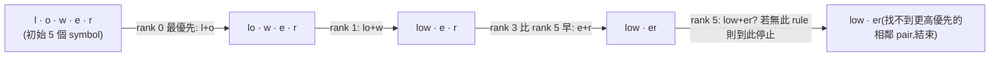

#note

# BPE 分詞策略:一段文字怎麼變成 token id 序列

> 對應原始碼(commit `17252c7`,2026-08-29):`src/llama-vocab.h/.cpp`(`llm_tokenizer_bpe`/`llm_tokenizer_bpe_session`)、`src/unicode.h/.cpp`(byte-level 映射、regex 切分)、`include/llama.h`(`llama_vocab_type` enum)。
>
> 這篇夾在兩篇之間:vocab 資料(token list、merge rules)怎麼從 `.gguf` 檔案讀出來,見 [[模型載入]] 第六節,這裡不重複展開,只講「讀出來之後怎麼被用」;tokenize 這個動作在一次 API request 生命週期裡的哪個時間點被呼叫,見 [[API 請求生命週期]] 第二節。輸出端「token id → 文字」的 byte-level 還原機制,直接解釋了 [[API 請求生命週期]] 第八節提到的「單一 token 不保證對齊 UTF-8 codepoint 邊界」現象。

---

## 一、tokenizer 型別怎麼決定

`llama_vocab_type` 是一個 enum(`include/llama.h:74-76` 起),BPE 只是其中一種:

```cpp
LLAMA_VOCAB_TYPE_SPM = 1, // LLaMA tokenizer based on byte-level BPE with byte fallback
LLAMA_VOCAB_TYPE_BPE = 2, // GPT-2 tokenizer based on byte-level BPE
LLAMA_VOCAB_TYPE_WPM = 3, // BERT tokenizer based on WordPiece
```

型別由 GGUF KV `tokenizer.ggml.model` 這個字串決定(`llama-vocab.cpp:1955` 起的一串 `if/else if`):`"llama"` → SPM、`"bert"` → WPM、`"gpt2"`/`"hybriddna"`/`"whitespace"` → **BPE**、`"t5"` → UGM、`"rwkv"` → RWKV、`"plamo2"` → PLaMo2……等等。

所有型別**共用同一個 `llama_vocab` 物件**,不是各自獨立的類別階層:`llama_vocab::impl` 裡只有一個 `std::unique_ptr<llm_tokenizer> tokenizer`(`llama-vocab.cpp:1845`),`init_tokenizer()`(`llama-vocab.cpp:3175`)依 `type` 用 `switch` 建對應的子類別(`llm_tokenizer_bpe`/`llm_tokenizer_spm`/`llm_tokenizer_wpm`/……),之後 `tokenize()`/`detokenize()`/`token_to_piece()` 這些函式全部是**同一份程式碼裡再一次 `switch(get_type())`** 分派到對應分支(例如 `llama-vocab.cpp:3437` 的 `case LLAMA_VOCAB_TYPE_BPE`)——是多型 + switch 混合,不是完全分離的物件。這篇之後只談 BPE 分支。

`llm_tokenizer_bpe` 這個子類別本身**只放靜態設定**(下一節的 regex 規則、byte-level 開關),不放每次呼叫會變動的狀態;真正跑 tokenize 時,`llama-vocab.cpp:3443` 會另外 `make_unique` 出一個 `llm_tokenizer_bpe_session`,這個 session 才持有本次呼叫要用的 symbol 串列、priority queue 等可變工作狀態,用完即丟。

> 直覺:設定(`llm_tokenizer_bpe`,模型載入時建一次)跟工作狀態(`llm_tokenizer_bpe_session`,每次 tokenize 呼叫建一次)分開,不只是程式碼整潔——這也是為什麼 [[API 請求生命週期]] 提到「tokenize 在 HTTP 執行緒上做,多個並行 request 不會互相卡」是真的成立:每個 request 的 tokenize 呼叫都拿到自己一份全新的 session,彼此不共用任何可變狀態,原生執行緒安全。

---

## 二、vocab 資料怎麼被用

**token 字串 ↔ id 雙向查表:**`id_to_token`(vector,以 token id 為索引)和 `token_to_id`(`std::unordered_map<std::string, llama_token>`,`llama-vocab.cpp:1827/2474`)——載入時把 GGUF 裡的 token list 兩個方向都建好索引,查詢都是 O(1) 雜湊。

**merge rules → pair 排名表:**`bpe_ranks`(`std::unordered_map<std::pair<std::string, std::string>, int, pair_hash>`,`llama-vocab.cpp:1838`)——GGUF 裡每一條 merge rule 是一行 `"第一段 第二段"` 的字串,載入時依序拆成 `(first, second)` pair,以它在 merge 列表裡的**行號**當 rank 存進去(`bpe_ranks.emplace(std::make_pair(first, second), i)`,`llama-vocab.cpp:2011`)。merge 列表本身就是照「學習順序」排的,所以行號越小代表這條規則在訓練 BPE 詞表時**越早被學到**——越早學到的合併,tokenize 時優先權越高。查詢時 `find_bpe_rank()`(`llama-vocab.cpp:4095`)直接對這個 map 做一次 `find(std::make_pair(left, right))`,查不到就回傳「不可合併」。

---

## 三、Pre-tokenization:合併前先切出一個個 word chunk

BPE 合併不是對整段文字一次跑完,而是先用一組**類 regex 的規則**把原始文字切成一串「word chunk」,合併只在**同一個 chunk 內部**進行,不會跨 chunk 合併。

`llm_tokenizer_bpe` 建構子(`llama-vocab.cpp:279`)依 `vocab.get_pre_type()`(`LLAMA_VOCAB_PRE_TYPE_*`,`llama-vocab.h:11` 起,近 60 種,對應不同模型家族/tokenizer.json 版本)`switch` 出一組 `regex_exprs`。例如 Llama 3 這條(`llama-vocab.cpp:289`):

```text
(?:'[sS]|'[tT]|'[rR][eE]|'[vV][eE]|'[mM]|'[lL][lL]|'[dD])|[^\r\n\p{L}\p{N}]?\p{L}+|\p{N}{1,3}| ?[^\s\p{L}\p{N}]+[\r\n]*|\s*[\r\n]+|\s+(?!\S)|\s+
```

大致意思是:先抓英文縮寫(`'s`/`'re`/`'ve`……)、再抓「一個字母序列」「1~3 位數字」「一串符號」「換行」「空白」各自成一個 chunk。DeepSeek 系列則是好幾條規則依序套用(換行、拉丁字母、標點、CJK 字元、數字各自一條,`llama-vocab.cpp:308-316`),不同語言/字元類型天生就不會被切進同一個 chunk。

真正執行切分的是 `unicode_regex_split()`(`src/unicode.h:111`,實作在 `unicode.cpp:1216`)——常見模式(GPT-2/Llama3/Qwen2/Qwen3.5/Kimi-K2 等)還有專門手刻的 `unicode_regex_split_custom_*` 函式(`unicode.cpp:215/333/474/610/777`)取代真正跑 regex engine,理由是 C++ 標準函式庫的 `std::regex` 在這種高頻呼叫的場景太慢,手刻版本直接掃過 unicode 分類表達到一樣的切分效果但快得多;其餘不在手刻清單裡的 pre-type 才會落到 `unicode_regex_split_stl()`(`unicode.cpp:739`),真的用 `std::regex`/`std::wregex` 跑。

> 直覺:合併規則本身是「資料驅動」的(從 GGUF 讀出來,訓練時學到什麼就是什麼),但**先切成哪些 chunk**是「規則驅動」的、寫死在程式碼裡依模型家族分派——這是因為 pre-tokenization 規則來自訓練 tokenizer 當下用的 HuggingFace `tokenizer.json`,每個模型家族當初設定不同,llama.cpp 必須照抄那份設定才能重現一模一樣的切分結果,不能自己發明一套通用規則。

---

## 四、Byte-level 編碼:先把 bytes 映射成「看得懂」的字元

GPT-2 系 BPE 有一層容易被忽略的前處理:**不是直接對 UTF-8 bytes 做 BPE**,而是先把每個 byte(0~255)映射成一個「印得出來、不會跟控制字元衝突」的 unicode 字元,再對映射後的字元序列做 pre-tokenization + 合併。

`unicode_byte_to_utf8_map()`(`unicode.cpp:148`)建這張表:可印字元(`!`~`~`、`¡`~`¬`、`®`~`ÿ` 這幾個範圍)直接映射到自己;其餘 256 個 byte 值(多半是控制字元、不可見字元)依序映射到 `256, 257, 258, ...` 這些「借用」的 unicode code point。反向的 `unicode_utf8_to_byte_map()`(`unicode.cpp:172`)做相反的事,detokenize(第八節)會用到。`unicode_byte_encoding_process()`(`unicode.cpp:196`)把 pre-tokenization 切出來的每個 word chunk,逐字元套用這個映射,是實際套用的地方;`llm_tokenizer_bpe::byte_encode`(`llama-vocab.cpp:558`)這個旗標控制要不要走這條路——預設 `true`(GPT-2 風格),少數模型(Gemma4、Sarvam MoE、jina whitespace 等,`llama-vocab.cpp:520/528/543`)關掉它,直接對原始 UTF-8 做 BPE。

> 直覺:任何一個 byte 值都要能保證有對應的 token 可用(至少落到「單一映射字元」這個最小粒度),否則遇到訓練語料沒出現過的 byte 組合就無法 tokenize。先映射成「安全」的可見字元,是為了讓 BPE 詞表本身可以只用一般文字符號表示,同時保證**任何輸入 bytes 都有 fallback 路徑**——這也是為什麼 vocab 裡一定會有一份「256 個單一映射字元各自的 token」,當作合併不出更長 token 時的最後手段(見第五節結尾的 fallback 邏輯)。

---

## 五、核心合併演算法:symbol 鏈結串列 + priority queue

這是整個機制裡最重要的一段,主體在 `llm_tokenizer_bpe_session::tokenize()`(`llama-vocab.cpp:603`),對每個 pre-tokenization 切出來的 word chunk 各自跑一輪:

**1. 把 chunk 拆成初始 symbol 串列**(`llama-vocab.cpp:630-640`):chunk 裡每個 UTF-8 字元(用 `unicode_len_utf8()` 判斷佔幾個 byte)變成一個 `llm_symbol`(`llama-vocab.cpp:80`):

```cpp
struct llm_symbol {
    index prev;       // 前一個 symbol 的索引,-1 代表沒有
    index next;       // 後一個 symbol 的索引,-1 代表沒有
    const char * text; // 指向原字串裡這個 symbol 的起始位置
    size_t n;          // 這個 symbol 目前佔幾個 byte(合併後會變大)
};
```

用 `prev`/`next` 索引串成一條雙向鏈結串列,而不是真的搬動字串資料——合併時只要改鏈結、把某個 symbol 的 `n` 設成 `0`(代表「已被吃掉」),不用真的做字串搬移。

**2. 找出所有可合併的相鄰 pair,丟進 priority queue**(`add_new_bigram()`,`llama-vocab.cpp:726`):對每一對相鄰 symbol,查 `find_bpe_rank()`(第二節),查得到就包成 `llm_bigram_bpe`(`llama-vocab.cpp:263`,`{left, right, text, rank, size}`)丟進 `work_queue`。`work_queue` 是 `llama_priority_queue<llm_bigram_bpe, ..., comparator>`(`llama-vocab.cpp:271`)——比較器 `l.rank > r.rank`(`llama-vocab.cpp:266`)讓 rank **數字最小**(= 最早學到)的 pair 排在 queue 頂端,每次 `pop_move()` 拿到的都是目前**最優先**該合併的 pair。`llama_priority_queue`(`llama-vocab.cpp:249`)是對 `std::priority_queue` 的一個小擴充,多一個 `pop_move()`——用 `std::move` 取出堆頂再 `pop_heap`,省掉 `llm_bigram_bpe::text` 這個 `std::string` 欄位在每次 pop 時的一次複製。

**3. 迴圈合併,合併完的新相鄰 pair 再檢查一次**(`llama-vocab.cpp:646-673`):

```cpp
while (!work_queue.empty()) {
    bigram = work_queue.pop_move();
    // 讀出時可能已經過期(其中一個 symbol 已被別的合併吃掉,或內容跟建立時不同了)
    if (left.n == 0 || right.n == 0) continue;
    if (left_text + right_text != bigram.text) continue;   // 過期就跳過,不重新入隊

    // 合併:右邊併進左邊,n 相加,右邊標記成「已吃掉」(n = 0)
    left.n += right.n; right.n = 0;
    left.next = right.next;
    if (right.next >= 0) symbols[right.next].prev = bigram.left;

    // 合併後,左右兩側各自可能出現新的可合併 pair,重新檢查一次
    add_new_bigram(left.prev, bigram.left);
    add_new_bigram(bigram.left, left.next);
}
```

這裡沒有真的從 queue 裡「刪除」過期的項目(lazy deletion)——一個 symbol 被合併掉之後,queue 裡任何還提到它的舊 pair 一律靠 `n == 0` 或 `text` 對不上直接跳過,不用維護一個能高效刪除任意元素的資料結構,用「多丟一些很快被跳過的髒資料」換取結構簡單。

**4. 收尾:token 化,查不到的 symbol 逐 byte fallback**(`llama-vocab.cpp:691-722`):遍歷最終鏈結串列,每個還存活(`n > 0`)的 symbol 整段拿去查 `token_to_id`;查不到(代表這段字串從沒被合併/收錄成一個完整 token)就逐 byte 拆開,每個 byte 各自查它的「單一映射字元」token(第四節提到的 fallback)。

**手工範例(自己編的示範,不是從程式碼跑出來的實際輸出,只是幫助理解合併順序):** 假設 merge rules 依序學到 `l+o`(rank 0)、`lo+w`(rank 1)、`e+r`(rank 3)、`low+e`(rank 5),輸入 chunk 是 `"lower"`:



重點是**每一輪都從 queue 裡挑當下所有候選 pair 中 rank 最小的那個**,不是死板地由左到右掃描——`e+r` 會搶在 `low+e` 之前執行,是因為它的 rank(3)比 `low+e` 的 rank(5)小,儘管 `low+e` 在字串裡「先出現」。

---

## 六、Special tokens 怎麼在合併之前被保護起來

像 `<|im_start|>`、`<s>`、`<unk>` 這類 special token 不該被 BPE 拆開重新合併——這件事**不是**在 `llm_tokenizer_bpe_session` 裡處理的,而是在更前面一層:`tokenizer_st_partition()`(`llama-vocab.cpp:3208`)。

頂層 `tokenize()`(`llama-vocab.cpp:3371`)一開始把整段輸入文字包成一個 `fragment_buffer_variant`(型別是 `RAW_TEXT`),然後對 `cache_special_tokens`(第七節)裡**每一個** special token 字串,在 buffer 裡逐一尋找出現位置——找到就把該 fragment 從中間切開,中間那段換成一個型別是 `TOKEN`(直接存 token id,不是文字)的 fragment,左右兩段留著繼續給下一個 special token 找。所有 special token 都找過一輪之後,buffer 就變成一串 `RAW_TEXT`/`TOKEN` 交錯的片段。真正呼叫 BPE session 的地方(`llama-vocab.cpp:3455-3469`)是逐個 fragment 處理:`TOKEN` 片段直接 `append` 那個 id,`RAW_TEXT` 片段才交給 `session->tokenize()` 走第五節的合併流程——**BPE 合併從來沒機會看到 special token 的字串本身**,自然不會把它拆開。

`LSTRIP`/`RSTRIP` 屬性(`llama-vocab.cpp:3257/3282`)還處理了「special token 前後的空白該不該一併被吃掉」這種邊界情況(部分 special token 定義成會吞掉相鄰的空白)。

---

## 七、快取

- `bpe_ranks`/`token_to_id`/`id_to_token`:vocab 載入時建一次,整個生命週期常駐,查詢都是雜湊表 O(1)(第二節)。
- `cache_special_tokens`(`llama-vocab.cpp:1830/2996`):vocab 載入時掃一次所有 token,把 special token 的 id 收集起來並排序,`tokenizer_st_partition()` 每次呼叫都重用同一份清單,不用每次 tokenize 都重新掃整個詞表找 special token。
- `cache_token_to_piece`:`token_to_piece()`(第八節)開頭會先查這個 per-token 的 piece 字串快取(`llama-vocab.cpp:3603-3611`),命中就直接回傳,不必每次都重跑 byte-level 解碼邏輯。

---

## 八、Detokenize:token id 怎麼變回文字

反方向由 `token_to_piece()`(BPE 分支在 `llama-vocab.cpp:3635`)負責單一 token,`detokenize()`(`llama-vocab.cpp:3701`)負責把一串 token 的 piece 依序接起來:

1. **查表拿回 token 的原始文字**(`id_to_token[token].text`)。
2. **一般 token(`LLAMA_TOKEN_ATTR_NORMAL`)**:如果 `byte_encode` 是開啟的(第四節),這段文字本身就是「byte-level 映射後」的字元序列,要用 `llama_decode_text()`(`llama-vocab.cpp:3351`)逐 codepoint 查 `unicode_utf8_to_byte()`(第四節反向表)還原成原始 bytes。
3. **byte fallback token(`LLAMA_TOKEN_ATTR_BYTE`)**:直接是 `token_to_byte()` 查出的單一 byte。
4. **special/user-defined token**:原樣輸出文字,不經過 byte-level 解碼。
5. `detokenize()`(`llama-vocab.cpp:3734-3746`)單純把每個 token 的 piece **依序串接**進輸出 buffer,沒有額外的語意處理(除了開頭去掉 SPM 風格的空白前綴、以及 `clean_spaces` 選項對標點前空白的收尾清理)。

**這正是「單一 token 不保證對齊 UTF-8 codepoint 邊界」的根源**:byte-level BPE 底層本來就是照 byte(映射後的)在合併,一個多 byte 的 UTF-8 codepoint(例如大多數中文字、emoji)完全可能因為訓練語料頻率不夠,沒有被合併成一個完整 token,而是被拆成兩個(甚至更多)各自代表一部分 byte 的 token——單獨看其中一個 token 的 piece,可能就是一段不完整、無法單獨解碼的 byte 序列。這正是 [[API 請求生命週期]] 第八節「不完整 UTF-8 緩衝」要處理的情況,那裡的 `validate_utf8()` 邏輯不重複展開。

---

## 九、這一切在整條 pipeline 的哪裡發生

- **輸入端**:HTTP 執行緒收到 request 後,`tokenize_input_prompts()` 呼叫這裡的 `tokenize()`,見 [[API 請求生命週期]] 第二節——這一步在 HTTP 執行緒上做,不佔用 queue 執行緒的關鍵路徑。
- **輸出端**:queue 執行緒每採樣出一個 token,呼叫 `token_to_piece()`(這篇第八節)把它變成文字片段,再交給 [[API 請求生命週期]] 第八節的兩層緩衝邏輯決定要不要先送出。
- **資料來源**:`bpe_ranks`/`token_to_id`/`cache_special_tokens` 這些表,是模型載入時 `load_vocab()` 呼叫 `vocab.load(ml, kv)` 從 GGUF KV 讀出來的,見 [[模型載入]] 第六節。

---

## 十、重點摘要

- BPE 是 `llama_vocab_type` 其中一種(由 GGUF KV `tokenizer.ggml.model` 決定),跟 SPM/WPM/UGM 等共用同一個 `llama_vocab` 物件,靠 `switch(get_type())` 分派,不是各自獨立的類別階層;`llm_tokenizer_bpe`(靜態設定)跟 `llm_tokenizer_bpe_session`(每次呼叫的工作狀態)分開,天生執行緒安全。
- 合併前**先用 regex 規則把文字切成 word chunk**,合併只在 chunk 內部發生;不同模型家族的切分規則(`LLAMA_VOCAB_PRE_TYPE_*`)是照 HuggingFace `tokenizer.json` 照抄的,寫死在程式碼裡。
- GPT-2 風格 BPE 有一層 **byte→可見 unicode 字元** 的映射(`byte_encode`),確保任何 byte 序列都有 fallback 路徑,也是 detokenize 要反向解碼的原因。
- 核心演算法是 **symbol 雙向鏈結串列 + rank 最小優先的 priority queue**:每輪挑全域 rank 最小(最早學到)的相鄰 pair 合併,合併後產生的新相鄰 pair 再丟回 queue,舊的過期項目靠比對內容 lazy 跳過,不用真的刪除。
- Special token 保護靠 `tokenizer_st_partition()` 在 BPE 合併**之前**就把它們從文字裡切出來,BPE session 只看得到 special token 之間的普通文字。
- Detokenize 是 `token_to_piece()` 逐 token 查表 + byte-level 反向解碼,再單純串接——這正是為什麼單一 token 的文字片段可能不是合法、完整的 UTF-8。
