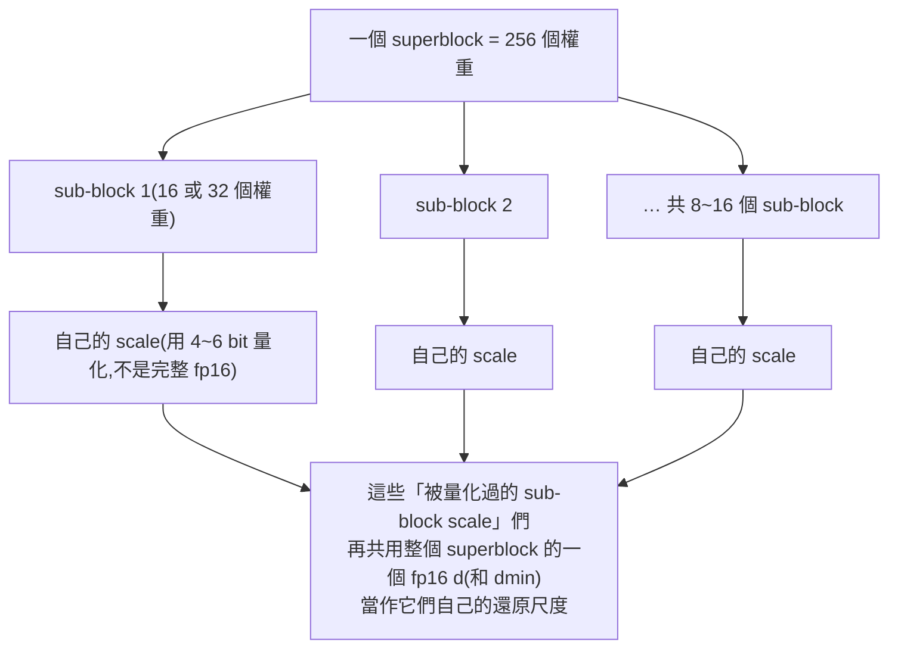

#note

# GGML 量化格式:Q4_0、Q4_K、IQ2_XXS 這些名字是怎麼組出來的

> 對應原始碼(`master` 分支,commit `daef7b6`,2026-08-31):`ggml/src/ggml-common.h`(block 結構定義)、`ggml/src/ggml-quants.c`(量化/反量化實作)、`src/llama-quant.cpp`(`llama_tensor_get_type_impl()`,決定 `_S/_M/_L` 混合精度怎麼分配)、`tools/quantize/README.md`。

---

## 一、名字怎麼拆

```
Q        4        _0 / _1 / _K
量化前綴   每個權重幾個 bit   變體(legacy 用 0/1,新式用 K)

Q4_K_M
Q  4  _K  _M
        │    └ 混合精度策略:S(small)/M(medium)/L(large)
        └ 這個 tensor 用 K-quant 格式(superblock 結構)

IQ2_XXS
I Q  2   _XXS
importance-quant  2 bit  codebook 大小分級(XXS < XS < S < M)
```

三個世代,設計邏輯完全不同,合起來才是「GGML 量化」:

| 世代 | 例子 | 核心想法 |
|---|---|---|
| **Legacy**(舊式) | `Q4_0` `Q4_1` `Q5_0` `Q5_1` `Q8_0` `Q8_1` | 每 32 個權重一組(block),組內線性量化,一組一個 scale |
| **K-quants**(2023 中,ikawrakow 提出) | `Q2_K` ~ `Q8_K`,以及 `Q3_K_S/M/L` 等混合版 | 256 個權重一組(superblock),組內再切小 block,兩層 scale,並且**同一個 tensor 內不同層/不同位置可以用不同精度** |
| **IQ-quants**(importance quant) | `IQ1_S` `IQ2_XXS` `IQ3_XXS` `IQ4_NL` … | 不是線性量化,而是**查表(codebook)**——量化值取一組事先算好的、對常見權重分布最省 bit 的向量,通常要配合 `imatrix`(importance matrix)校正 |

---

## 二、共通概念:block-wise quantization

> 直覺:一整個 tensor(可能幾百萬個 fp16 權重)不會共用一個 scale,因為權重分布在不同區域差異很大,共用一個 scale 誤差會被最大的離群值拉爛。所以 GGML 把權重切成固定大小的**block**,每個 block 各自算自己的 scale(有時還有 min/offset),量化誤差被限制在 block 內。

一個 legacy block 长这样(以 `Q4_0` 為例,`ggml-common.h`):

```c
typedef struct {
    ggml_half d;           // fp16 scale(這個 block 的量化步階)
    uint8_t qs[QK4_0 / 2]; // 32 個 4-bit 量化值,兩兩塞進一個 byte
} block_q4_0;               // QK4_0 = 32
```

還原公式很單純:`weight[i] ≈ d * (q[i] - 8)`(4-bit 無號數 0~15,減 8 讓範圍對稱到 -8~7)。`Q4_1` 多存一個 `m`(min),還原變成 `weight[i] ≈ d * q[i] + m`,不強制對稱,對非對稱分布誤差更小,但多付 2 byte/block。

---

## 三、Legacy 量化(block = 32 個權重)

| 類型 | block 內容 | bytes/block | bits/weight | 說明 |
|---|---|---|---|---|
| `Q4_0` | d(2B) + 16B 4-bit | 18 | **4.5** | 對稱量化,只有 scale |
| `Q4_1` | d(2B) + m(2B) + 16B 4-bit | 20 | **5.0** | 加 min,非對稱 |
| `Q5_0` | d(2B) + qh(4B) + 16B | 22 | **5.5** | 4-bit 主體 + 額外 1 bit(存在 `qh`)湊成 5-bit |
| `Q5_1` | d+m(4B) + qh(4B) + 16B | 24 | **6.0** | Q5_0 + min |
| `Q8_0` | d(2B) + 32B int8 | 34 | **8.5** | 幾乎無損,常用於 KV cache 量化或當作 K-quant 的中繼格式 |
| `Q8_1` | d+s(4B) + 32B int8 | 36 | **9.0** | 多存一個「量化值總和」給量化矩陣乘法用,主要用在**激活值**(activation)而不是權重儲存 |

這批是最早期的格式,結構簡單、CPU/GPU kernel 好寫,但同一個 tensor 全部權重用同一種精度,沒有「重要的地方多給幾個 bit」的彈性——這正是 K-quants 要解決的問題。

---

## 四、K-quants(superblock = 256 個權重)

### 兩層結構



> 直覺:legacy 格式的 scale 是「每 32 個權重存一個完整 fp16(16 bit)」,佔比不小(1 個 fp16 scale 換 32 個 4-bit 權重,scale 本身就佔了快 1 bit/weight)。K-quants 的做法是:先把權重切更細(sub-block),但 sub-block 的 scale **不用 fp16 存,而是也拿去量化**(通常 4~6 bit),量化後的這些小 scale 再共用一個 superblock 等級的 fp16 當「scale 的 scale」。相當於「兩層量化」,用多一層的複雜度換更細的顆粒度,同時把 scale 本身的儲存成本也壓下來。

`Q4_K` 的實際結構(`ggml-common.h`):

```c
typedef struct {
    ggml_half d;              // superblock scale
    ggml_half dmin;           // superblock scale(給 min 用)
    uint8_t scales[12];       // 8 個 sub-block(每 32 個權重)的 6-bit scale + 6-bit min,packed 進 12 bytes
    uint8_t qs[QK_K/2];       // 256 個 4-bit 量化值
} block_q4_K;                  // QK_K = 256
```

### 各類型 bits/weight(依 struct byte 數換算,實測會因 tensor 而略有差異)

| 類型 | superblock 結構重點 | bytes/256 weights | bits/weight |
|---|---|---|---|
| `Q2_K` | 16 個 sub-block(每組 16),4-bit scale+min | 84 | **2.625** |
| `Q3_K` | 16 個 sub-block,6-bit scale + 額外 1 bit(hmask)湊 3-bit 主體 | 110 | **3.4375** |
| `Q4_K` | 8 個 sub-block(每組 32),6-bit scale+min | 144 | **4.5** |
| `Q5_K` | 同 Q4_K 但主體多 1 bit(qh) | 176 | **5.5** |
| `Q6_K` | 16 個 sub-block,8-bit scale,6-bit 主體 | 210 | **6.5625** |
| `Q8_K` | 幾乎無損,int8 主體 + 32-bit float scale | 292 | **9.125** |(多半當中繼格式,做 K-quant 之間矩陣乘法的 activation 側)

### `_S` / `_M` / `_L`:同一個 tensor 裡不同層用不同精度

`Q4_K` 本身只是「這個 tensor 用 K-quant 4-bit 格式」,但一個模型檔案(GGUF)裡不會每個 tensor 都用同一種類型——`llama_tensor_get_type_impl()`(`src/llama-quant.cpp`)會依照**tensor 種類**和**所在層數**動態决定實際類型,`_S/_M/_L` 選的其實是這套分配策略的鬆緊程度:

- **`output.weight` / `token_embd`**:幾乎永遠保留較高精度(常見是 `Q6_K` 或 `Q8_0`),因為這兩個 tensor 誤差會直接放大到 logits 上。
- **`attn_v`(attention 的 V 投影)**:公認對量化最敏感,`Q2_K` 在 GQA head 數 ≥ 4 時會升到 `Q4_K`;`Q3_K_M/L` 一律升到 `Q5_K`;`Q4_K_M`/`Q5_K_M` 則只在**最前、最後 8 層**升到 `Q6_K`。
- **`ffn_down`**:一樣是「頭尾層留精度」的邏輯——最前面 1/8(或 `Q3_K_M` 情況下 1/16)的層數會被拉高一級。
- **MoE 模型**(`n_expert >= 4`):部分 attention tensor 直接跳到 `Q4_K` 甚至 `Q8_0`。

所以「`Q4_K_M` 的整體 bits/weight」比上面表格算出的純 4.5 bpw 略高(常見引用值約 4.8~4.9 bpw),因為有一部分 tensor 被悄悄升級了。`_S` 升級的 tensor 最少(檔案最小、掉分最多)、`_M` 折衷(社群最常用的預設)、`_L` 升級最多(檔案較大、最接近 F16 品質)。

---

## 五、IQ-quants:查表法,不是線性量化

Legacy 和 K-quants 都是「`還原值 = scale × 量化整數 (+ min)`」的線性映射。IQ 系列換了一套邏輯:

- 每個 sub-block 的量化值不是「乘一個 scale 就還原」,而是**去查一張事先訓練好的 codebook**(一組向量),量化的工作變成「在 codebook 裡找最接近目前這組權重形狀的那一項」。因為 codebook 針對真實模型的權重分布(通常接近高斯分布)最佳化過,同樣 bit 數下失真比線性量化小。
- 因此 IQ 量化幾乎都需要搭配 **`imatrix`**(importance matrix,對一批校正文本跑一次 forward、記錄哪些權重對輸出影響大)才能決定要優先保留哪些權重的精度,不然掉分明顯。
- 命名裡的 `XXS/XS/S/M` 不是「哪些 tensor 升級」(那是 K-quants 的 `_S/_M/_L`),而是**codebook 大小/密度**分級,越大掉分越小、體積越大。

```c
// IQ2_XXS:block = 256 個權重,只用 2 bytes(d)+ 64 bytes(qs,查表索引) = 66 bytes
typedef struct {
    ggml_half d;
    uint16_t qs[QK_K/8];
} block_iq2_xxs;   // 66 bytes / 256 = 2.0625 bits/weight

// IQ1_S:同樣 256 個一組,含額外的 1-bit 修正(qh)
typedef struct {
    ggml_half d;
    uint8_t  qs[QK_K/8];
    uint16_t qh[QK_K/32];
} block_iq1_s;     // 50 bytes / 256 = 1.5625 bits/weight

// IQ4_NL:block = 32(跟 legacy 一樣小),但主體是查 16 個值的非線性表,不是線性 4-bit
typedef struct {
    ggml_half d;
    uint8_t  qs[16];
} block_iq4_nl;    // 18 bytes / 32 = 4.5 bits/weight,同 bit 數比 Q4_0/Q4_K 準
```

---

## 六、總表:怎麼選

| 類型 | bits/weight | 適合場景 |
|---|---|---|
| `Q8_0` | 8.5 | 幾乎無損,拿來當「量化校驗基準」或 KV cache |
| `Q6_K` | 6.56 | 品質接近 F16,檔案仍明顯變小 |
| `Q5_K_M` / `Q5_K_S` | ~5.7 / ~5.2 | 品質與體積都不錯的中高階選擇 |
| `Q4_K_M` | ~4.8 | **社群最常用的預設**,品質/體積平衡點 |
| `Q4_K_S` | ~4.6 | 比 M 再小一點,掉分略明顯 |
| `Q3_K_M/L` | ~3.9 / ~4.0 | 記憶體真的吃緊時才考慮,口感開始掉 |
| `IQ4_XS` / `IQ4_NL` | ~4.25 / 4.5 | 同 bit 數比 K-quant 準,但 kernel 較慢(查表運算) |
| `IQ2_XXS` / `IQ1_S` | ~2.06 / ~1.56 | 極限壓縮,幾乎只在大模型(70B+)硬塞進小 VRAM 時使用,且必須配 `imatrix` |

一句話版本:**block 越小、scale 存得越「貴」(fp16 全存 vs. 量化再共用)→ 精度越高但密度越低;K-quants 用兩層 scale 把「scale 本身的成本」打下來,讓同樣 bit 數更準;IQ-quants 進一步放棄線性假設,改用查表逼近真實分布,bit 數可以壓到最低但要吃 imatrix 校正、算得也比較慢。**
