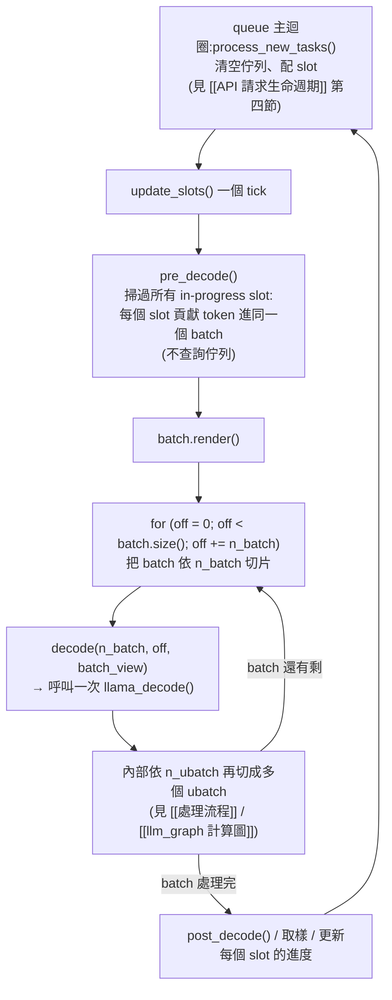

#note

# Server 排程:一次 API call 怎麼變成好幾次 llama_decode()

> 對應原始碼(commit `17252c7`,2026-08-29):`tools/server/server-context.cpp`。[[處理流程]] 與 [[llm_graph 計算圖]] 談的是「一次 `llama_decode()` 內部」發生的事;這篇談的是**上一層**——server 怎麼決定什麼時候、用誰的 token 去組出下一次 `llama_decode()` 呼叫。更外層「HTTP request 從 JSON 進來、任務怎麼被接進 slot、到回應文字送出」的完整旅程見 [[API 請求生命週期]]。

---

## 一、先破除一個直覺:batch ≠ 一次 API call

`llama_batch` 對應的不是「一個 API call 的全部內容」,而是**排程器的一個時間切片(tick)**——常常是好幾個不同 API call 各出一點 token 拼起來的橫切面快照:

- 正在做 prompt prefill 的 request:這個 tick 貢獻一段 prompt token。
- 已經在自回歸生成的 request:這個 tick 通常只貢獻**剛取樣出的那一個 token**。

反過來,**一個 API call 要花掉很多次 `llama_decode()` 呼叫**才能跑完:prompt prefill 階段可能被拆成好幾次(見第四節),之後每生成一個 token 就要一次新的 decode() 呼叫,直到 EOS 或 max_tokens。

> 直覺:batch = 排程的一個時間切片(可能混著好幾個 API call 的一小段);API call = 一條貫穿很多個 batch/decode() 呼叫的生命週期。

---

## 二、`server_slot`:一次 API call 的化身

`struct server_slot`(`server-context.cpp:239`)才是跟「一個 API call / 一個對話」一一對應的物件:自己的 `id`、自己的 `prompt.tokens`(目前已處理的 token 內容與進度)、自己的 KV cache 區域(`seq_id = slot.id`)。Server 維護 `std::vector<server_slot> slots`,數量等於 `n_parallel`——同時最多能有 `n_parallel`個 API call 在「進行中」狀態。

**`seq_id` 只是槽位號碼,不是身分證:** `n_seq_max`(KV cache 隔開幾個 sequence 的上限)在 server 就是 `n_parallel`;啟動時一次性指定 `slot.id = i`(`for (i = 0; i < n_parallel; i++)`,`server-context.cpp:1290`),之後**固定不變**。所以 seq_id 更像「KV cache 裡的房間號碼」——引擎本身不驗證這個 id 有沒有語意,只檢查範圍合法(`0 <= seq_id < n_seq_max`,`llama-batch.cpp:61`)。某個 API call 結束、slot 被釋放(`seq_rm` 清掉這個 seq_id 對應的 KV cache 內容)後,下一個新進來的 API call 會**重複使用同一個 seq_id**——誰是誰,完全是 server 這層自己記帳,跟引擎無關。

**slot 數量是使用者超參數,決定的是並行度,不只是 KV cache 大小:** `n_parallel`(啟動旗標 `-np`/`--parallel`,`common/arg.cpp:2541`;不設就是 `-1` = auto,server 自動選 4,`server.cpp:152-155`)才是 slot 陣列的長度——它是「同時能有幾個 API call 處於進行中狀態」的並行度上限,超過的請求會被 `defer` 排隊等 slot 釋放。KV cache 大小是這個並行度選擇之後**跟著算出來的代價**:固定的 `-c`(總 KV pool)被平分給每個 slot,`n_ctx_seq = n_ctx / n_seq_max`(`llama-context.cpp:293`,即 `n_ctx / n_parallel`,對照 `n_ctx_slot()`,`server-context.cpp:4000`)。也就是說拉高 `-np` 而不同時拉高 `-c`,每個 slot 能處理的 prompt+生成總長會跟著變短——這也是為什麼有些啟動 preset 會連動設 `n_ctx = 2048 * n_parallel`(`common/arg.cpp:4569`),保住單一 slot 的可用長度不縮水。另有獨立的 `--kv-unified-per-slot` 旗標可以在 `kv_unified` 模式下額外封頂每個 slot 拿到的 KV 上限,做更精細的記憶體控制。

> 直覺:`n_parallel` 選的是「吞吐量 vs. 單次對話長度」的權衡點——固定顯存下,slot 越多、能同時服務的對話越多,但每個對話能記住的上下文越短。

---

## 三、`update_slots()` 的一個 tick 在做什麼



`pre_decode()` 本身不查詢任務佇列——真正決定「這一輪要不要收新請求」的是 `server_queue::start_loop()` 主迴圈裡、呼叫 `update_slots()` **之前**的 `process_new_tasks()`(把佇列清空、對每個任務呼叫 `get_available_slot()`/`launch_slot_with_task()` 配 slot),細節見 [[API 請求生命週期]] 第四節。一旦這一輪的新任務都配好 slot、進了 `update_slots()`,後面 `pre_decode()` 組的 `batch` 和 `for (off ...)` 依 `n_batch` 的切片就只是在處理**這批已經定案的 slot 們**,不會回頭看佇列。

---

## 四、`n_batch` 怎麼把長 prompt 切成好幾個 tick

Server 組 batch 時,對每個還在做 prefill 的 slot 執行(`server-context.cpp:3497`):

```cpp
while (slot.prompt.n_tokens() < slot.task->n_tokens() && batch.size() < n_batch) {
    llama_token cur_tok = input_tokens[slot.prompt.n_tokens()];
    batch.add(slot.id, cur_tok, slot.prompt.tokens.pos_next(), ...);
    slot.prompt.tokens.push_back(cur_tok);
}
```

`slot.prompt.n_tokens()` 是這個 slot **持久化**的處理進度,`batch.size() < n_batch` 是**這個 tick** 的封頂條件。所以一個很長的 prompt 不是被「事先規劃好切成 N 份」,而是**每個 tick 貢獻到 `batch` 塞滿 `n_batch` 就停**,進度記在 slot 上,下一個 tick 的 `pre_decode()` 再從中斷點繼續填。

---

## 五、三層粒度,只有最外層能加入新請求

| 層級 | 粒度 | 邊界在哪 | 新 API call 能加入嗎 |
|---|---|---|---|
| **tick**(`update_slots()` 呼叫) | 一次或多次 `llama_decode()` | queue 主迴圈的 `process_new_tasks()`,在 `update_slots()` **之前**執行(見 [[API 請求生命週期]] 第四節) | **可以**——這是唯一的 join 點 |
| **decode() 呼叫切片**(`for (off...)` 依 `n_batch` 切) | 一次 `llama_decode()` | 同一個 tick 內,`batch` 已經定案後再切片 | 不行——不查佇列,只是把已經組好的 batch 分批送出 |
| **ubatch**(`llama_decode()` 內部依 `n_ubatch` 切,見 [[處理流程]]) | 一次 compute graph([[llm_graph 計算圖]]) | 圖一旦建好、開始 `graph_compute()` 就定死形狀 | 不行——見 [[llm_graph 計算圖]] 第四節,stream 只是張量多一維,圖是單一實體 |

---

## 六、具體例子:2000 token prompt,`n_batch = 500`

1. **tick 1**:`pre_decode()` 把這個 slot 的 prompt 填進 `batch` 到 `batch.size() == 500` 就停(`slot.prompt.n_tokens() = 500`)→ 一次 `llama_decode()`。
2. **tick 2**:queue 主迴圈在這輪 `update_slots()` 之前先跑 `process_new_tasks()`——**如果這時有新 API call 進來且有空 slot**,它會在這裡被配到 slot;接著 `pre_decode()` 组 batch 時,它的 token 就會跟這個 slot 剩下的 prompt(第 500~1000 個)一起被塞進**同一個** `batch`、**同一次** `llama_decode()` 呼叫。
3. **tick 3、4**:依此類推,處理第 1000~1500、1500~2000 個 token,進度歸零後這個 slot 轉入生成階段(之後每個 tick 只貢獻 1 個 token)。

所以「4 個 500-token 段落」的邊界剛好跟「4 個 tick」的邊界重合——但因果關係是**填 batch 的迴圈本來就以 `n_batch` 為封頂條件**,不是「先規劃好要切幾份」。新請求能不能搭上某個 tick 的順風車,純粹看那個 tick 開始時佇列裡有沒有東西、有沒有空 slot。

---

## 七、重點摘要

- `llama_batch`/一次 `llama_decode()` ≈ 排程的一個時間切片,常混著多個 API call 的片段;`server_slot` 才對應一個 API call,生命週期橫跨很多次 decode() 呼叫。
- 長 prompt 的 prefill 是「每個 tick 填到 `batch.size() == n_batch` 就停,進度記在 `slot.prompt.n_tokens()`」自然切出來的,不是事先規劃的固定份數。
- 能讓新請求「搭上同一批計算」的唯一時機,是每輪 tick 開始前 queue 主迴圈的 `process_new_tasks()`(配 slot);decode() 呼叫切片和 ubatch 切分都是同一個 tick 內部的細分,進不去新東西。
