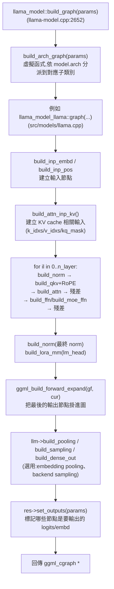

#note

# llm_graph:計算圖是怎麼建出來、算出來的

> 對應原始碼(commit `17252c7`,2026-08-29):`src/llama-graph.h/.cpp`、`src/llama-model.cpp`、`src/models/llama.cpp`(以 Llama 架構為例)。承接 [[處理流程]] 中 `process_ubatch()` 呼叫 `model.build_graph()` 之後的部分;更上一層「誰的 token 什麼時候被排進這次要建的圖」見 [[Server 排程與 batch 組裝]];最外層「一個 HTTP request 從 JSON 進來到回應文字送出」的完整旅程見 [[API 請求生命週期]]。

---

## 一、它是什麼(意義)

`llm_graph` 指的其實是一個 **`ggml_cgraph`**——ggml 的計算圖物件:一串「這次 forward 要做哪些張量運算(op)、依什麼順序、彼此怎麼餵資料」的**描述**,不是常駐的神經網路物件。

> 直覺:PyTorch 的 `nn.Module` 是「模型結構寫死在物件裡,每次 forward 直接照著跑」;ggml 是反過來——權重(`llama_model` 裡的 tensor)一直存在、只讀,但「這次要怎麼用它們算出結果」是**每次呼叫 `llama_decode()` 現建的一張圖**,圖的形狀(多少 token、多少 layer 的節點)綁定這次 [[處理流程|llama_ubatch]] 的大小。這樣設計是為了讓 ggml 的 backend scheduler 能針對「這次確切要做的運算」去規劃記憶體配置和多裝置(CPU/GPU)切分,而不是像動態圖那樣一個 op 一個 op 臨時決定。

`llm_graph_result`(`llama-graph.h:892`)是這張圖的容器,存了:
- `gf`:實際的 `ggml_cgraph *`
- `ctx_compute`:配置這些 tensor **metadata**(不含資料,no_alloc)用的 `ggml_context`
- `inputs`:所有 input 節點(下面會提到,例如 token id、position、attention mask)
- `t_logits` / `t_embd` 等:幾個「重要輸出張量」的指標,供之後從 backend 讀資料回來用

---

## 二、怎麼建出來的(build 階段)



每個 model 架構(Llama、Qwen、Mixtral……)都有自己的 `build_arch_graph()` 實作(`src/models/*.cpp`),但都繼承同一個 `llm_graph_context`(`llama-graph.h:983`),共用一批 helper:`build_norm`、`build_qkv`、`build_attn`、`build_ffn`、`build_moe_ffn`……所以不同架構的圖長得像,只是「怎麼排列這些 helper」不同(要不要 MoE、要不要 QK-norm、attention 種類等)。

`ctx0`(= `res->get_ctx()`)是專門配置 tensor **metadata** 的 `ggml_context`,建圖過程中呼叫的 `ggml_mul_mat`、`ggml_rope_ext`、`ggml_soft_max` 等函式,都只是在這個 context 裡建一個新的 tensor 節點、記錄它的 op 種類和輸入是誰——**不做任何實際數值運算**,也還沒有真正的資料 buffer。

---

## 三、長怎樣(以 Llama 架構為例,對照 `src/models/llama.cpp`)

**輸入節點:**

| 節點 | 建立函式 | 內容 |
|---|---|---|
| `inp_tokens` / `inp_embd` | `build_inp_embd()` | token id 查 embedding table,或直接吃 embedding |
| `inp_pos` | `build_inp_pos()` | 每個 token 的 position(給 RoPE 用) |
| `inp_attn`(`k_idxs`/`v_idxs`/`kq_mask`) | `build_attn_inp_kv()` | 這次要把 K/V 寫進 [[處理流程\|KV cache]] 的哪些 cell、attention mask 長怎樣 |
| `inp_out_ids` | `build_inp_out_ids()` | 只挑出需要輸出 logits 的那幾個 token(其餘 prompt token 不用算 lm_head) |

**每一層(重複 `n_layer` 次)的節點鏈:**

```
attn_norm(RMSNorm)
  → Q/K/V = build_qkv(...)
  → Qcur/Kcur = ggml_rope_ext(...)                    // RoPE
  → cpy_k / cpy_v                                     // 寫進 KV cache 對應 cell
  → k = get_k(cache), v = get_v(cache)                 // 讀「整段」cache(含剛寫入的+之前留著的)
  → kq = ggml_mul_mat(k, q) → +mask → softmax → ×v      // 或 fused 的 ggml_flash_attn_ext
  → wo 投影
  → residual add(+ inpSA)
ffn_norm(RMSNorm)
  → build_ffn(SiLU-gated MLP) 或 build_moe_ffn(MoE 路由)
  → residual add
```

**輸出:**

```
最終 build_norm(RMSNorm)
  → res->t_embd = cur                    // 若要輸出 embedding
  → build_lora_mm(model.output, cur)      // lm_head matmul
  → res->t_logits = cur
```

> 直覺:圖裡沒有「迴圈」這種控制流節點——`for il in 0..n_layer` 是**建圖時**的 C++ for 迴圈,把 `n_layer` 份幾乎一樣的節點鏈重複貼進圖裡,ggml 圖本身永遠是一個攤平的 DAG。這也是為什麼 `n_layer` 越多、`n_tokens` 越大,圖的節點數就線性增加。

---

## 四、多個 stream 是怎麼塞進同一張圖的

當一個 ubatch 裡同時裝了好幾個 sequence(例如 server 同時服務多個對話,`ubatch.n_seqs > 1`)時,**節點數不會變多**——每層還是同一條 `norm → QKV → RoPE → cache 讀寫 → attention → FFN → 殘差` 節點鏈,`n_layer` 份而已。改變的是**每個節點張量的形狀**:多出一個 stream 維度,讓一個 op 節點內部去做批次運算,不是把整條節點鏈複製好幾份。

- KV cache 本體:`layers[ikv].k` 建立時就是 `ggml_new_tensor_3d(ctx, type_k, n_embd_k_gqa, kv_size, n_stream)`(`llama-kv-cache.cpp:234`)——`n_stream` 是張量的第三維,每個 stream 各自有一段獨立的 KV 區域。
- `get_k()`(`llama-kv-cache.cpp:1267`)每次只是對這個持久化張量開一個 `ggml_view_4d(..., ns)` 視窗(`ns` = 這次要用到幾個 stream),**不複製資料、不複製節點**。
- attention mask 同理:`ggml_new_tensor_4d(ctx, type, n_kv, n_tokens/n_stream, 1, n_stream)`(`llama-graph.cpp:41`)——mask 也是單一張量,stream 放在第 4 維。
- `build_attn_mha` 裡 `n_stream = k->ne[3]`,`q`/`k`/`v` permute 過後,直接丟給**一次** `ggml_mul_mat` 或 `ggml_flash_attn_ext` 呼叫——這一個 op 節點內部(在 backend kernel 裡)才是對 stream 維度做批次運算,類似 PyTorch 的 batched matmul,不是圖層級的「兩個節點」。

是否走這種「多一維」的機制,取決於 `cparams.kv_unified`:

- **`kv_unified = false`**(每個 sequence 各自一塊獨立 KV 區域,典型是 server 同時服務多個獨立對話):`n_stream = n_seq_max`,用上面說的張量多一維方式,搭配 `split_equal()` 切出**等長**的 ubatch(不等長無法塞進同一個 batch 維度)。
- **`kv_unified = true`**(單一共用 KV 池):`n_stream = 1`,多個 sequence 的 token 直接攤平成一條(`split_simple()`),彼此純粹靠 attention mask(block-diagonal 樣式)隔開,不靠張量維度隔開。

> 直覺:圖本身永遠只有**一份實體**,拓撲順序執行、`set_inputs()` 填值也是這樣沒錯——只是「一個節點」處理的是「這個 op 在所有 stream 上各自算一次」的批次資料,而不是「兩個節點各處理一個 stream」。

---

## 五、怎麼被算出來的(execute 階段)

回到 [[處理流程]] 提過的 `process_ubatch()`:

1. `res->set_inputs(&ubatch)`:把 host 端的 token id / position / mask 等資料,實際 `memcpy` 進第二節那些 input 節點的 tensor buffer——**這一步之前圖裡都還沒有真正的數字**。
2. `graph_compute()`(`llama-context.cpp:2488`)呼叫 `ggml_backend_sched_graph_compute_async(sched, gf)`:
   - `ggml_backend_sched`(backend scheduler)先前已經依照每個 tensor 節點被指定的裝置(CPU / 各張 GPU,依 `-ngl` 分層設定),把整張圖切成多段(splits);
   - 各段依序(必要時跨裝置同步)丟給對應 backend 的 compute kernel 執行——例如 CPU 走 ggml 內建的多執行緒 kernel,CUDA/Metal 走各自的 GPU kernel;
   - 是**非同步**送出(`_async`),配合 `synchronize()` 在需要讀結果前等待完成。
3. 算完後,`process_ubatch` 把 `res->get_logits()` / `res->get_embd()` 指向的 tensor 資料從 backend 複製回 host。

> 直覺:「建圖」跟「算圖」是兩個完全分開的階段——建圖只是在紙上把運算步驟畫出來(且可能因為 shape 沒變而重複使用同一張圖,見 [[處理流程]] 的 graph reuse 討論),真正燒 CPU/GPU 算力是 `graph_compute()` 這一步才發生。

**layer 該放 GPU 還是 CPU,模型載入時就決定了,跟 forward/ubatch 無關**

`-ngl`(`n_gpu_layers`)在模型載入階段就把每一層分配到某個裝置:從最後一層往前數 `n_gpu_layers` 層放 GPU(`i_gpu_start = n_layer_all + 1 - n_gpu_layers`,`llama-model.cpp:1467`),寫進 `dev_layer[il]`(`llama-model.cpp:1168/1486`);每層的權重張量,載入時就配置在對應裝置的 buffer 上。`build_graph()` 建圖時完全不管這件事,只是照常把每層的 op 接上該層的權重張量——這些權重張量本來就已經在某個裝置的記憶體上了。

真正做「切裝置」這件事的,是 `graph_compute()` 前 `ggml_backend_sched_split_graph()`(`ggml-backend.cpp:1057`)每次執行前對整張圖的掃描:

1. 每個 op 節點,依它的**輸入張量目前在哪個裝置的 buffer**來指定 backend(`ggml_backend_sched_backend_id_from_cur`,`ggml-backend.cpp:912`)——權重在 GPU,算這層的 op 就指定給 GPU。
2. 把相鄰、同裝置的節點合併成連續的 split,裝置切換的邊界自動插入資料搬移(copy)節點。
3. 依序把每個 split 丟給對應裝置的 backend kernel 執行。

> 直覺:`build_graph()` 畫的是「這次要做什麼運算」的藍圖,完全不管硬體;`ggml_backend_sched` 才是「拿著藍圖去分派工地」的工頭——依每份材料(權重張量)目前放在哪個倉庫(裝置),把整張圖切成一段段發包,跨裝置的地方自己搬貨。所以一次 ubatch 執行永遠是**一次完整的、跑完所有 n_layer 層**的 forward(`process_ubatch` 對整張圖只呼叫一次 `graph_compute()`),沒有「高層邏輯逐層決定要不要換裝置」這回事——那是 scheduler 在圖切分階段自動處理的細節。

---

## 六、兩個容易搞混的旁支

- **Graph reuse**:形狀相容時直接重用上次建好的圖、只換 input 資料,省掉重新建圖的開銷,細節見 [[處理流程]]。
- **`graph_reserve()`**(`llama-context.cpp:581` 附近):跟這裡講的「推論時期真正跑的圖」是不同用途——在 context 初始化 / resize 時,先用「最壞情況」的假 ubatch 形狀(例如 `n_ubatch` 滿載)建一次圖,目的只是讓 backend scheduler 提前算出需要配置多大的 buffer,並不會真的拿去 `graph_compute()`。

---

## 七、重點摘要

- `llm_graph` = 一次 forward 用的 `ggml_cgraph`,由 `llama_model::build_graph()` → 各架構的 `build_arch_graph()` 現建,節點形狀綁定當次 `llama_ubatch`。
- 圖的長相:input 節點(token/pos/KV-cache 相關)→ `n_layer` 份「norm → QKV+RoPE → 寫入/讀出 KV cache → attention → FFN/MoE → 殘差」→ 最終 norm → lm_head。
- 多個 stream 不會讓節點數變多,而是讓 K/V cache、mask 等張量多一個 stream 維度,由單一 op 節點(`mul_mat`/`flash_attn_ext`)內部批次運算完成。
- 建圖只描述運算,不動資料;`set_inputs()` 灌資料,`ggml_backend_sched_graph_compute_async()` 才真正依裝置切分並執行。
- 權重張量(`llama_model` 裡的)在圖之間共用、不複製,每次重建的只是「怎麼用它們算」的節點鏈。
