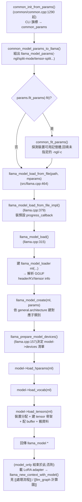

#note

# 模型載入:從一個 .gguf 檔案到可以推論的 llama_model

> 對應原始碼(commit `17252c7`,2026-08-29):`common/common.cpp`(`common_init_from_params`)、`common/arg.cpp`(CLI 旗標解析)、`src/llama.cpp`(`llama_model_load_from_file`/`llama_model_load`)、`src/llama-model.cpp`(`load_hparams`/`load_vocab`/`load_tensors`)、`src/llama-model-loader.h/.cpp`、`src/llama-mmap.h/.cpp`、`ggml/src/gguf.cpp`。
>
> 這篇是整個系列筆記裡**最早**的階段——server/CLI 一啟動、還沒有任何 API request 之前就會跑完。範圍是「檔案 → 記憶體裡一個 tensor 都配置好、資料都搬進對應裝置的 `llama_model` 物件」,到 `llama_new_context_with_model()` 建立 `llama_context`(配置 KV cache、準備 compute graph)之前為止;那之後的旅程見 [[處理流程]]、[[llm_graph 計算圖]]、[[Server 排程與 batch 組裝]]、[[API 請求生命週期]]。量化格式本身(Q4_K、IQ2_XXS 這些名字怎麼來的)見 [[GGML 量化格式]],這裡只講「loader 怎麼讀出每個 tensor 用哪種格式」,不重複格式細節。

---

## 一、整體呼叫鏈



> 直覺:`common_init_from_params()` 是 CLI/server 共用的單一入口——server 啟動、`llama-cli`、`llama-quantize` 背後都是同一條路。`-fit` 這一步刻意排在 `llama_model_load_from_file()` **之前**:它需要先知道裝置有多少可用記憶體,才能回填使用者沒填的 `-ngl`/`-c`;之後真正的載入函式看到的都已經是具體數字,不用自己猜「auto 是多少」。

---

## 二、GGUF 檔案怎麼被解析

`gguf_init_from_file()`(`ggml/src/gguf.cpp:992`)是最底層的檔案解析器,做的事很單純:讀 magic bytes(`"GGUF"`)、version、然後依序讀出 header 裡宣告的 **n_kv 個 KV metadata**(`general.architecture`、`llama.block_count`、`tokenizer.*` 等鍵值對)和 **n_tensors 個 tensor info**(每個 tensor 的名字、shape、量化型別 `ggml_type`、在檔案裡的 offset)。

`llama_model_loader` 建構子(`src/llama-model-loader.cpp:532`)呼叫它時傳 `no_alloc = true`——這一步只把 header/KV/tensor-info 讀進一個 `gguf_context`,**不讀任何 tensor 的實際數值資料**,對應建出來的 `ggml_context` 裡每個 tensor 也只有 shape/type 的 metadata,`data` 指標是空的。真正的位元組要等到第九節才會被搬動。

> 直覺:GGUF 檔案本身就是「先讀目錄、才讀內容」設計的——header 集中放完整的 tensor 清單和每個 tensor 的 offset,所以 loader 可以只花很小的 I/O 就知道「這個模型長什麼樣子」,不用把幾十 GB 的檔案整個讀過一遍才能回答「這是什麼架構、有幾層」。

---

## 三、`llama_model_loader`:loader 這個物件在做什麼

`llama_model_loader`(`src/llama-model-loader.h:31`)包住上一節的 `gguf_context`,是後面所有載入步驟共用的介面,關鍵欄位/方法:

- `weights_map`:`std::map<std::string, llama_tensor_weight>`——每個 tensor 名字對應到 `{檔案 idx, 檔案內 offset, ggml_tensor* metadata}`(`llama-model-loader.h:33-50`),建構時就會檢查 offset+size 有沒有超出檔案範圍,避免半途才發現檔案壞掉。
- `get_key()`/`get_key_or_arr()`/`get_arr()`:從 GGUF KV metadata 讀值,`load_hparams()`/`load_vocab()` 幾乎都是靠這幾個模板函式在讀。
- `create_tensor()`:第七節的主角,把某個 tensor 的 metadata 註冊進正確的 `ggml_context`(依裝置分桶)。
- `load_all_data()`:第九節的主角,真正把資料搬進 buffer。

---

## 四、多檔案切分模型(split GGUF)

大模型常被切成 `model-00001-of-00005.gguf` 這種多個檔案。`llama_model_loader` 建構子(`llama-model-loader.cpp:595-673`)偵測方式:

1. 讀主檔(第一個傳進來的檔案)的 `LLM_KV_SPLIT_COUNT` KV——如果 > 1,代表這是切分模型。
2. 檢查主檔的 `LLM_KV_SPLIT_NO` 必須是 `0`(呼叫端必須拿第一個 split 當入口,不能從中間檔案開始載)。
3. 如果沒有手動給檔名清單,用 `llama_get_list_splits()` 依主檔檔名規律推算出其餘檔名。
4. 依序對每個 split 呼叫 `gguf_init_from_file()`(一樣 `no_alloc`),核對它的 `LLM_KV_SPLIT_NO` 跟預期的 idx 相符,再把這個 split 裡的所有 tensor **合併進同一份 `weights_map`**(`llama_tensor_weight` 記著每個 tensor 屬於哪個檔案 idx)。
5. 全部載完後,用 `LLM_KV_SPLIT_TENSORS_COUNT` 跟實際合併出的 tensor 數量對帳,不符就直接報錯。

> 直覺:切分之後,對上層(`load_hparams`/`load_tensors`)來說完全透明——`weights_map` 是攤平合併過的,查一個 tensor 名字不需要知道它躺在哪個檔案裡;`llama_tensor_weight.idx` 只在真正要讀資料(第九節)時才用得到,用來找到對應的 `llama_file`/mmap。

---

## 五、`load_mode`:mmap / mlock / direct I/O 的選擇

載入用哪種 I/O 策略,由 `llama_load_mode` 決定(`src/llama.cpp:49-75` 定義了 `auto`/`none`/`mmap`/`mlock`/`mmap+mlock`/`dio` 六種,CLI 用 `-lm`/`--load-mode` 指定,舊的 `--mmap`/`--no-mmap`/`--mlock`/`-dio` 旗標已標記 deprecated、內部轉呼叫同一個欄位,`common/arg.cpp:2686-2730`)。

| 模式 | 行為 | 適合情境 |
|---|---|---|
| `mmap`(auto 預設選這個,除非裝置不支援) | 用 `mmap()` 把檔案映射進虛擬記憶體,不主動讀——由 OS page cache 決定何時真的從硬碟載入 | 一般情況;多個 process 載同一個模型檔可共用 page cache |
| `none` | 直接用 `llama_file` 讀檔案到記憶體 | mmap 不支援的環境,或想避開 page cache 造成的 I/O 不可預期性 |
| `mlock`/`mmap+mlock` | 額外呼叫 `llama_mlock`(`src/llama-mmap.h:65`)把已配置的記憶體釘住,防止被 OS swap 出去 | 記憶體吃緊、怕被換到硬碟拖慢推論的場合 |
| `dio`(Direct I/O) | 讀檔繞過 OS page cache | 避免大模型把系統 page cache 洗掉,或 NVMe 上想自己控制 I/O 排程 |

`llama_model_loader` 建構子把它拆成兩個布林旗標:`use_mmap`(`mmap`/`mmap+mlock`/`auto` 都算)、`use_direct_io`(只有 `dio`)。`load_tensors()` 開頭(`llama-model.cpp:1402-1411`)還有一次 **auto 模式的裝置相容性檢查**:如果 `load_mode == AUTO` 且任何一個目標裝置回報 `!props.caps.mmap_support`,直接把 `ml.use_mmap` 降級成 `false`——不會因為某個裝置不支援就整個載入失敗。

另有 `--tensor-read-lazy`(`common/arg.cpp:2731-2743`,依賴 mmap):某些巨大的 tensor(例如 per-layer embedding)不必整個常駐記憶體,可以「用到哪幾行就從 mmap 裡現讀哪幾行」,對應 `create_tensor()` 的 `TENSOR_READ_LAZY` flag(`llama-model-loader.h:71`)。

> 直覺:mmap 的價值不在「載入變快」,而在**把「要不要真的把這段資料搬進記憶體」這個決定,從 loader 手上交給 OS 的 page cache**——這也是第九節「mmap tensor 可能是 zero-copy」的前提:既然虛擬記憶體已經映射好了,CPU tensor 可以直接把 `data` 指標指過去,連 `memcpy` 都省了。

---

## 六、`load_hparams()` / `load_vocab()`:超參數與詞表也是從 GGUF KV 讀出來的

`llama_model_base::load_hparams()`(`llama-model.cpp:1196`)幾乎整個函式都是 `ml.get_key(LLM_KV_XXX, hparams.xxx, required)` 的重複:`LLM_KV_CONTEXT_LENGTH` → `n_ctx_train`、`LLM_KV_EMBEDDING_LENGTH` → `n_embd`、`LLM_KV_BLOCK_COUNT` → `n_layer_all`、`LLM_KV_ATTENTION_HEAD_COUNT`/`_KV` → 每層的 head 數(用 `get_key_or_arr`,允許每層不同,例如某些混合架構)……等等。架構是先前 `llama_model_create()` 依 `general.architecture` 這個 KV 決定的(所以哪些 KV 鍵存在、怎麼解讀,取決於架構),讀完通用欄位後才呼叫 `load_arch_hparams(ml)` 讓每個模型子類別讀自己專屬的欄位(例如 MoE 的 `n_expert`、SWA 的 window size)。

`load_vocab()`(`llama-model.cpp:1384`)只是薄薄一層轉呼叫 `vocab.load(ml, kv)`——tokenizer 的 vocab list、merge rules、special token id 等,原理一樣是從 GGUF KV(`tokenizer.ggml.*` 系列)讀出來,細節不在這篇展開。這些資料載入之後怎麼被拿來把文字切成 token(BPE 合併演算法、pre-tokenization、special token 保護等),見 [[BPE 分詞策略]]。

> 直覺:GGUF 檔案裡除了 tensor 資料,KV metadata 那一段本質上就是「這個模型的完整說明書」——連 vocab 都存在裡面,不需要額外的 tokenizer 檔案,這也是為什麼一個 `.gguf` 檔案能自給自足地被載入、不用配套其他檔案(除了同一模型的其他 split)。

---

## 七、建立 tensor 骨架:`create_tensor()`

`load_tensors()` 對模型裡每個要用到的 tensor 呼叫 `create_tensor()`(`llama-model-loader.cpp:1073`),做的是「登記」而不是「配置資料」:

1. 依 `tn`(tensor name,例如 `blk.0.attn_q.weight`)決定這個 tensor 的**語意角色**(`llm_tensor_info_for()`)——是 input 層、output 層、還是某個 repeating layer 的一部分,以及會被用在哪個 `ggml_op`(`mul_mat`/`add`/`mul_mat_id`……)。
2. 依角色選對應的 buffer type 候選清單(`buft_list_input`/`buft_list_output`/`buft_list_layer`,即第八節算出來的裝置分配結果)。
3. 找到(或新建)一個對應該 buffer type 的 `ggml_context`(每種 buffer type 一個 context,`ctx_map` 裡分桶),在裡面用 `ggml_new_tensor` 建一個**只有 metadata、沒有資料**的 tensor 節點——shape 來自呼叫端傳的 `ne`,實際 dtype/量化格式則是**GGUF 檔案裡這個 tensor 存的原生型別**(`gguf_get_tensor_type()`,量化格式本身見 [[GGML 量化格式]])。
4. `check_tensor_dims()`(`llama-model-loader.cpp:873`)驗證這個 shape 跟 GGUF 裡記錄的是否一致(不一致就直接報錯,除非帶 `TENSOR_ALLOW_RESHAPE`)。

`flags` 參數(`TENSOR_NOT_REQUIRED`/`TENSOR_DUPLICATED`/`TENSOR_SKIP`/`TENSOR_READ_LAZY` 等,`llama-model-loader.h:66-71`)讓每個架構的 `load_arch_tensors()` 可以表達「這個 tensor 可能不存在也沒關係」「這個 tensor 是共用另一個的資料,不用真的配」之類的例外情況。

---

## 八、裝置分配:`-ngl` 怎麼變成每一層放哪個裝置

這是模型載入裡最容易被問到「怎麼算的」的一段,`load_tensors()` 開頭(`llama-model.cpp:1420-1492`)實際邏輯:

**1. 先決定 `model->devices` 有哪些裝置** —— `llama_prepare_model_devices()`(`llama.cpp:157`):
- 使用者用 `-dev`/`--device` 明講就直接用那份清單。
- 否則自動列舉系統上的 GPU/iGPU/RPC 裝置(依 `device_id` 去重複)。
- `--split-mode tensor` 時,不用個別裝置清單,而是把所有 GPU 包成一個 **meta device**(供 tensor-parallel 用)。
- `--split-mode none` 時,裁到只剩 `--main-gpu` 指定的那一個裝置(`-mg` 沒給或 <0 則整個清空、退回純 CPU)。

**2. 每個裝置建自己的 buffer type 候選清單** —— `make_cpu_buft_list()`/`make_gpu_buft_list()`(`llama-model.cpp:1026/1088`):`--split-mode row` 時,GPU 的清單第一順位是特殊的 **split buffer type**(`ggml_backend_split_buffer_type`,單一 tensor 的每一 row 依 `--tensor-split` 比例攤到多張 GPU);其餘模式用該裝置的預設 buffer type。

**3. 算出「第幾層開始放 GPU」**(`llama-model.cpp:1467-1489`):

```cpp
const int i_gpu_start    = std::max(n_layer_all + 1 - n_gpu_layers, 0);
const int act_gpu_layers = devices.empty() ? 0 : std::min(n_gpu_layers, n_layer_all + 1);
```

`n_gpu_layers`(`n_gpu_layers()`,`llama-model.cpp:1858`)就是 `-ngl` 給的數字(若 `-ngl` 是負值——CLI 的 `auto`/`all` 都會先變成負數再傳進來——這裡直接視為「全部層都放 GPU」,即 `n_layer_all + 1`;`auto` 真正「依可用顯存猜一個數字」的行為發生在**更早**、第一節提到的 `-fit`/`common_fit_params()` 那一步,不是這裡)。`i_gpu_start` 就是「從最後一層往前數 `n_gpu_layers` 層」的起始 index——注意是**從後面數**,所以 `-ngl` 拉高時,先被搬到 GPU 的是**接近輸出端**的那些層。

每一層(以及代表 output 層的 `n_layer_all` 這個虛擬 index)呼叫 `get_layer_buft_list(il)`:落在 `[i_gpu_start, i_gpu_start + act_gpu_layers)` 範圍內的層,依 `--tensor-split` 算出的累積比例(`std::upper_bound` 找落在哪個裝置的區間)分配到對應 GPU;範圍外的一律回 CPU。**Input 層固定放 CPU**(`dev_input`,`llama-model.cpp:1483`,程式碼註解說 offload 它幾乎沒好處)。結果分別存進 `dev_layer[il]`(每層)、`dev_input`、`dev_output`。

**4. 手動覆寫個別 tensor**:`-ot`/`--override-tensor`(`common/arg.cpp:2776`,`<正規表示式>=<buffer type>,...`)讓使用者繞過上面整層級的分配,直接用正規表示式比對 tensor 名字、強制指定某些 tensor 的 buffer type——`create_tensor()`(第七節)裡 `tensor_buft_overrides` 的檢查**排在**一般的 layer-based 分配**之前**(`llama-model-loader.cpp:1183-1208`),命中就整層分配的結果直接被蓋掉。`-cmoe`/`--cpu-moe`、`-ncmoe N`/`--n-cpu-moe`、`-ncffn N`/`--n-cpu-ffn`(`common/arg.cpp:2781-2808`)是這個機制的便利封裝——內部就是自動產生對應的正規表示式,把 MoE expert 權重或前 N 層的 dense FFN 權重強制釘在 CPU(常見於「attention 放 GPU、佔記憶體最兇的 FFN/MoE 放 CPU」的混合部署)。

| `--split-mode` | 行為 | 對應這節哪個機制 |
|---|---|---|
| `none` | 只用一張 GPU(或指定的 `main_gpu`) | `devices` 只剩一個,`dev_layer` 只會分到那張卡或 CPU |
| `layer`(預設) | 整層分配到某張卡(pipelined) | 本節的 `i_gpu_start`/`dev_layer` 主邏輯 |
| `row` | 單一 tensor 的資料依 row 切開,攤到多張卡(parallelized) | `make_gpu_buft_list()` 裡的 split buffer type |
| `tensor`(實驗性) | 多張卡包成一個 meta device,由 backend 自己決定怎麼切 | `llama_prepare_model_devices()` 的 meta device 分支 |

> 直覺:`dev_layer`/`dev_input`/`dev_output` 只回答「這個 tensor 的資料應該放哪個裝置的記憶體」,是**靜態的、載入時就定案**的決定;`build_graph()` 建圖時只是照著這個既定事實接線,真正跨裝置搬資料/同步是 `ggml_backend_sched` 在每次 `graph_compute()` 前處理的(見 [[llm_graph 計算圖]] 第五節)。這篇談的是「材料放在哪個倉庫」,那篇談的是「工頭怎麼依材料位置發包」。

---

## 九、真正配置記憶體、把資料搬進去

決定完每個 tensor 該去哪個 buffer type 之後,`load_tensors()`(`llama-model.cpp:1690-1817`)對 `ctx_map` 裡的每個 buffer type 分別做:

**1. 建立 backend buffer**:
- **mmap 零複製路徑**(`ml.use_mmap && buffer_from_host_ptr_supported && is_default_buft`,`llama-model-loader.cpp` 呼叫端邏輯 / `llama-model.cpp:1718-1738`):找出這個 context 裡的 tensor 們對應到 mmap 裡的哪段位元組範圍(`ml.get_mapping_range()`),直接用 `ggml_backend_dev_buffer_from_host_ptr()` 把**既有的 mmap 記憶體**包裝成一個 backend buffer——不額外配置、不複製。只有裝置的 backend 明確支援「拿一段任意 host 指標當 buffer」時才走這條路,實務上通常是 CPU。
- **一般路徑**:`ggml_backend_alloc_ctx_tensors_from_buft(ctx, buft)` 真的配置一塊該裝置的記憶體(GPU 一定走這條,因為 VRAM 不可能被 mmap 進來)。若 `no_alloc`(例如只是要算記憶體用量的 dry-run,見 `graph_reserve()` 那類用途),則只配 dummy buffer、不真的要記憶體。
- 每個 buffer 都會被標記 `GGML_BACKEND_BUFFER_USAGE_WEIGHTS`——這個標記後來會被 `ggml_backend_sched` 用來讓「用到這個權重的 op」優先排到權重所在的裝置(呼應 [[llm_graph 計算圖]] 第五節的 split 邏輯)。
- 若開了 `mlock`,`llama_mlock` 把這塊 buffer 的記憶體釘住。

**2. `ml.load_all_data()`**(`llama-model-loader.cpp:1448`)——對每個 tensor 真正搬資料:
- **mmap 模式**:`data = mmap_addr + weight->offs` 算出這個 tensor 在 mmap 裡的位置;如果這個 buffer 就是上面那種「直接包 mmap」的 buffer(`cur->data == nullptr`),用 `ggml_backend_tensor_alloc()` 把 tensor 的 `data` 指標**直接指過去**——這才是名符其實的 zero-copy;否則(例如目標其實是 GPU 的一般 buffer)還是得 `ggml_backend_tensor_set()` 真的複製一份過去,mmap 在這裡只是省掉「先讀進一塊暫存記憶體」這一步,GPU 端的複製免不了。
- **非 mmap 模式**:走 `llama_file::read_raw()` 讀檔;如果目標裝置支援非同步上傳(`props.caps.async && host_buffer && events`),會另外配置 4 個 pinned staging buffer(依對齊需求選 1MB 或 64MB 一塊)搭配 `ggml_backend_event_t`,做 pipeline 化的讀檔→上傳,不用整個檔案讀完才開始傳。
- `check_tensors` 開啟時,每個 tensor 讀完會丟一個 `std::async` 去跑 `ggml_validate_row_data()`(數值合法性檢查,例如量化資料有沒有壞掉),不卡住主要的搬資料迴圈。
- 每個 tensor 處理完呼叫一次 `progress_callback((float) size_done / size_data, ...)`(第十節)。

> 直覺:mmap 帶來的「零複製」其實有兩層,常被混在一起講——一層是**建 buffer 時**不用另外配置記憶體(直接借用 mmap 映射),另一層是**搬資料時**如果目的地也支援吃任意 host 指標,連 `data` 指標賦值都省了,兩層都符合才是真正的「檔案 → GPU 材質不經過任何額外記憶體」;只要有一層走一般路徑(最典型就是 GPU 沒辦法直接吃 mmap 出來的 host 記憶體),還是得複製一次。

---

## 十、Progress callback 與失敗路徑

呼叫端沒給 `progress_callback` 時,`llama_model_load_from_file_impl()`(`llama.cpp:410-425`)裝一個預設值:每跨過一個整數百分比就印一個 `.`,滿 100% 印換行——這是 CLI 執行時看到那排點點點的來源。這個 callback 也身兼「取消」機制:回傳 `false` 就會讓 `load_all_data()` 中止、整條載入鏈提早結束。

`llama_model_load()`(`llama.cpp:315`)用回傳的 pair 表達三種結果:

| 回傳值 | 情況 |
|---|---|
| `{0, model}` | 成功 |
| `{-1, nullptr}` | 一般錯誤——檔案格式不對、`load_hparams`/`load_vocab` 拋例外(缺必要 KV、shape 不符)、`llama_prepare_model_devices()` 失敗等,整個函式包在 `try/catch` 裡收斂成這個狀態 |
| `{-2, nullptr}` | `load_tensors()` 回 `false`,即被 `progress_callback` 取消 |

外層 `llama_model_load_from_file_impl()` 依這個狀態決定要不要 `llama_model_free()` 清理、印什麼訊息、最終回傳 `nullptr` 給呼叫端。

---

## 十一、載入完成之後,還差什麼

`load_tensors()` 回傳後,`llama_model` 已經是一個「權重都在正確裝置上、可以拿來 build compute graph」的完整物件,但**還不能推論**——`common_init_from_params()` 接著做的事:

1. 讀取 vocab(`llama_model_get_vocab`)、載入 `--lora` 指定的 LoRA adapter(`llama_adapter_lora_init`)。
2. 呼叫建立 `llama_context` 的函式(`llama_init_from_model`/`llama_new_context_with_model`)——這一步才會依 `-c`/`-np` 等參數配置 [[處理流程|KV cache]]、準備 [[llm_graph 計算圖|compute graph]] 用的 scheduler。

這之後的內容(KV cache 怎麼運作、compute graph 怎麼建/算、server 怎麼排程多個 API call)都是另外四篇筆記的範圍,這篇不重複。

---

## 十二、重點摘要

- 完整鏈路:`common_init_from_params()`(CLI/server 共用入口)→(可選)`-fit` 依可用記憶體回填 `-ngl`/`-c` → `llama_model_load_from_file()` → `llama_model_load()` → 建 `llama_model_loader`(解析 GGUF)→ `load_hparams`/`load_vocab`(從 GGUF KV 讀出)→ `load_tensors`(裝置分配 + 建骨架 + 配 buffer + 搬資料)。
- GGUF 是「先讀目錄、才讀內容」的格式:header 集中放 KV metadata 和 tensor info,`gguf_init_from_file()` 一開始只讀這些,不碰任何 tensor 實際數值;多檔案切分模型靠 `LLM_KV_SPLIT_*` 系列 KV 偵測、合併成同一份 `weights_map`。
- `load_mode`(`-lm`,取代舊的 `--mmap`/`--mlock`/`-dio`)決定 I/O 策略:`mmap` 讓 OS page cache 決定何時真的讀,`none` 主動整段讀進記憶體,`mlock` 額外釘住頁面防止 swap,`dio` 繞過 page cache。
- 裝置分配是**靜態、載入時定案**的:`-ngl` 算出 `i_gpu_start`,決定從後面數第幾層開始放 GPU;`--split-mode`(`none`/`layer`/`row`/`tensor`)決定「整層搬去一張卡」還是「單一 tensor 的 row 攤到多張卡」;`-ot`/`-cmoe`/`-ncmoe` 可以用正規表示式對個別 tensor 手動覆寫這個決定。
- 真正搬資料時,mmap 能不能做到零複製要看兩層是否都成立:建 buffer 時能不能直接借用 mmap 映射、搬資料時目標裝置能不能吃任意 host 指標——GPU tensor 通常兩層都不成立,還是得真的複製一份過去。
- 載入完成的 `llama_model` 只是「權重就位」,還需要建立 `llama_context` 才會有 KV cache 和 compute graph,那是另外四篇筆記的範圍。
