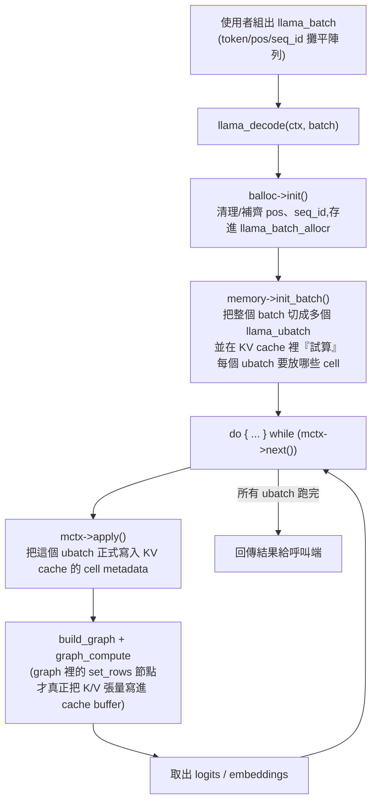

#note

# llama.cpp 推論處理流程:llama_batch → llama_ubatch → KV cache

> 對應原始碼(commit `17252c7`,2026-08-29):`include/llama.h`、`src/llama-batch.h/.cpp`、`src/llama-context.cpp`、`src/llama-kv-cache.h/.cpp`
>
> 這篇談的是「一次 `llama_decode()` 呼叫內部」發生的事;上一層「誰的 token 什麼時候被組進這次呼叫的 `llama_batch`」見 [[Server 排程與 batch 組裝]];最外層「一個 HTTP request 從 JSON 進來到回應文字送出」的完整旅程見 [[API 請求生命週期]]。

---

## 一、整體流程



`llama_decode()` 一次呼叫,內部可能跑好幾輪 ubatch;`llama_batch` 是「使用者給的整包」,`llama_ubatch` 是「引擎實際餵給 compute graph 的一小份」。

---

## 二、llama_batch 是什麼

定義在 `include/llama.h:262`,是一組**攤平的平行陣列**(structure of arrays),使用者自己配置或用 helper 函式產生:

```c
typedef struct llama_batch {
    int32_t n_tokens;
    llama_token  *  token;    // [n_tokens] token id
    float        *  embd;     // 或直接餵 embedding,取代 token
    llama_pos    *  pos;      // [n_tokens] 每個 token 在自己 sequence 中的位置
    int32_t      *  n_seq_id; // [n_tokens] 這個 token 屬於幾個 sequence
    llama_seq_id ** seq_id;   // [n_tokens][n_seq_id[i]] 屬於哪些 sequence id
    int8_t       *  logits;   // [n_tokens] 這個位置要不要輸出 logits
} llama_batch;
```

> 直覺:它就是「這一輪要塞進模型的所有 token,以及每個 token 的身份資訊(屬於哪個對話/序列、在序列裡第幾個位置、要不要輸出)」。沒有任何切分、排序或 KV 配置邏輯——這些都是後面 `llama_batch_allocr` 和 KV cache 的工作。

兩種產生方式:
- `llama_batch_get_one(tokens, n_tokens)`:單一 sequence 的簡易包裝,不需自己配陣列。
- `llama_batch_init(n_tokens, embd, n_seq_max)`:在 heap 上配置好各陣列(可支援多 sequence、embedding 輸入),用完要 `llama_batch_free()`。

---

## 三、llama_batch → llama_ubatch:切分過程

`llama_batch_allocr`(`src/llama-batch.h/.cpp`)是介於兩者間的 helper:

1. **`init()`**:檢查 `llama_batch` 是否合法(pos 越界、seq_id 越界等),缺 `pos` 時自動用「該 sequence 已存在的長度」補上,並算出每個 sequence 的 `seq_pos`(位置集合)、`seq_cpl`(哪些 sequence 彼此耦合,例如共用同一段 prompt)。
2. **切分成一個或多個 `llama_ubatch`**,依情境選其一:

| 方法 | 用途 |
|---|---|
| `split_simple(n_ubatch)` | 單一 stream:直接照順序切,不要求每份長度相等 |
| `split_equal(n_ubatch, sequential, n_keep_tail)` | 多 stream 時,切出「每個 sequence-set 長度相等」的 ubatch,方便 batched attention |
| `split_seq(n_ubatch)` | 一個 ubatch 只裝一個 sequence-set |

`n_ubatch`(compute 用的實體 batch 上限,`llama_context` 設定)通常 ≤ `n_batch`(邏輯上限),所以一個大 `llama_batch` 常會被切成好幾個 `llama_ubatch` 依序處理。

`llama_ubatch`(`src/llama-batch.h:15`)欄位和 `llama_batch` 很像,但多了描述「這一小份形狀」的資訊:`n_tokens = n_seq_tokens * n_seqs`、`equal_seqs()`(是否每個 sequence-set 等長,決定能不能用簡單的 2D attention mask)、`seq_id_unq` / `seq_idx`(這批裡有哪些 unique sequence,方便取 pooled embedding)。

---

## 四、llama_ubatch 怎麼被執行

在 `llama_context::decode()`(`src/llama-context.cpp:1643`)裡:

```cpp
mctx = memory->init_batch(*balloc, cparams.n_ubatch, output_all);  // 切好所有 ubatch,並在 KV cache 裡先卡好位置
do {
    const auto & ubatch = mctx->get_ubatch();
    process_ubatch(ubatch, gtype, mctx.get(), status);             // 見下方
} while (mctx->next());                                            // 換下一個 ubatch,直到全部跑完
```

`process_ubatch()`(`llama-context.cpp:1333`)每次做的事:

1. `mctx->apply()`——**先把這個 ubatch 正式寫入 KV cache 的 cell metadata**(哪個 cell 屬於哪個 seq_id / pos),圖還沒建。
2. 用 `ubatch` 建 [[llm_graph 計算圖|compute graph]](`model.build_graph`),圖裡的節點才是真正把 K/V 張量寫進 cache 的 buffer(`ggml_set_rows`),以及依照 cache 目前狀態算 attention mask。
3. `res->set_inputs(&ubatch)`:把 token/pos/mask 等灌進圖的 input tensor。
4. `graph_compute()`:實際跑一次 forward(細節見 [[llm_graph 計算圖]])。
5. 把這個 ubatch 對應的 logits / embeddings 從 backend 複製回 host。

> 直覺:切成 ubatch 不只是「因為記憶體/算力上限」,還因為每個 ubatch 需要在 KV cache 裡有「連續且屬於同一批」的 cell 位置,才能用簡單的張量運算一次寫入/讀取,所以切分粒度和 KV cache 的配置是綁在一起的(見下節)。

---

## 五、KV cache 大概流程

以 `llama_kv_cache`(`src/llama-kv-cache.h/.cpp`)為例,它把 KV 存在一個**固定大小的 ring buffer(cells 陣列)**裡,每個 cell 記錄「目前屬於哪個/哪些 seq_id、pos 是多少、是否空著」。

**`init_batch()`(`llama-kv-cache.cpp:703`)做兩件事:**

1. 呼叫 `split_simple`/`split_equal` 把整包 batch 切成 `ubatches`(如上節)。
2. 呼叫 `prepare(ubatches)`:對每個 ubatch **依序**在 cells 裡 `find_slot()` 找位置——但先不真的改動,而是把「找到的位置」`apply_ubatch()` 到一份暫存狀態上,確認**所有** ubatch 都能找到位置後才算成功;只要有一個失敗,就把已經試算的全部復原(rollback),回傳失敗讓上層去重試/縮小 batch。

**`find_slot(ubatch, cont)`**:在 ring buffer 裡掃描,找出一段(或依 sequence 各自)足夠且未被佔用的 cell 區間,優先延續同一個 sequence 之前用過的位置,讓同一個 sequence 的 KV 在 buffer 中盡量連續。

**真正決定送進哪個 ubatch 時**(`process_ubatch` 裡),再呼叫一次 `mctx->apply()` → `kv->apply_ubatch(sinfo, ubatch)`:把 `find_slot` 已經算好的位置**正式寫進** cells(更新哪個 cell 屬於哪個 seq/pos),接著 build graph 時,graph 裡的節點才把這個 ubatch 的 K/V 張量寫進對應 cell 的 buffer 位置,並依照目前所有 cell 的佔用狀況組出這次要用的 attention mask(causal / sliding-window 等)。

> 直覺:KV cache 不是「算完 attention 才存」,而是「先在 ring buffer 裡佔好格子 → 建圖時把新 token 的 K/V 寫進那些格子 → 同一次 forward 用整個 cache(含剛寫入的和之前留著的)算 attention」。切 ubatch、找 slot、寫入、算圖是同一輪迴圈裡緊密綁在一起的四個步驟。

**Q/K/V 不對稱:為什麼只算新 token 卻能看到整段歷史**

一個 ubatch 的 `build_qkv()` 只對**這批新 token**算 Q/K/V——這是唯一靠 ubatch 帶進圖裡的部分。差別在接下來:

```
Qcur/Kcur/Vcur = QKV(這次 ubatch 的 n_tokens 個 token)
cpy_k(Kcur) / cpy_v(Vcur) → 寫進 KV cache 對應 cell（新 K/V 落地）
k = get_k(cache), v = get_v(cache) → 對持久化張量開 view，涵蓋這個 sequence「目前 cache 裡所有還留著的」cell
kq = mul_mat(k, Qcur) → mask → softmax → ×v
```

`get_k()`/`get_v()`(`llama-kv-cache.cpp:1267/1301`)回傳的是 `ggml_view_4d`,不複製資料,涵蓋範圍是 `n_kv`(這個 sequence 目前用到的 cell 數,含之前每一輪 ubatch 寫入、一直留到現在的)——所以 QK^T 時 Q 只有「這次的」,K/V 卻是「從序列開頭到現在的全部」,不需要每次把舊 token 重新跑一次 QKV。

Causal mask 怎麼知道誰在誰前面,靠的也不是 ubatch 內的相對順序,而是 cell 的**絕對位置**:`set_input_kq_mask_impl()`(`llama-kv-cache.cpp:1556`)裡,`p0 = cells.pos_get(j)`(key 在 cell j 的絕對 pos,來自 cache metadata)跟 `p1 = ubatch->pos[i]`(query token 的絕對 pos)直接比較決定要不要蓋掉——這也是為什麼每個 cell 要記 `pos`:它不只是佔位,是 causal mask 判斷的依據來源。

> 直覺:KV cache 像一份持續在長的逐字稿,每個 ubatch 只負責把這批新台詞的 K/V 抄一份存進對應的行,然後每次 attention 都是拿目前為止**整份逐字稿**去跟新台詞的 Q 比對——不用把前面台詞重新念一遍(重算 K/V)。真正限制「能看到多遠」的不是 ubatch 邊界,是 causal mask 用絕對位置做的比較。

---

## 六、重點摘要

- **`llama_batch`**:使用者層、攤平陣列,一次可以裝任意多 sequence 的 token,不做任何切分或 KV 邏輯。
- **`llama_batch_allocr`**:把 `llama_batch` sanitize 後,依 `n_ubatch` 切成一個或多個 **`llama_ubatch`**(依 stream 數量選 `split_simple`/`split_equal`/`split_seq`)。
- **`llama_ubatch` 的執行**:`decode()` 用 `do { process_ubatch(...) } while (mctx->next())` 依序跑完每個 ubatch;每個 ubatch 各自建一次 compute graph、算一次 forward。
- **KV cache 流程**:`init_batch()` 先為所有 ubatch **試算**位置(`find_slot`,失敗就整批 rollback)→ 每個 ubatch 真正執行前先 `apply()` **正式佔位** → build graph 時把新 K/V 寫進對應 cell、並用當下 cache 狀態組 attention mask。
