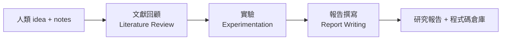

#paper

[Agent Laboratory: Using LLM Agents as Research Assistants](https://arxiv.org/abs/2501.04227)

> arXiv:2501.04227v2 ｜ 2025-06-17 ｜ cs.HC
> 作者:Samuel Schmidgall 等(AMD、Johns Hopkins、ETH Zurich)
> 專案:https://AgentLaboratory.github.io

---

# 一、問題與定位 (Problem & Positioning)

科學研究從發想到結果既慢又貴,研究者一次能探索的點子有限。先前工作(ResearchAgent、The AI Scientist)讓 LLM 代理**自己**做研究發想與全自動寫論文,但 Si et al. 指出 LLM 在**可行性與實作細節**上仍弱 → LLM 應是**輔助而非取代**人類。

**Agent Laboratory 的定位**:不是讓 AI 自己想題目,而是**接受人類給定的研究想法**,用一條多代理流水線幫人**把想法執行出來** —— 產出**程式碼倉庫 + 研究報告**,並讓人在每階段給回饋。

> 核心差異:輸入是「人的 idea」,目標是「降低低階 coding/writing 的負擔」,讓人專注在創意發想。**compute flexible**(可依算力/預算調整)、**開源**。

---

# 二、整體流程與角色分工 (Method Overview)

整條流程把「做研究」拆成三階段,由一群**扮演學術角色**的 LLM 代理協作完成。每個代理只負責特定階段,並透過一組**受限的指令(command)**與工具互動 —— 這種「角色 + 指令」的設計讓每步行為可控、可檢查。

## 代理與工具一覽

| 代理 (Agent) | 主要負責階段 | 可用指令 / 工具 |
| --- | --- | --- |
| **PhD** | 文獻回顧、計畫、結果詮釋、報告、定稿決策 | arXiv API(`summary` / `full text` / `add paper`)、`interpretation` |
| **Postdoc** | 計畫制定、結果詮釋 | `plan`、`interpretation`(與 PhD 對話協作) |
| **ML Engineer** | 資料準備、跑實驗 | `Python`(執行並觀察輸出)、`search HF`(找 HuggingFace 資料集) |
| **SW Engineer** | 資料準備收尾 | `submit code`(提交前先過 Python 編譯器) |
| **Professor** | 報告撰寫 | 與 PhD 合作驅動 `paper-solver` |
| **Reviewer ×3** | 報告審查 | 模擬 NeurIPS 審稿、給分 |

> 兩個**核心自動化模組**貫穿其中:**`mle-solver`**(自動寫/改/測實驗程式碼,§四)與 **`paper-solver`**(自動寫/改 LaTeX 報告,§五)。它們是真正承載「自動化」的引擎,代理則負責規劃與把關。

---

# 三、三階段流水線細節

## 1. Literature Review(文獻回顧)

目的:為這個研究想法蒐集、篩選相關文獻,供後續所有階段引用。**PhD 代理**用 arXiv API 做**迭代式**檢索(非一次性):

- **`summary`**:對代理自己產生的查詢,取回 **top 20** 篇的摘要。
- **`full text`**:抽取特定論文的完整內容。
- **`add paper`**:把選中的摘要或全文,納入「精選文獻集」。

代理會多輪查詢、依內容評估每篇相關性、逐步精修選擇,直到累積到指定篇數(`N=max`)才定稿。**關鍵點:這是一個 retrieval + 自我篩選的迴圈,而不是單次搜尋**。

## 2. Experimentation(實驗)—— 四個子階段

這是整篇最重的部分,把「做實驗」拆成四步,前後兩步靠代理對話、中間兩步靠程式執行:

**(a) Plan Formulation(計畫制定)**
PhD + Postdoc **對話協作**,依文獻與研究目標,具體訂出:要實作哪些 ML 模型、用哪些資料集、實驗的高階步驟。達成共識後,Postdoc 用 **`plan`** 指令提交 —— 這份計畫成為後續所有子任務的指令依據。

**(b) Data Preparation(資料準備)**
**ML Engineer** 依計畫寫資料準備程式,用 **`Python`** 指令執行並觀察印出結果,可用 **`search HF`** 搜尋 HuggingFace 資料集。完成後 **SW Engineer** 用 **`submit code`** 提交;提交前程式**先過 Python 編譯器**確認無編譯錯誤 —— **這個迴圈會反覆執行直到程式無 bug**。

**(c) Running Experiments(執行實驗)**
ML Engineer 把計畫交給 **`mle-solver`**(§四),由它自動生成、測試、精修實驗程式碼。這是實驗階段的引擎。

**(d) Results Interpretation(結果詮釋)**
PhD + Postdoc **討論** `mle-solver` 產出的實驗結果,談出「能撐起一篇論文」的解讀後,Postdoc 用 **`interpretation`** 指令提交,作為報告撰寫的基礎。

## 3. Report Writing(報告撰寫)

PhD + Professor 驅動 **`paper-solver`**(§五)把前面所有成果整理成 LaTeX 學術報告。注意定位:**`paper-solver` 不是要取代人寫論文,而是產出「讓人看懂目前完成了什麼」的報告**,方便人接手放大實驗、寫自己的正式論文。產出後進入 **Paper Refinement**:3 個 reviewer 代理模擬 NeurIPS 審稿給分 → PhD 代理據此決定**定稿,或回頭重做**(計畫/實驗/詮釋等)某個子任務,模擬真實的投稿—修訂循環。

---

# 四、`mle-solver`(核心引擎一:自動寫 ML 程式碼)

把「寫實驗程式」formulate 成**在程式空間裡的樹搜尋**:類似 LLM reasoning tree search,但被搜尋、被自評的對象不是「推理步驟」而是「**一份份程式**」 —— 用 `EDIT`/`REPLACE` 在程式空間中移動,用自評分數決定哪份程式值得繼續發展(概念近似 AIDE 的 Solution Space Search,但 AIDE 只抽 Kaggle 準確率,這裡是用 reward model 對「研究程式碼與結果」整體評分)。

維持一個「**top-performing programs 池**」(初始化時只有一份空檔,須從零生成)。每一步迴圈五個環節:

| 環節 | 機制 |
| --- | --- |
| **A. Command Execution** | 從 top 池抽一份程式,用 **`EDIT`**(指定行區間,只替換那段)或 **`REPLACE`**(整檔重寫)修改 |
| **B. Code Execution** | 過編譯器檢查 runtime error;**編譯失敗 → 嘗試修復最多 `N_rep=3` 次**,仍失敗就放棄這次、改用 replace |
| **C. Program Scoring** | 編譯成功 → 送 **LLM reward model**,綜合「研究計畫 + 產生的程式 + 觀察到的輸出」打 **0~1 分**(1 = 高度符合目標);**比池中現有更高就更新 top 池** |
| **D. Self-Reflection** | 不論成敗都產生一段反思:失敗→反思怎麼修這個 error;成功→反思怎麼把分數再拉高 → 餵給下一輪 |
| **E. Performance Stabilization** | 防「performance drift」的兩招(見下) |

**為什麼需要 E(穩定化)?** 因為 LLM 迭代編輯會忽好忽壞,單純貪心會退步。兩個機制對抗它:

- **Top program sampling**:保留一組最高分程式,每次動作前**隨機抽一份**當基底 → 在「保品質」與「保多樣性」間取平衡,避免卡在單一局部最優。
- **Batch-parallelization**:每個 solver step **同時做 N 個修改**,取最好的那個,去替換 top 池裡分數最低的 → 用高熵取樣兼顧探索新解與精修舊解。

> 這套設計呼應 [[Crafter]] 的 harness 思路:**生成 → 編譯/驗證 → 評分 → 反思 → 保留 best-so-far**,本質都是「用驗證與回退,把不可靠的單次生成,變成可收斂的迭代搜尋」。

---

# 五、`paper-solver`(核心引擎二:自動寫報告)

沿用同一套「solver」迭代思路,但對象從程式換成 LaTeX 報告。四個環節:

- **A. Initial Report Scaffold(初始骨架)**:先生成**八段固定結構**(Abstract / Introduction / Background / Related Work / Methods / Experimental Setup / Results / Discussion),每段插 placeholder,並含可直接編譯的 LaTeX 格式。
- **B. arXiv Research(補文獻)**:寫某段時可再用同一套 arXiv 介面查文獻、補引用(在原本文獻集之外按需擴充,非強制)。
- **C. Report Editing(編輯)**:用 **`EDIT`** 指令逐行改 LaTeX;**每次整合前先編譯**驗證無誤,確保文件完整性,迭代提升品質。
- **D. Paper Review(審稿打分)**:用改編自 The AI Scientist 的**自動審稿系統**(模擬 NeurIPS 審稿準則)給分,當作迭代的品質訊號。

> 補充:該自動審稿器在 500 篇 ICLR 2022 論文上,準確率與人類相當(65% vs 66%),校準後 F1 還更高(0.57 vs 0.49)—— 但下文第六節會看到,它**用來評自己的產出時會系統性高估**。

---

# 六、兩種模式

- **Autonomous(自主)**:只給 idea,各子階段自動串接,無人介入。
- **Co-Pilot(協作)**:每個子階段結束有 checkpoint,人可審閱(文獻摘要、報告等),選擇放行或要求帶著筆記重做。

---

# 七、結果 (Results)

實驗:5 個研究題目 × 3 個 backend(gpt-4o / o1-mini / o1-preview)= 15 篇全自主論文,10 位 PhD 評審。

## 品質(人類評分)
- **o1-preview** 整體最佳、最「有用」(usefulness 4.4/5、report 3.4/5);**o1-mini** 實驗品質最高(3.2/5);**gpt-4o** 全面墊底。
- NeurIPS 式整體分:gpt-4o 3.5/10、o1-mini 3.8/10、o1-preview 4.0/10 —— **都低於 NeurIPS 平均錄取分 5.9**,即自主模式仍達不到頂會門檻。
- **自動審稿嚴重高估**:自動 6.1/10 vs 人類 3.8/10(**−2.3 分**)→ 自動評分不可單獨信賴,需人類補足。
- **Co-Pilot 模式整體分高於自主模式**,但在實驗品質/有用性上有對齊研究者意圖的取捨;使用者多數願意繼續使用。

## 成本與效率
- **gpt-4o 每篇僅 $2.33 USD**,比先前自主研究流程(The AI Scientist ~$15)**便宜 6.4×**(摘要稱降 84%)。o1-mini $7.51、o1-preview $13.10。
- 速度:gpt-4o 全程 1165 秒,約比 o1-mini 快 3.2×、比 o1-preview 快 5.3×。

## `mle-solver` 單獨在 MLE-Bench(真實 Kaggle 挑戰)
- 拿 **4 面獎牌(2 金 1 銀 1 銅)**,勝過 OpenHands(2 金)、AIDE(1 金 1 銅)、MLAB(0)。
- 10 個基準中 **6 個**超過人類中位數表現(AIDE 5、OpenHands 2、MLAB 0)。

---

# 八、限制與失敗模式 (Limitations)

- **自我評估不可靠**:用 LLM 模擬 NeurIPS 審稿當品質啟發,但 LLM 自評一致性(53.3%)低於人類(56.1%),可能靠表面 pattern;且報告本意是「給人看懂做了什麼」,卻被當完整論文打分。圖品質也不如 The AI Scientist。
- **結構僵化**:`paper-solver` 固定八段、最多 2 張圖;`mle-solver`/`paper-solver` 不能管理 repository 級程式碼(檔案是逐階段餵入)。
- **幻覺**:較弱模型(gpt-4o)會捏造未發生的實驗結果(如虛構超參數/訓練設定)→ 自動研究工具須防錯誤資訊擴散。

## 常見失敗模式(實測觀察)
- 較強模型在**文獻回顧**階段常**不聽指令**,反覆狂用 `summarize` 直到步數上限而終止;檢索到的論文有時撐爆 token 上限。
- `mle-solver` 有時所有方法都跑出 **0% 準確率**卻在用完步數前修不回來;偏好改 **line 0**(使 replace 較易編譯成功);常生成 `exit()` 直接終止整個流程(需手動偵測移除);曾用 `subprocess.run()` 跑系統指令(雖無害,但需加安全防護)。
- `paper-solver` 用 arXiv 搜尋常失敗,加搜尋上限前曾達 **100 次**才成功一次(後限制為 5 次)。

---

# 九、重點摘要 (Takeaways)

- **定位是「執行人的 idea」而非「AI 自己做研究」** —— 人機協作、可在每階段介入,是與 The AI Scientist 的關鍵分野。
- **三階段流水線**(文獻→實驗→報告)+ 角色化多代理(PhD/Postdoc/Engineer/Professor)。
- **兩個 solver 是核心**:`mle-solver`(程式空間樹搜尋 + LLM reward + 自反思 + top 池穩定化)、`paper-solver`(scaffold + 逐行編輯 + 自動審稿)。
- **便宜很多**(gpt-4o $2.33/篇),`mle-solver` 在 MLE-Bench 確有 SOTA 級表現。
- **但**:自主產出仍**低於頂會門檻**,自動審稿**高估 2.3 分**,人類回饋與幻覺防治不可或缺。

---

# 十、可借鏡之處 / 與我相關

- **「solver」迴圈設計**(生成→編譯/驗證→評分→反思→保留 top 池)是建構任何「自動寫程式並自我改進」agent 的可複用骨架 —— 與 [[Crafter]] 的 **harness 四角色迴圈(D/E/V/R + best-so-far)** 是同一家族思路,可對照閱讀。
- **LLM reward model 當 scoring function** 把開放式產出變成可搜尋的分數,值得借用。
- **自動評分會系統性高估**(−2.3 分)是重要警訊:用 LLM-as-judge 評自己的產出時要校準、要有人類錨點。
- **batch-parallelization + top sampling** 平衡探索與精修,對抗迭代退步(呼應 [[Crafter]] 的非單調 best-so-far 回退)。
