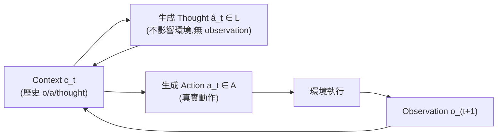
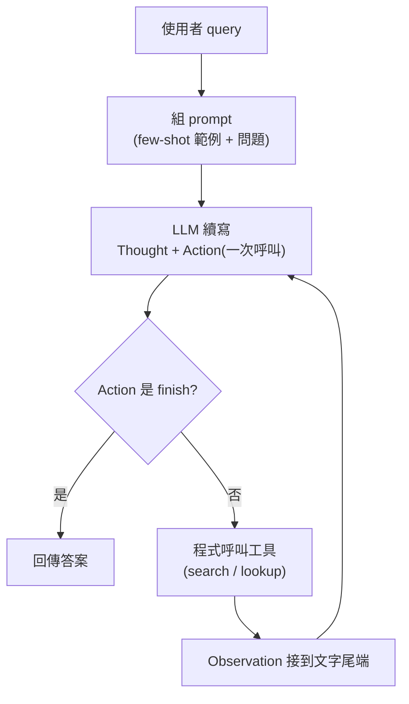

#paper

[ReAct: Synergizing Reasoning and Acting in Language Models](https://arxiv.org/abs/2210.03629)

> arXiv:2210.03629v3 ｜ 2023-03-10 ｜ cs.CL
> 作者:Shunyu Yao(Princeton)、Jeffrey Zhao、Dian Yu、Nan Du、Izhak Shafran、Karthik Narasimhan(Princeton)、Yuan Cao(Google Research, Brain team)
> 專案頁:https://react-lm.github.io/

---

# 一、問題與定位 (Problem & Positioning)

人類解決任務時會把「動口(語言推理)」和「動手(行動)」交織在一起。

煮菜時邊想「水已經熱了,該下麵了」邊實際去下麵,想不出下一步就去翻食譜(用行動取得新資訊來支撐推理)。

在此之前,LLM 相關研究把這兩件事當成獨立課題:

- **只做推理**:Chain-of-Thought(CoT, Wei et al. 2022)讓模型生成一串思考步驟。

  但這是一個**靜態黑箱** —— 模型只用自己內部的表徵生成 thought,完全不接觸外部世界,容易產生 **fact hallucination(幻覺)** 且錯誤會沿著推理鏈**傳播、無法修正**。

- **只做行動**:SayCan、WebGPT、Inner Monologue 等工作讓 LLM 直接把觀察轉成 domain-specific action。

  但不具備抽象推理或維護 working memory 的能力(Inner Monologue 是唯一例外,但也僅限於重述環境的空間事實這種**很有限**的「推理」)。

> 直覺:CoT 像是閉著眼睛純靠記憶推論,行動類方法像是睜著眼卻不會思考只會反射動作。
>
> ReAct 的定位就是把兩者接在同一個生成序列裡,讓「推理」引導「該做什麼行動」,又讓「行動得到的觀察」回頭修正「推理」—— 兩者互為輸入輸出,形成閉環。

論文的四個核心貢獻(對應到本筆記的四、五節):

1. 提出 ReAct 這個 prompt-based paradigm
2. 在多個 benchmark 上證明優於單純推理或單純行動
3. 系統性 ablation 分析推理對行動類任務、行動對推理類任務各自的重要性
4. 明確分析 ReAct **在 prompting 設定下的限制**,並用初步 finetuning 實驗展示改善空間

---

# 二、方法 (Method)

## 1. 形式化定義:把「語言」塞進 action space

一般的 agent-environment 互動定義如下:在時間步 $t$,agent 收到觀察 $o_t \in \mathcal{O}$,依 policy 產生動作 $a_t \in \mathcal{A}$:

$$\pi(a_t \mid c_t)$$

其中 $c_t$ 是完整的歷史 context:

$$c_t = (o_1, a_1, \cdots, o_{t-1}, a_{t-1}, o_t)$$

當 $c_t \mapsto a_t$ 這個映射高度隱含、需要大量計算(例如要對整條軌跡做多步推理才能決定下一步),單純學一個 policy 會很難。

ReAct 的作法很簡單:把 action space 擴增為

$$\hat{\mathcal{A}} = \mathcal{A} \cup \mathcal{L}$$

其中 $\mathcal{L}$ 是**語言空間**。一個屬於 $\mathcal{L}$ 的動作 $\hat{a}_t$ 稱為 **thought(思考)**:

- 它**不會影響外部環境**,因此**沒有對應的 observation**
- 純粹是對當前 context $c_t$ 做推理、產出有用資訊
- 再把它併入下一步的 context:

$$c_{t+1} = (c_t, \hat{a}_t)$$

> 直覺:thought 是一種「不耗費環境成本的偽動作」—— 它讓模型有機會在兩個真實動作之間「喘口氣想一想」,而這個想法會被寫進歷史,影響它自己接下來的判斷。
>
> 因為 $\mathcal{L}$ 是無限的語言空間,直接學習這個擴增後的 policy 很難,所以論文選擇**不訓練**,而是用**凍結的大模型(PaLM-540B)+ few-shot in-context 範例**來誘導這種行為 —— 每個範例就是一條人工寫的「thought-action-observation」軌跡示範。

## 2. thought 可以做哪些事

論文列舉 thought 的典型用途(對應 Figure 1 的例子):

- 拆解目標、建立行動計畫(decompose task goals and create action plans)
- 注入常識知識(inject commonsense knowledge)
- 從觀察中抽取重點(extract important parts from observations)
- 追蹤進度、切換子目標(track progress and transit action plans)
- 處理例外、調整計畫(handle exceptions and adjust action plans)

## 3. 兩種 thought 出現密度:dense vs. sparse

- **推理為主的任務**(HotpotQA、FEVER):thought 與 action **交替**出現,形成多個 thought-action-observation 三元組(dense thought)。
- **決策為主、動作數量可能很大的任務**(ALFWorld、WebShop):thought 只需要**稀疏地**出現在關鍵節點,具體何時出現由模型自己決定(sparse thought)。

**「模型自己決定」其實沒有額外機制**,就是 [[#1. 形式化定義:把「語言」塞進 action space|§二.1]] 的 $\hat{\mathcal{A}} = \mathcal{A} \cup \mathcal{L}$ 直接帶來的結果:

- 決策任務的 prompt 裡,thought 被寫成一種普通動作,格式是 `think: ...`,環境對它只回 `OK.`(不改變狀態)。
- 每一步模型只是在生成「下一個動作」,而 `think: ...` 和 `go to ...`、`take ...` 地位相同 —— 要不要想,取決於模型這一步生成了哪一種。
- 何時該想的「判斷力」完全來自 few-shot 範例:標註者只在關鍵節點(拆解目標、找到物品、切換子目標)寫 thought,模型透過 in-context learning 模仿這個節奏。沒有 classifier、沒有規則、沒有額外訓練。
- 對比推理任務:prompt 格式固定為 `Thought i → Action i → Observation i` 輪流出現,交替是**格式強制**的,模型沒有選擇空間。

> 所以 dense / sparse 的差別不是兩套演算法,而是 **prompt 範例的寫法不同**:一個把交替寫死在格式裡,一個把 thought 當成可選動作交給模型模仿。

> 直覺:知識密集型任務每一步都需要「想清楚要查什麼」,但長horizon 決策任務裡大部分步驟是例行的(走到某個位置、打開某個容器),只有轉折點才值得停下來想 —— 讓模型自己決定何時該想,比死板規定「每 N 步想一次」更貼近人類行為,這也是後面 [[#4. ReAct vs. Inner Monologue(IM)—— 內部推理 vs. 純外部回饋|§四.4]] 用 ReAct-IM ablation 驗證的重點。

## 4. ReAct 的四個特性

**A) 直覺、易設計**
- 標註者只要把自己的想法用自然語言寫在動作旁邊,不需要設計任何 ad-hoc 格式

**B) 通用、有彈性**
- thought 空間和出現位置都很自由,可套用到 QA、事實驗證、文字遊戲、網頁導覽等差異很大的任務

**C) 表現好、穩健**
- 只靠 1~6 個 in-context 範例就能泛化到新任務實例,持續優於只推理或只行動的 baseline

**D) 人類可對齊、可控**
- 軌跡可被人類檢視事實正確性,甚至能透過**編輯 thought 文字**直接修正 agent 行為(見 [[#六、人在迴圈的延伸實驗(Human-in-the-loop, Appendix A.3)|§六 人在迴圈實驗]])



## 5. 實際運作流程:一個 query 進來會發生什麼

整個框架就是**一個 while 迴圈的程式 + 一個 LLM**:LLM 只負責續寫文字,真正執行動作的是外面的程式。

以 HotpotQA 為例:

1. **組 prompt**:6 條人工示範軌跡 + 使用者的 `Question: ...`,結尾由程式補上 `Thought 1:`
2. **呼叫 LLM 續寫**,設定遇到 `Observation` 就停,模型一次寫出:
   ```
   Thought 1: 我需要先搜尋 Apple Remote,找出它原本設計來控制哪個程式。
   Action 1: search[Apple Remote]
   ```
3. **程式解析 Action**,用字串比對抓出 `search[Apple Remote]`,呼叫 Wikipedia API;Thought 程式**完全不處理**
4. **把結果接回文字尾端**:`Observation 1: The Apple Remote is ... designed to control the Front Row ...`
5. **整段(示範 + 問題 + 歷史)再丟給 LLM**,重複 2~4,直到模型寫出 `finish[答案]`,程式回傳答案



| 元素 | 誰產生 | 程式怎麼處理 |
|---|---|---|
| Thought | LLM | **不處理**,只留在歷史文字裡 |
| Action | LLM | 解析後**呼叫工具** |
| Observation | 工具/環境 | 接回文字,給下一輪看 |

**Thought 與 Action 是一階段生成**,不是兩次呼叫。官方實作(簡化):

```python
# 一次呼叫:從 "Thought i:" 開始續寫,寫到 "Observation i:" 就停
thought_action = llm(prompt + f"Thought {i}:", stop=[f"\nObservation {i}:"])
try:
    thought, action = thought_action.strip().split(f"\nAction {i}: ")
except:
    # 只有格式壞掉(例如模型只寫了 thought)才補第二次呼叫
    thought = thought_action.strip().split('\n')[0]
    action = llm(prompt + f"Thought {i}: {thought}\nAction {i}:", stop=["\n"])
```

**模型為什麼會先寫 Thought?** 主要不是靠「think before action」之類的指令,而是:

- **few-shot 範例**(主因):示範軌跡每步都是 Thought → Action → Observation,模型照格式續寫
- **簡短格式說明**:prompt 開頭一句「用交錯的 Thought、Action、Observation 步驟解題,Action 有三種……」
- **程式強制起頭**:每輪 prompt 結尾都補上 `Thought {i}:`,模型只能從 thought 開始寫

> 直覺:PaLM-540B 是 base model,不擅長聽指令但很會模仿格式,所以範例才是關鍵。
>
> Thought 的作用純粹是**影響 LLM 自己接下來寫什麼** —— 它被寫進歷史,下一輪模型看到它,就會照著這個計畫行動。
>
> ALFWorld 的 sparse 版則不補 `Thought:` 起頭,模型每輪只輸出一行,可能是 `think: ...`(環境回 `OK.`)也可能是 `go to desk 1` —— 所以那裡是「每步二選一」,HotpotQA 是「每步先想再動」。

---

# 三、任務設定與方法細節 (Task Setups)

## 1. 知識密集推理任務:HotpotQA + FEVER

- **Domain**:HotpotQA(多跳問答,需跨 2+ 篇 Wikipedia 段落推理)、FEVER(事實驗證,判斷 SUPPORTS / REFUTES / NOT ENOUGH INFO)。

  採用 **question-only** 設定 —— 模型不給支持段落,只能靠內部知識或主動檢索。
- **Action space**(刻意設計成貼近人類用網頁的方式,而非用強力檢索器):
  - `search[entity]`:回傳該實體 wiki 頁前 5 句;若無此頁則回傳最相似的 5 個實體
  - `lookup[string]`:模擬瀏覽器 Ctrl+F,回傳頁面中含 `string` 的下一句
  - `finish[answer]`:結束任務並給出答案
  - > 直覺:這個 API 只能取回一小段、且要精確頁名才查得到,遠弱於 SOTA 檢索器 —— 目的正是**強迫模型必須靠語言推理去主動、逐步地檢索**,而不是丟給一個強力檢索器一次撈到所有相關內容。
- **Prompting**:HotpotQA / FEVER 各手寫 6 / 3 條 few-shot 軌跡(更多範例不會提升表現)。

  thought 涵蓋拆解問題(「我需要先查 x,找到 y,再找 z」)、抽取觀察資訊、常識/算術推理、改寫搜尋詞、綜合最終答案。
- **Baselines**(對 ReAct 軌跡做系統性消融):
  - Standard:移除所有 thought/action/observation
  - CoT:移除 action/observation,只留推理(純推理 baseline);另建 **CoT-SC**(self-consistency):以 temperature 0.7 採樣 21 條 CoT 軌跡,取多數決答案
  - Act:移除 thought,只留動作(類似 WebGPT 的行為模式,但任務/action space/訓練方式都不同 —— WebGPT 用 imitation+RL,這裡用 prompting)
- **結合內外部知識的啟發式切換**(因為 ReAct 更真實但沒 CoT 靈活,CoT 推理結構好但容易幻覺):
  - **A) ReAct → CoT-SC**:ReAct 在給定步數內(HotpotQA 7 步、FEVER 5 步)沒給出答案就退回 CoT-SC
  - **B) CoT-SC → ReAct**:取 $n$ 個 CoT-SC 樣本,若多數答案得票數滿足

    $$\text{得票數} < n/2$$

    (代表內部知識信心不足)就退回 ReAct
- **Finetuning**:因為人工標註大量推理+行動軌跡成本太高,採用類似 STaR(Zelikman et al. 2022)的 **bootstrapping**。

  用 ReAct 生成的 3,000 條「答案正確」的軌跡,微調較小的 PaLM-8B / 62B,讓它學習在給定問題下解碼完整的 thought-action-observation 序列。

## 2. 決策任務:ALFWorld + WebShop

- **ALFWorld**:對齊 embodied ALFRED benchmark 的合成文字遊戲,共 6 種任務類型(例如「examine paper under desklamp」),透過文字動作(`go to coffeetable 1`, `take paper 2`, `use desklamp 1`)在模擬家居中導航互動。

  - 規模:單一任務實例可能有 50+ 個地點、專家策略需 50+ 步
  - 刻意需要**常識知識**(檯燈通常在桌子/架子/梳妝台上)
  - 每種任務類型標註 3 條訓練集軌跡,用 2-of-3 排列組合出 6 組 prompt 做穩健性測試
  - baseline 為 BUTLER(在 $10^5$ 條專家軌跡上做 imitation learning 的模型)

- **WebShop**:118 萬件真實商品 + 1.2 萬條人類指令的線上購物環境,文字高度雜亂(真實爬取的商品標題/描述/選項)。

  - 任務:依指令(例如「找一個有抽屜、鎳質、售價 140 美元以下的床頭櫃」)透過搜尋/選商品/選選項/購買完成購買
  - 評估指標:**average score**(所選商品符合需求屬性的比例)與 **success rate**
  - baseline:IL(1,012 條人工軌跡)與 IL+RL(額外加 10,587 條訓練指令)

- 兩個任務的 Act prompt 用同樣的行動集但不含 thought;ReAct 額外加入決定探索方向、何時購買、判斷選項相關性等推理。

---

# 四、實驗結果 (Results)

## 1. HotpotQA / FEVER(PaLM-540B)

| Prompt Method | HotpotQA (EM) | Fever (Acc) |
|---|---|---|
| Standard | 28.7 | 57.1 |
| CoT | 29.4 | 56.3 |
| CoT-SC | 33.4 | 60.4 |
| Act | 25.7 | 58.9 |
| ReAct | 27.4 | 60.9 |
| CoT-SC → ReAct | 34.2 | 64.6 |
| ReAct → CoT-SC | **35.1** | 62.0 |
| Supervised SoTA | 67.5 | 89.5 |

觀察:
- **ReAct 持續優於 Act**(兩個任務都贏),證明「推理引導行動」有價值,尤其在綜合最終答案時最明顯。
- **ReAct vs. CoT**:FEVER 上 ReAct 贏(60.9 > 56.3),HotpotQA 上略輸(27.4 < 29.4)。論文對 200 條軌跡(50 個 ReAct 對/錯 × 50 個 CoT 對/錯)做人工錯誤分類:

| 類型 | 定義 | ReAct | CoT |
|---|---|---|---|
| Success / True positive | 推理與事實皆正確 | 94% | 86% |
| Success / False positive | 推理或事實有幻覺但答對 | 6% | 14% |
| Failure / Reasoning error | 推理錯誤(含陷入重複迴圈無法跳出) | 47% | 16% |
| Failure / Search result error | 搜尋結果空白或無用資訊 | 23% | — |
| Failure / Hallucination | 推理或事實幻覺 | 0% | 56% |
| Failure / Label ambiguity | 預測正確但沒精確對上標籤 | 29% | 28% |

三個關鍵發現:

1. **幻覺是 CoT 的主要問題**

   56% 的失敗案例、成功案例裡假陽性率也高出一倍 —— 因為它完全靠內部知識;ReAct 因為能接到外部知識庫,幻覺率是 0%。

2. **結構限制換來的代價**

   interleave thought/action/observation 提升了 groundedness,但也降低了推理的靈活度,導致 reasoning error 比 CoT 高(47% vs 16%)。

   其中一種 ReAct 特有的錯誤模式是**模型陷入重複生成前面 thought/action 的迴圈跳不出來**(論文猜測是貪婪解碼所致,未來可用 beam search 改善)。

3. **搜尋品質是 ReAct 的瓶頸**

   23% 的失敗來自搜尋結果空泛或無用,這會把模型的推理帶偏,且很難自行恢復 —— 這正是「事實性 vs 靈活性」的 trade-off,也是論文提出 ReAct+CoT-SC 混合策略的動機。

4. **混合策略效果最好**

   ReAct→CoT-SC(HotpotQA)、CoT-SC→ReAct(FEVER)分別是各任務最佳單一 prompting 方法,且用 3-5 個 CoT-SC 樣本就能達到純 CoT-SC 用 21 個樣本的水準。

## 2. Finetuning 的 scaling 效應

用 PaLM-8B/62B 做 prompting 時,ReAct 因為要同時從少量範例學會「推理+行動」兩種行為,表現是四法中**最差**的。

但只要用 3,000 條軌跡 finetune:

- finetuned ReAct 立刻變成**最好**的方法
- **PaLM-8B finetuned ReAct 打贏所有 PaLM-62B prompting 方法**
- **PaLM-62B finetuned ReAct 打贏所有 PaLM-540B prompting 方法**
- 反過來,finetune Standard/CoT 效果明顯比 finetune ReAct/Act 差 —— 因為前者本質是在教模型「記憶(可能幻覺的)知識事實」,後者教的是「如何推理並行動去取得資訊」,是更可泛化的技能

> 直覺:prompting 靠少量範例硬記格式,ReAct 要學的行為模式比純推理或純行動都複雜,自然在小樣本下吃虧。
>
> 但一旦有足夠訓練訊號,「學會怎麼查資料」比「死記資料」更划算,且更能遷移到沒見過的問題。

## 3. ALFWorld / WebShop

**ALFWorld(6 種任務類型 success rate %)**

- ReAct(best of 6)整體達 **71%**,大幅超過 Act(best of 6, 45%)與 BUTLER(37%)
- 甚至 **ReAct 最差的一次嘗試(48%)也超過另外兩法各自最好的嘗試**
- ReAct 對 Act 的相對提升在 6 次受控試驗中穩定落在 33%~90%(平均 62%)
- 定性觀察:完全沒有 thought 的 Act 無法正確把目標拆成子目標,或會搞不清目前環境狀態

**WebShop**:

| Method | Score | SR |
|---|---|---|
| Act | 62.3 | 30.1 |
| ReAct | **66.6** | **40.0** |
| IL | 59.9 | 29.1 |
| IL+RL | 62.4 | 28.7 |
| Human expert | 82.1 | 59.6 |

one-shot Act 就已經打平 IL/IL+RL(這兩者需要上千條訓練軌跡);加上稀疏推理後 ReAct 再提升,success rate 絕對值提升 10%。

但**與人類專家仍有明顯差距** —— 人類會做更多商品探索與查詢改寫,這是純 prompting 方法目前做不到的。

## 4. ReAct vs. Inner Monologue(IM)—— 內部推理 vs. 純外部回饋

論文特別設計了 **ReAct-IM** ablation:用同樣的專家軌跡,但把 thought 重新標註成「只描述環境回饋」的密集外部回饋(模仿 Inner Monologue 的風格,只能想 (1) 分解目前目標、(2) 目前子目標)。

結果 ReAct 明顯優於 ReAct-IM(整體 71% vs 53%,6 個任務中 5 個都贏)。

定性分析顯示 ReAct-IM 常常搞錯子目標何時完成、下一個子目標是什麼,也缺乏常識去判斷物品可能在哪 —— 這兩個弱點正是**因為它沒有高層目標拆解和常識推理的空間**,而這正是 ReAct 靈活 thought space 補上的部分。

---

# 五、限制 (Limitations)

論文本身沒有獨立的「Limitations」章節,但限制在論文 §3.3 錯誤分析(本筆記 [[#1. HotpotQA / FEVER(PaLM-540B)|§四.1]])、Conclusion、Ethics Statement、Appendix 中被明確點出,整理如下:

1. **推理靈活度 vs. 事實根基的 trade-off**

   interleave thought/action/observation 這個結構性約束,雖然讓推理更 grounded、減少幻覺,但也**降低了推理的自由度**,導致 reasoning error 比純 CoT 更高(47% vs 16%)。

2. **貪婪解碼下的重複迴圈**

   ReAct 特有的失敗模式 —— 模型會不斷重複生成前面已經產生過的 thought/action,無法判斷該採取什麼新行動而跳出迴圈。論文猜測是 greedy decoding 造成,未驗證但建議 beam search 等更好的解碼策略可能有幫助。

3. **檢索品質是硬瓶頸**

   23% 的失敗來自搜尋結果空白或無關資訊,一旦檢索失準,模型很難自行恢復、重新組織推理。

4. **In-context learning 的規模限制**

   複雜任務、大 action space 需要更多示範才能學好,但示範一多很容易超出 in-context 的輸入長度上限 —— 這是 Conclusion 明確點出的限制,也是論文轉向 finetuning 實驗的原因。

5. **Prompting 在複雜聯合行為上學習效率低**

   小模型(PaLM-8/62B)用 prompting 學 ReAct 這種「推理+行動」聯合行為時,表現是四法最差 —— 純 prompting 對聯合任務的樣本效率不足;需要額外訓練資料(finetuning)才能釋放潛力,而人工標註推理+行動軌跡的成本很高(論文只能用 bootstrapping 生成的資料,規模仍有限)。

6. **與監督式 / 人類專家的差距仍大**

   HotpotQA/FEVER 上所有 prompting 方法都遠低於 Supervised SoTA(EM 35.1 vs 67.5);WebShop 上 ReAct(SR 40.0)距離人類專家(SR 59.6)仍有明顯落差,顯示模型在**主動探索、查詢改寫**這類需要大量嘗試的行為上仍不足。

7. **資料集標籤本身可能過時**(Appendix A.2)

   ReAct 因為能查到即時網路資訊,反而會與**過時的資料集標籤**產生分歧(例如某飯店房間數隨時間增加,標籤仍停在建構資料集時的數字)—— 這既是 ReAct 的優點展示,也暴露了「拿靜態標籤評估會查即時資訊的 agent」這個評測方法論上的隱憂。

8. **安全與倫理風險**(Ethics Statement)

   讓 LLM 接上能與真實世界互動的 action space(網頁、實體環境)存在查到不當/隱私資訊、或在環境中做出有害行為的風險。本論文透過限制互動範圍(僅 Wikipedia / WebShop 研究版,且 action space 設計上模型**不能真的**購買商品或編輯 Wikipedia)來降低風險,但作者明確提醒:未來設計更開放的實驗前,研究者應意識到這類風險。

9. **依賴閉源大模型**

   主要實驗建立在當時未公開的 PaLM-540B 上,可重現性受限;論文額外用 GPT-3(text-davinci-002)驗證 ReAct 具跨模型的一致有效性(HotpotQA、ALFWorld 上 GPT-3 甚至優於 PaLM-540B,推測與其做過 instruction-following finetuning 有關),但也意味著 ReAct 的實際表現對「底層模型是否經過 instruction tuning」比較敏感。

---

# 六、人在迴圈的延伸實驗(Human-in-the-loop, Appendix A.3)

因為 thought 是**自然語言**而非隱藏的模型內部狀態,人類可以直接讀懂、甚至**編輯**它來修正 agent 行為。

論文示範一個具體案例:一條 ReAct 在 ALFWorld 因為一個幻覺 thought(誤判某容器裝著目標物品)而失敗的軌跡,人類只需要:

- 移除幻覺句子(編輯 Act 17 的 thought)
- 加一點提示(編輯 Act 23 的 thought)

就讓模型接下來的行為完全改觀,成功完成任務。

> 直覺:這比「編輯動作序列」或「調模型參數」都輕量得多 —— 因為 thought 承載的是模型的**信念與推理風格**,改一句話等於重新引導了它後續一整段的決策路徑,而不是逐一修正表面動作。
>
> 論文認為這是人機協作對齊的一個有前景方向,但只做了案例展示,未做系統性研究。

---

# 七、重點摘要 (Takeaways)

- **核心設計**:把「thought」當成一種**不影響環境、無 observation 的特殊動作**,塞進與真實動作同一個生成序列裡,讓推理與行動在同一個 context 裡交替餵養彼此。

- **兩種密度**:知識密集任務用 **dense thought**(每步都想);長 horizon 決策任務用 **sparse thought**(模型自己決定何時想)。

- **效果雙向成立**:
  - 推理幫助行動 —— 避免 Act-only 迷失方向、幻覺行動
  - 行動幫助推理 —— 接外部知識庫顯著降低 CoT 的幻覺率(56% → 0%)

- **最佳實務是混合,不是二選一**:ReAct↔CoT-SC 用簡單的啟發式互相補位,效果優於任一單一方法。

- **Prompting vs. finetuning**:Prompting 對「學習聯合推理+行動」樣本效率不足,但 finetuning 後 ReAct 是四法中最好、且能用小模型打贏大模型的純 prompting。

- **核心限制**:結構性 interleaving 犧牲了一部分推理靈活度、貪婪解碼下容易卡進重複迴圈、檢索品質是硬瓶頸,且與人類專家/監督式 SoTA 仍有明顯差距。

- **人機協作優勢**:因為 thought 是自然語言,人類可以直接讀懂並編輯它來對齊/糾正 agent 行為 —— 這是 ReAct 相對於純 RL/imitation policy 的一個獨特優勢。

---

# 八、這篇研究可能的啟發 (Inspirations)

**對 agent framework 設計的啟發**:

- ReAct 提出的「thought = 語言空間裡的偽動作,寫進同一條歷史序列」是後續幾乎所有 LLM agent 框架(如 ReWOO、Reflexion、AutoGPT 系列的 scratchpad 設計)共享的基礎原型。讀這篇等於讀到了「reasoning-acting interleaving」這個設計模式的源頭,值得作為本資料夾 Agent framework 系列筆記的**起點**,之後讀到的框架都可以標註「相對 ReAct 多做了什麼」(例如:顯式 planner/executor 分離、失敗後自我反思重試、多 agent 分工等)。

- **稀疏 vs 密集 thought 的取捨**提示:設計 agent 時不必每步都插入推理,應該讓模型(或框架邏輯)自己判斷「什麼時候值得停下來想」,這對降低 token 成本、避免推理拖慢長 horizon 任務有直接的工程意義。

**對評測與除錯方法論的啟發**:

- 論文 §3.3(本筆記 [[#1. HotpotQA / FEVER(PaLM-540B)|§四.1]])的**人工分類錯誤模式**(reasoning error / search result error / hallucination / label ambiguity)是分析 agent 軌跡失敗原因的一個很實用範本 —— 之後分析任何 agent 系統的失敗案例,都可以照這個「先分 success/failure,再細分子類型並統計佔比」的方法做。

- Appendix A.2 揭露的「資料集標籤過時 vs. agent 查到即時資訊」提醒:評測**具備即時檢索能力**的 agent 時,靜態 benchmark 的 ground truth 本身可能就是雜訊來源,設計評測時要考慮這點。

**待展開的開放問題(論文自己點出、可作後續筆記的線索)**:

- 用更好的 decoding(如 beam search)能否緩解重複迴圈的錯誤模式?—— 值得對照後續論文(如 Tree of Thoughts、self-consistency 類方法)如何處理這個問題。

- Human-in-the-loop thought editing 只做了案例展示,如何系統化(例如自動偵測「可疑 thought」再交給人審)是一個開放方向,可與 Reflexion 之類「self-critique」機制對照著讀。

- 論文明言 combining ReAct 與 RL 是未來方向 —— 這條線可以對照之後讀到的 RLHF / RL-finetuned agent 論文。

**相關筆記(可互相參照,連結先建立、內容之後補)**:

- [[Agent Laboratory]] —— 另一種「LLM agent 分工協作」設計,可對比 ReAct 的單一 agent 內部 thought-action loop 與 Agent Laboratory 的多 agent 角色分工兩種不同粒度的「reasoning+acting」組織方式。

- [[Crafter]] —— 若之後補筆記,可比較不同的具身/長 horizon 決策 benchmark 設計。
