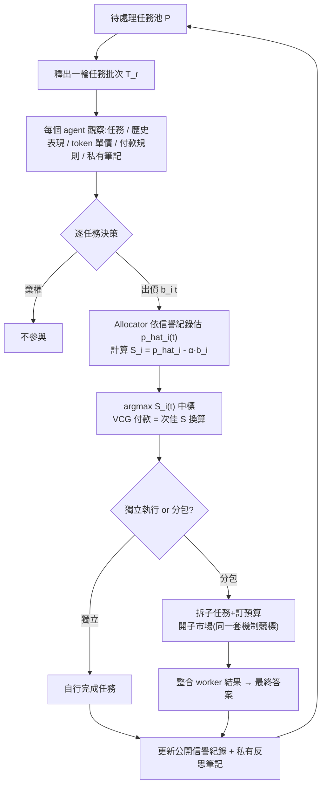

#paper

[Markets, Not Planners: Decentralized Orchestration of LLM Agents with Private Information](https://arxiv.org/abs/2608.23867)

> arXiv:2608.23867v1 ｜ 2026-08-24 ｜ cs.MA / cs.CL
> 作者:Xiao Liu, Haoyang Li, Songwei Li, Hongbo Fang, Fengli Xu, Feng Shi, James Evans

---

# 一、問題與定位 (Problem & Positioning)

LLM agent 生態越來越像「經濟體」而非「呼叫子程式」:不同單位打造的 agent 有不同能力與成本,誰該接哪個任務、何時該多個 agent 協作,變成一個**分配問題**。論文設定了一個貼近現實的資訊限制:

- 平台(orchestrator)只能觀察 agent 的**過去表現紀錄**,無法直接看到 agent 對「新任務」的**私有執行成本**(execution cost)。
- 平台有一個預先給定的 **cost sensitivity α**,要在「任務成功率」與「執行成本」間取捨做分配。

**現有做法(集中式 planner/router)的三個缺陷**:

1. **假設完全資訊**:要求 planner 直接掌握所有 agent 的成本與能力,但成本本質是私有的。
2. **容易被操縱/偏誤**:單一決策點,插入偏好就能大幅扭曲分配。論文做了驗證性實驗——只在集中式 LLM allocator 的 system prompt 裡插入「偏好某 agent」,不改任務內容,該 agent 的任務占比就從 **34% 飆到 62%**;插入「偏好貴的分配」,平均執行成本從 **$0.014 漲到 $0.018**/任務。
3. **資訊處理瓶頸**:agent 數與任務數增加時,要求單一 allocator 推斷所有分散資訊,違反 bounded rationality 的經典限制(Simon 1955;Arrow & Hurwicz 1958)。

> 直覺:這不是「要不要 allocator」的問題,而是「資訊該集中處理還是分散決策」的問題。作者的解法呼應 Hayek (1945) 的核心洞見——**市場讓參與者用出價/價格局部通訊私有資訊**,不需要一個全知的中央規劃者。

**定位**:不是取消 allocator,而是把「私有資訊」與「參與決策」下放給 agent 自己,allocator 只根據**送出的出價 + 公開信譽紀錄**做選擇。

---

# 二、方法:AgentLance 框架

## 2.1 問題形式化

- 任務序列 $T=\{t_1,\ldots,t_m\}$、agent 池 $A=\{a_1,\ldots,a_n\}$,任務分批(market round)釋出。
- 每個任務 $t$ 有公開輸入 $x_t$、隱藏參考答案 $y_t$(只用於評分)。
- 平台知道 agent 的歷史表現,但不知道其對新任務的成本;agent 自己知道輸入/輸出 token 單價,可估算預期成本。
- 給定成本敏感度 $\alpha>0$,最終分數定義為

$$\mathrm{Score}(t)=\mathbf{1}\{\mathrm{Correct}(\hat{y}_t,y_t)\}-\alpha\,\mathrm{Cost}(t) \tag{1}$$

$\alpha$ 越大,代表每一塊錢成本被扣得越重,平台目標是最大化平均 Score。

## 2.2 Labor Agent 參與與出價 (Bidding)

每輪,每個 agent 觀察:可用任務、自己的表現歷史、輸入/輸出 token 單價、付款規則、**私有策略筆記(reflective notes)**。基於這些資訊,agent 對每個任務估算成本與適配度,決定:

- **參與並出價** $b_i(t)$(要求的報酬),或
- **棄權**(認為任務不適合/不划算)。

> 直覺:出價是 agent 把「私有成本估計」洩漏給市場的唯一管道——平台看不到成本本身,只看得到出價這個訊號。

**私有策略筆記**會記錄任務類型的強弱項、成本估計的規律、有效出價區間、何時該棄權,並在每輪市場結束後更新。

## 2.3 分配與 [[VCG Mechanism (Vickrey-Clarke-Groves)|VCG]] 式付款

Allocator 對每個出價者估計成功機率 $\hat{p}_i(t)$,依據任務內容 + 該 agent 的**公開信譽紀錄**(過去任務與成敗)。

**分配分數**:

$$S_i(t)=\hat{p}_i(t)-\alpha\,b_i(t)$$

**中標者**:$i^*(t)=\arg\max_{i\in\mathcal{B}(t)} S_i(t)$ —— 誰的「預期成功 − 出價成本」權衡最好就得標。

**[[VCG Mechanism (Vickrey-Clarke-Groves)|VCG 式付款]]**(由次佳分配分數決定,而非中標者自己的出價):

$$S^{\max}_{-i^*}(t)=\max\Big(\{0\}\cup\{S_j(t): j\in\mathcal{B}(t)\setminus\{i^*\}\}\Big) \tag{2}$$

$$\mathrm{pay}_{i^*}(t)=\frac{\hat{p}_{i^*}(t)-S^{\max}_{-i^*}(t)}{\alpha} \tag{3}$$

> 直覺(為什麼要 VCG 而不是「贏家出多少付多少」):付款不是你自己喊的價,而是「你不存在時,次好選擇會留下的分數缺口」換算回來的錢。這樣一來,**出價低於真實成本 → 冒著虧本執行的風險;出價高於真實成本 → 冒著丟失有利可圖工作的風險**——唯一的穩定策略是誠實報出你的預期成本。這是拍賣理論裡 second-price / Clarke pivot rule 的經典結果(Vickrey 1961;Clarke 1971;Groves 1973),論文把它搬進 LLM agent 市場。

## 2.4 執行與分包 (Subcontracting)

中標的 primary-market winner 預設**獨立執行**任務。但對於多步驟的複雜任務,winner 可以改當「manager」:

1. 把任務拆成子任務,幫每個子任務訂預算,開一個**子市場**。
2. 其他 labor agent 在子市場用**同一套分配 + VCG 付款規則**競標子任務。
3. 被選中的 worker 回傳結果,manager 統整成最終答案。

**約束**:子任務預算總和不能超過 manager 在主市場拿到的付款,否則分解被拒絕、退回獨立執行;若沒有任何 worker 被選中,也退回獨立執行。

利潤計算:
- 獨立執行:成本 = winner 自己的模型使用成本。
- 分包執行:成本 = manager 的規劃/整合成本 + 所有被選 worker 的執行成本。
- Manager 利潤 = 主市場付款 − worker 付款 − 自己的規劃/整合成本;Worker 利潤 = 子市場付款 − 執行成本。

> 直覺:這其實是把 Babbage (1832) 的「按技能等級分工降低生產成本」原則,用同一套市場機制遞迴套用到 agent 協作上——不需要另外設計一套「多代理協調協定」,分包只是「再開一次同樣的市場」。

## 2.5 信譽與筆記更新

- **公開信譽紀錄**:每輪結束後,把「誰執行了什麼任務、成不成功」寫進該 agent 的公開紀錄,供未來 allocator 估計 $\hat{p}_i(t)$。
- **私有反思筆記**:agent 根據自己的出價、輸贏、付款、實際成本、利潤、任務結果更新筆記,且被要求記錄**通則性的策略/警示**而非個案細節——避免筆記膨脹成流水帳。

## 2.6 整體流程

---

# 三、實驗設計

**任務套件**(四個互補基準,各抽 100 題:25 題暖身 + 75 題評測):

| 基準 | 類型 |
| --- | --- |
| OlympiadBench | 競賽級數學推理 |
| BigCodeBench | 程式碼生成 |
| SuperGPQA | 知識密集型 QA(285 個研究所學科) |
| GAIA | 多步推理 + 工具使用(agentic) |

暖身題只用來初始化信譽紀錄,不計入報告分數。

**Agent 池**:GPT-5 nano、Grok 4.3、Gemini 3 Flash、DeepSeek-V3.2(四個模型家族,能力與成本都不同)。**Allocator 一律用 GPT-5 mini**,每輪釋出 4 個任務;**分包只在 GAIA 上啟用**(因為 GAIA 才明確需要多步驟)。

**三類基線**:
- **Single Model**:固定指派給單一模型(含 4 個固定模型 + per-α 挑最佳的 oracle)。
- **Centralized Orchestrator**:Centralized LLM Planner、IRT-Router (Song et al. 2025)、CARROT (Somerstep et al. 2025)——注意這些集中式方法都被**額外給予成本資訊**(市場方法裡這是對 allocator 私有的)。
- **Labor Market**:MarketBench (Fradkin & Krishnan 2026) 的兩個變體(direct cost estimation / self-knowledge bidding)。

所有 LLM-based allocator 統一用 GPT-5 mini,temperature=0,三次獨立跑分取平均。

---

# 四、市場行為是否符合預期?

在跑完整市場前,先用簡化的兩 agent 場景驗證機制設計是否奏效(這兩實驗都關閉分包,只看主市場分配):

**專長對應分配**:Gemini 3 Flash 與 DeepSeek-V3.2 兩者互補——Gemini 在 SuperGPQA 準確率較高(0.64 vs 0.55),DeepSeek 在 GAIA 較強(0.27 vs 0.20),α=1。結果市場把 **89.2% 的 SuperGPQA 任務分給 Gemini、77.6% 的 GAIA 任務分給 DeepSeek**——不是「全部給全域最強者」,而是依任務類型對應到強項。

**成本敏感分配**:GPT-5 nano 與 Grok 4.3 在 OlympiadBench/BigCodeBench 上,Grok 較準(0.76 vs 0.61)但 GPT-5 nano 便宜很多($0.0014 vs $0.0045)。隨 α 從 1 拉到 100,GPT-5 nano 的任務占比從 **3.3% 單調上升到 70.7%**——α 低時市場偏好準確度,α 高時逐步把工作轉向便宜的 agent。

> 直覺:這兩個小實驗本質是「機制健全性檢查」——先確認 S_i = p̂ᵢ − α·bᵢ 這個分配分數的方向性行為正確,再去看整體多 agent 市場的績效數字才有意義。

---

# 五、主要結果

## 5.1 Table 1:不同 α 下的整體表現

Score(%) = Acc − α × Cost

| Method | α=1 | α=2 | α=5 | α=10 | Average |
| --- | --- | --- | --- | --- | --- |
| GPT-5 nano | 44.6 | 44.1 | 42.8 | 40.6 | 43.0 |
| Grok 4.3 | 56.3 | 54.5 | 49.3 | 40.5 | 50.1 |
| Gemini 3 Flash | 56.5 | 52.9 | 42.3 | 24.6 | 44.1 |
| DeepSeek-V3.2 | 52.1 | 50.1 | 44.3 | 34.7 | 45.3 |
| Best Single Model (per α) | 56.5 | 54.5 | 49.3 | 40.6 | 50.1 |
| Centralized LLM Planner | 55.1 | 54.3 | 48.2 | 42.0 | 49.9 |
| IRT-Router | 52.7 | 50.1 | 44.3 | 34.7 | 45.4 |
| CARROT | 55.9 | 54.4 | 50.0 | 46.1 | 51.6 |
| MarketBench (direct) | 55.3 | 51.8 | 41.0 | 23.5 | 42.9 |
| MarketBench (self-knowledge) | 49.9 | 49.1 | 47.3 | 44.0 | 47.6 |
| **AgentLance w/o subcontract** | 56.3 | 55.3 | 51.6 | 45.6 | 52.2 |
| **AgentLance w. subcontract** | **57.6** | **56.2** | **54.8** | **48.4** | **54.2** |

重點解讀:

- AgentLance(無分包)平均已是所有基線中最高,勝過集中式 orchestrator——顯示**分散式參與決策比集中式決策更能利用分散資訊**,即使集中式方法額外拿到成本資訊。
- 相對 per-α 最佳單一模型 oracle,AgentLance 的優勢**隨 α 增大而擴大**:α=1 時略輸 oracle,α=10 時領先 **5.0 個百分點**——市場化配置在成本權重越重時越有價值。
- 開啟分包後,**每個 α 都進一步提升**,平均從 52.2 → 54.2,在四個 α 上都是最佳,對所有基線的平均提升**統計顯著(p<0.05)**。在有觸發分包的任務子集上:準確率 **+27.3%**、成本 **−64.1%**。
- 明顯落後的是兩個 MarketBench 變體——說明「有市場的概念」不代表市場設計有效,AgentLance 的**公開信譽紀錄 + 私有反思筆記 + VCG 付款**三件套才是關鍵。

## 5.2 Table 2:消融實驗(含 [[VCG Mechanism (Vickrey-Clarke-Groves)|VCG]] 付款規則消融)

| Method | α=1 | α=2 | α=5 | α=10 | Avg. |
| --- | --- | --- | --- | --- | --- |
| AgentLance w/o subcontract | 56.3 | 55.3 | 51.6 | 45.6 | 52.2 |
| w/o Reflective Notes | 55.3 | 51.7 | 50.9 | 36.5 | 48.6 |
| w/o VCG-style Payment | 50.7 | 55.1 | 45.6 | 47.5 | 49.7 |

- 拿掉私有反思筆記:每個 α 都變差,平均 52.2→48.6。agent 仍能看到近期結果與信譽摘要,但**無法把過去經驗累積成一致的出價策略**。
- 拿掉 VCG 付款(改成「贏家付自己出的價」,分配規則不變):平均降 2.5%(→49.7),顯示 critical payment 對「有效出價 + 有效分配」都有幫助——這正是機制設計理論預期的效果。

---

# 六、診斷市場失靈與改進空間

雖然 AgentLance 全面勝出,作者進一步找出市場**尚未完美運作**的兩個瓶頸。

## 6.1 瓶頸一:成本估計不準

| 模型 | Correlation (direct) | MAPE % (direct) | Correlation (+history) | MAPE % (+history) |
| --- | --- | --- | --- | --- |
| GPT-5 nano | 0.091 | 2307.6 | 0.126 | 336.4 |
| Grok 4.3 | 0.141 | 219.4 | 0.158 | 140.8 |
| Gemini 3 Flash | 0.208 | 113.5 | 0.134 | 309.2 |
| DeepSeek-V3.2 | 0.299 | 350.3 | 0.354 | 615.7 |

即使 agent 知道自己的 token 單價、也能看到歷史任務成本,對「這個新任務會花多少錢」的預測仍**相關性極低(0.09–0.35)、誤差極大(MAPE 一百多到兩千多%)**。給歷史成本資訊也不是穩定的解方——有些模型變好、有些變差。這與其他研究觀察一致(Bai et al. 2026;Lin et al. 2026)。

## 6.2 瓶頸二:出價策略未收斂到最優

VCG 機制下的理論最優策略是「誠實出價 = 自己估計的成本」。作者用 gpt-5-mini 分類 agent 的反思筆記,統計提及「cost-truthful bidding」策略的比例:**從市場初期 47.9% 上升到後期 66.7%**——agent 確實逐漸學到這個策略,但**約三分之一的筆記到最後都還沒提及**,適應並不完全。

## 6.3 Table 3:受控介入實驗

$\Delta$ = 介入設定 − 原始 AgentLance(百分點)

| 修正成本估計 | 修正出價策略 | Δ(α=1) | Δ(α=2) | Δ(α=5) | Δ(α=10) |
| --- | --- | --- | --- | --- | --- |
| ✓ | ✗ | −1.0 | −0.9 | +1.9 | +4.8 |
| ✗ | ✓ | +1.6 | −2.2 | −1.1 | −11.4 |
| ✓ | ✓ | +1.5 | +2.5 | +5.4 | +7.7 |

- **只修正成本估計**:α 越大幫助越大(成本資訊在高成本敏感市場中權重更大),但在低 α 時反而沒用甚至略負。
- **只修正出價策略**(強制 cost-truthful bidding):α 低時有幫助,但 α 越高**傷害越大(α=10 時 −11.4)**——因為這時策略是建立在**不準的成本估計**之上,理論上「最優」的策略反而放大了估計誤差對分配的傷害。
- **兩者一起修正**:在所有 α 下都**一致提升**(+1.5 / +2.5 / +5.4 / +7.7)——說明**準確的成本估計與誠實出價策略是互補的**,只修一邊可能沒用甚至反效果。

> 直覺:這是這篇論文最有意思的發現之一——「教 agent 用正確的博弈論策略」本身不是萬靈藥,如果它依賴的私有訊號(成本估計)本身是錯的,理論上最優的策略反而會**更精確地把錯誤訊號傳導進分配決策**。兩個瓶頸必須聯合解決。

## 6.4 私有筆記裡都在寫什麼(Figure 4)

把最終筆記切成片段、用 TF-IDF 抽關鍵詞歸納主題,再用 GPT-5-mini 分類:

| 主題 | 占比 |
| --- | --- |
| Task fit(任務適配) | 34.7% |
| Success & reputation(成敗與信譽) | 22.3% |
| Auction positioning(競標定位) | 21.4% |
| Cost & payment(成本與付款) | 10.3% |
| Risk & abstention(風險與棄權) | 9.7% |

**任務適配是最大主題**,agent 主要在記「我適合做什麼」,而**成本與付款只占一成**——與前面「成本估計/出價策略」是瓶頸的發現相互印證:agent 的注意力並沒有充分放在市場機制真正需要它們做好的那件事上。

## 6.5 Agent 真的賺得到錢嗎?

在有分包的完整市場中,多數 agent 隨市場輪次**逐步累積利潤**,說明市場參與是有效且持續的。但獲利並不均等——**Grok 4.3 在幾乎每個 α 下累積利潤最高**,顯示利潤主要流向「常拿到主任務或分包工作」的 agent(附錄 Figure D.1)。

---

# 七、相關工作定位

- **Orchestration of Multi-Agent Systems**:分成 model routing(FrugalGPT、IRT-Router、CARROT 等——集中式路由,把候選模型當被動選項)與 multi-agent coordination(MetaGPT、ChatDev 等人工角色分工,或近期自動優化 prompt/拓撲/工作流的方法)。AgentLance 主要對標前者(主市場即路由),再用 subcontracting 擴展出多代理協調能力。
- **Economic Mechanisms for LLM Agents**:多數先前工作把 LLM agent 當「模擬經濟行為的沙盒」(如 Horton et al. 2023 模擬個體經濟決策),或用經濟機制做去中心化信用分配 / agent 演化(Economy of Minds, Qi et al. 2026)。**最相關的是 MarketBench**(Fradkin & Krishnan 2026)——同樣測 LLM agent 能否用市場機制估算自身能力/成本,但其評測侷限在軟體工程任務,且市場配置**輸給集中式方法**。AgentLance 用更完整的機制設計(VCG 付款、信譽+筆記、分包)證明市場配置**可以贏過集中式方法**,同時系統化找出瓶頸。

---

# 八、限制 (Limitations)

- **成本自估仍不可靠**:即使有歷史資料輔助,相關性最高也只有 0.354,這是目前 LLM agent 市場設計的核心硬傷,論文也承認只是「diagnosing」而非解決。
- **出價策略學習不完全**:約 1/3 的 agent 到市場末期仍未學會 cost-truthful 策略,且純靠 prompt/筆記自我修正的效果有限(甚至可能反效果,見 Table 3)。
- **評分函數未考慮市場通訊開銷**:論文明確說明只算任務執行成本,不計市場溝通(出價、協商往返)的 token 開銷,理由是「相對複雜任務而言是次要的」,但作為概念驗證,實際部署時這部分成本未必可忽略。
- **場景規模有限**:單一 allocator(GPT-5 mini)貫穿所有方法、4 個模型的封閉池、每個基準僅 100 題,尚未驗證在更大 agent 池、動態加入/退出、對抗性 agent(例如刻意亂出價)下的穩健性。
- **分包只在 GAIA 上開啟**,尚未看到分包機制在其他任務類型上是否同樣有效或有不同的失敗模式。

---

# 九、重點摘要 (Takeaways)

- 集中式 LLM 分配器有三個結構性缺陷:**假設完全資訊、單點易被操縱(34%→62% 的偏誤實驗很有說服力)、隨規模擴大出現資訊瓶頸**。
- **AgentLance = 重複賽局的勞動市場**:agent 用私有成本 + 反思筆記出價 → allocator 依出價 + 公開信譽選贏家 → **VCG 式付款**誘導誠實出價 → 複雜任務可**遞迴分包**(用同一套機制開子市場)。
- 在四個異質基準上,AgentLance 全面勝過單一模型、集中式 orchestrator、既有市場基線(MarketBench),且**優勢隨成本敏感度 α 增大而擴大**;分包再帶來額外增益(尤其 GAIA 這類多步任務)。
- 消融證明**反思筆記**與**VCG 付款**都是必要成分,拿掉任一個都掉分。
- 診斷發現兩個尚未解決的瓶頸——**成本自估不準**、**出價策略未完全收斂**——且兩者必須**聯合修正**才會穩定帶來增益,單獨修正甚至可能有害。

---

# 十、這篇研究可能的啟發 (Inspirations)

**對多代理編排設計的啟發**
- 與 [[Agent Laboratory]] 的「角色化流水線 + solver 迭代」相比,AgentLance 提供了另一條完全不同的協調哲學:不是設計更聰明的中央規劃者,而是**設計正確的激勵機制讓分散決策自然收斂到好結果**。兩者可以互補——solver 類方法解決「單一 agent 怎麼把一件事做好」,市場類方法解決「一群異質 agent 之間怎麼分工」。
- 分包(subcontracting)本質是把「任務分解 + 多代理協調」問題,重新表述成「遞迴地再開一次同樣的拍賣」——這比手工設計協調協議(如 [[Recursive Multi-Agent Systems (RecursiveMAS)]] 或 MetaGPT 式固定角色分工)更具可擴展性,值得在自己設計多代理系統時考慮:**能否把「協調」問題化約成「重複賽局」問題**,而不是為每種協作模式手刻邏輯。

**對成本/路由類工作的啟發**
- 「LLM agent 對自己執行成本的估計極不準確(相關性 <0.36)」是一個獨立於本篇市場設計、本身就很有價值的實證發現——任何依賴 LLM 自報 token 用量/成本做決策的系統(路由、預算控制、資源調度)都該警惕這一點,可能需要外部校準機制而非單純問模型「這個任務要花多少」。
- Table 3 的交互效應(單獨修正 strategy 在高 α 時反而 −11.4)提醒:**在教 agent 遵循博弈論最優策略之前,要先確保它賴以決策的私有訊號本身夠準**——否則「更聰明的策略」只是把雜訊放得更大聲。這對任何想用 prompt/微調讓 LLM agent 學會「策略性行為」的工作都是一個重要的前置檢查點。

**未解問題**
- 若允許 agent 動態加入/退出市場、甚至存在惡意/勾結出價的 agent,VCG 機制在此設定下的抗操縱性如何?論文只驗證了集中式 planner 的偏誤脆弱性,尚未對市場機制本身做同等程度的紅隊測試。
- 市場通訊開銷(出價、協商的 token 成本)在什麼規模下會由「可忽略」變成「不可忽略」?這會決定 AgentLance 這類機制能否用在任務粒度更細、輪次更頻繁的場景。
