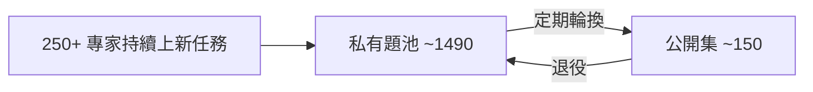

#paper

[Agents' Last Exam (ALE)](https://arxiv.org/abs/2606.05405)

> arXiv:2606.05405v2 ｜ 2026-06-11 ｜ cs.AI / cs.CL / cs.LG
> 作者:Yiyou Sun、Xinyang Han、Weichen Zhang、Yuanbo Pang 等 310 位作者(學界 + 業界)
> 與 **250+ 產業專家**合作建構

---

# 一、問題與定位 (Problem & Positioning)

近年 AI 在各種 benchmark 上分數很高,但這些成績**沒有轉化成各專業領域實際可部署、有經濟價值的產出**。作者主張:這個落差**主要是「評測問題」** —— 現有 benchmark 缺乏在**真實、有經濟價值工作流**上的持續量測。

**ALE 的定位**:一個專門評測 AI agent 在**長時程 (long horizon)、有經濟價值、真實世界、結果可驗證**任務上的 benchmark。

> 一句話:不是再做一個 leaderboard,而是當「**縮小 benchmark 成功與 GDP 級實際影響之間落差**」的量測工具。

---

# 二、任務分類體系 (Taxonomy)

以美國聯邦職業分類標準 **O*NET / SOC 2018** 為基礎,涵蓋**非物理性 (non-physical)** 產業:

- **13 個產業群 (industry clusters)** × **55 個子領域 (sub-fields)** × **1K+ 任務**。
- 13 群:製造與工業營運、生物分子結構與設計、3D/動畫/互動媒體、機器人與自主系統、商業營運、法律、教育、農業/環境、計算數學、工程、健康/醫療、音訊製作、視覺與媒體藝術。

---

# 三、任務怎麼來、怎麼驗證 (Construction & Verification)

## 建構:五道關卡 (five-gate)
任務來自 250+ 產業專家**提交自己真實完成過的專案**,經過:① 專家招募 → ② 提交任務(AI 輔助精修) → ③ 初審(會議式 accept/reject 決議) → ④ 工程實作 + dry-run → ⑤ 專家委員會最終 QC。

## 驗證:刻意少用 LLM-as-judge
**有確定性檢查就不用 LLM 評分**。每個任務用一份 `main.py` 規格,含三個生命週期函式(load / start / evaluate)。評分手段組合:

- 精確值 / 雜湊值比對
- 結構化數值欄位 + manifest 驅動的容差 (tolerance)
- 幾何距離
- vision-LLM judge(只做**窄域 yes/no 探針**,不做整體主觀評分)
- 固定輸入軌跡下的**世界狀態 (world-state) 行為檢查**

> **核心模式「Gate-and-score」**:先過二元前置條件 (gate),過了才評品質指標;**gate 沒過 → 整題 0 分**。這讓「看起來有做」但實質沒達標的產出無法蒙混。

---

# 四、難度分層 (Difficulty Tiers)

公開集 152 題,依預算與能力分三層:

| 層級 | 題數 | 特性 |
| --- | --- | --- |
| **Near-Term** | 67 | 當前前沿 agent 約 ~40% 通過;適合快速迭代 |
| **Full-Spectrum** | 55 | 每個子領域 ≥1 題,確保覆蓋面 |
| **Last-Exam** | 38 | 最難工作流,**多數 agent 0% 通過**;留作里程碑評測 |

---

# 五、評測對象 (Harnesses & Backbones)

- **Harness(11 種)**:Codex、ALE-Claw、Claude Code、Cursor、Droid、Gemini CLI、OpenClaw、OpenHands、ForgeCode、Hermes、Terminus。
- **Backbone 模型**:GPT-5.5 / 5.4、Claude Opus 4.8 / 4.7 / 4.6、Claude Sonnet 4.6、Gemini 3.1 Pro、DeepSeek V4 Pro、Qwen、GLM 5.1、Kimi K2.6、MIMO v2.5、Grok 4.3。
- **統一介面**:全部統一成 **Generalist CUA(電腦使用 agent)**,透過「GUI-as-Tool」—— 一座統一 MCP 橋,在主推理迴圈中暴露 **14 個桌面操作工具**。

---

# 六、主要發現 (Key Findings)

| 指標 | 結果 |
| --- | --- |
| **最難層 (Last-Exam) 平均完整通過率** | **< 1%**(遠未飽和) |
| Near-Term 最佳 agent | ~24% 通過 |
| Last-Exam:Codex + GPT-5.5 | **完整通過 0%**,平均分僅 11.2% |
| ALE-CLI 子集:Codex + GPT-5.5 | 23.3% 通過(同組在 Terminal-Bench 有 82%)→ ALE **顯著更難** |
| **模型 vs. harness 影響** | 換 **基礎模型** 帶來約 **3×** 的表現差距,遠大於換 harness |
| 領域差異 | 計算數學 / 農業 55–85% 平均分;**教育 < 25%** |

**失敗類型(Claude Code + Opus 4.7)**:約 **75% 失敗集中在「理解 (Understanding)」與「方法 (Approach)」** → 瓶頸是**領域知識,不是執行力**。

**GUI 利用不足**:34% 公開任務指定圖形軟體為主工具,但各配置 GUI 使用率都偏低 —— agent 傾向退回 CLI 替代方案,而**缺乏專業領域知識**。

---

# 七、Living Benchmark(防汙染的活體 benchmark)

- 只公開約 **10%**(150 / 1,490)實例,其餘私有。
- **滾動評測**:私有題定期輪換進公開集,退役的公開題被替換 → 維持一塊**未被汙染**的評測面,跨世代模型都能公平比。
- **代表性驗證**(Appendix D.1):實證公開子集能反映完整池的分布。
- 任務池**隨新工作流與新產業持續擴充**。

---

# 八、重點摘要 (Takeaways)

- **評測即瓶頸**:作者把「AI 有用但沒落地」重新框成評測問題,並用真實職業工作流去逼近經濟價值。
- **可驗證優先**:Gate-and-score + 確定性檢查,刻意壓低 LLM-as-judge 的角色,降低評分被操弄/高估的風險。
- **最難層 < 1%**:當前最強組合在真實長時程任務上幾乎全軍覆沒,證明 benchmark 還很有頭。
- **模型 > harness**:基礎模型差異(~3×)主導表現,harness 工程其次。
- **領域知識是牆**:失敗主要來自不懂這行,而非不會操作。

---

# 九、這篇研究可能的啟發 (Inspirations)

> 以下是這篇對後續研究 / 自己工作可能的啟發方向。

## 1. 評測設計層面
- **「Gate-and-score」是可複用的評分骨架**:任何開放式產出評測,都可先設**二元硬門檻**(必過的客觀前置條件),過了才談品質分。能有效防止「形似但實質沒達標」的產出拿到部分分 —— 與 [[Agent Laboratory]] 觀察到的「自動審稿系統性高估 −2.3 分」正好互補:**ALE 用確定性 gate 把 LLM judge 的權重壓到最低**。
- **可驗證性 (verifiable outcome) 應是選題的第一原則**:真實任務若無法寫出確定性 evaluate,就不該進 benchmark。這對設計任何 agent RL 環境的 reward 也適用 —— 先問「結果可不可驗證」,再問「任務有不有趣」。
- **Living / 滾動 benchmark 對抗資料汙染**:公開 10% + 私有輪換,是面對「模型每季更新、benchmark 很快被刷爆/被訓練資料汙染」的務實解。任何長期維護的評測都值得借這套「公開子集 + 私有底池 + 代表性驗證」結構。

## 2. Agent 能力研究層面
- **瓶頸在領域知識而非執行**(75% 失敗屬理解/方法)→ 指向「**領域知識注入**」比「再強化 tool-use / 規劃」更值得投資:RAG over 專業語料、領域微調、專家 in-the-loop。這是一個明確、可量化的研究缺口。
- **模型 > harness(~3× vs harness 差異小)**:提醒做 agent 框架的人別過度工程化 harness;**先換更強的 backbone**,harness 的邊際效益有限。呼應 [[Agent Laboratory]] 與 [[Crafter]] —— harness 設計重要,但天花板由基礎模型決定。
- **GUI 利用不足是真實缺口**:34% 任務需要 GUI、agent 卻退回 CLI。→ 「**真正會用專業圖形軟體**」(CAD、DAW、剪輯、生信工具…)的 computer-use agent 是尚未被攻克、且經濟價值高的方向。

## 3. 方法論 / 框架層面
- **以職業分類 (O*NET/SOC) 為座標系**:用既有的官方職業分類來定義 benchmark 覆蓋面,是把「AI 能力」對映到「經濟/GDP 影響」的聰明錨點。任何想宣稱「通用能力」的評測都可借此論證代表性,而非自己拍腦袋列任務。
- **專家提交「自己真做過的專案」**:任務真實性來自 real practitioner 的歷史工作,而非眾包標註者想像的題目 —— 對想建高品質、抗 gaming 資料集的人是值得抄的 sourcing 策略。
- **長時程任務揭露的是「累積誤差」**:< 1% 完整通過率說明真正難的是**端到端不出錯**,而非單步能力。未來研究值得聚焦在 agent 的**錯誤偵測 / 自我回復 / best-so-far 回退**(與 [[Crafter]]、[[Agent Laboratory]] 的 solver 迴圈同源)。
