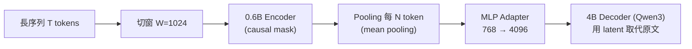

#paper

[End-to-End Context Compression at Scale](https://arxiv.org/abs/2606.09659)

> arXiv:2606.09659v1 ｜ 2026-06-08 ｜ cs.CL / cs.AI / cs.LG
> 作者:Ang Li、Sean McLeish、Tom Goldstein、Micah Goldblum、Pavel Izmailov 等
> 提出 **Latent Context Language Models (LCLM)**

---

# 一、問題與定位 (Problem & Positioning)

長上下文推論的瓶頸是**記憶體**:KV cache 隨上下文長度線性成長。現有 KV cache 壓縮法的痛點:

- 要嘛**嚴重掉品質**,要嘛壓一個長 prompt 就要花**大量時間/算力**。
- 多數方法要求輸入**先塞得進目標模型的 context window**,且**和現代 production 推論引擎不相容**。

**Encoder-decoder 壓縮器**(把長 token 序列映射成較短的 latent embedding,再餵給 decoder)原則上是更好的方案,但**過去的版本在「準確率-效率」前緣上打不過 KV cache 壓縮**。

**本文目標**:重新檢視 encoder-decoder 壓縮,**把這個差距補上** —— 透過架構搜尋 + 大規模續訓,做出在「通用任務表現 × 壓縮速度 × 峰值記憶體」三軸上推進 Pareto 前緣的 **LCLM**。

---

# 二、架構設計 (Architecture)

長序列 → 壓縮 latent → decoder 消費,三段式:

- **Encoder**:輸入切成大小 `W`(預設 1024)的窗,每窗過 0.6B encoder 產生 hidden states。
- **Pooling / 壓縮**:對每 `N` 個 token 做池化(壓縮比)。試了三種:token-based(EOS pooling)、mean pooling、concatenation → **mean pooling 在高壓縮比(16×)最佳**。
- **Adapter + Decoder**:MLP adapter 把表徵從 encoder 維度 768 投影到 decoder 維度 4096,decoder(4B Qwen3)推論時**用 latent token 取代原始上下文**。
- **壓縮公式**:`T` 個輸入 token → `⌈T/N⌉` 個 latent token。壓縮比 4:1、8:1、16:1。

---

# 三、架構搜尋的關鍵發現 (Architecture Search)

作者在 **38B token** 的小規模上做**從零預訓練**的控制變因實驗(一次只改一個設計軸、其餘固定),先把架構定下來,再放大續訓。四個關鍵軸:

## 1. Pooling:怎麼把 N 個 token 壓成 1 個 latent
要把每 `N` 個 encoder hidden state 聚合成 1 個 latent,比較三種做法:
- **token-based (EOS pooling)**:在每段尾端放一個特殊 token,只取它的 hidden state 當代表 —— 等於「叫一個 token 去總結整段」。
- **mean pooling**:把 `N` 個 hidden state**取平均**。
- **concatenation**:把它們接起來再投影。

**結論:mean pooling 最好,尤其在高壓縮比(16×)**。直覺:壓縮比越高、每個 latent 要扛的資訊越多,讓單一 token 去濃縮(EOS)就越吃力;平均能更均勻地保留整段資訊。低壓縮比時 concatenation 可與之打平。

## 2. 窗大小 W:encoder 一次看多長
encoder 把輸入切成大小 `W` 的窗、逐窗處理(窗之間互不看見)。
- **`W=1024` 明顯優於 `W=N`(=16)**:這裡 `W` 是 encoder 一次看的 token 數,`N` 是壓縮比(每 `N` 個 token 壓成 1 個 latent)。`W=N` 代表「窗大小=壓縮單位」,也就是 encoder 一次只看 16 個 token、看完馬上把這 16 個壓成 1 個 latent —— 壓縮前**根本沒看到前後文**,只憑這 16 個 token 本身就要濃縮,品質自然差。`W=1024` 則是先在 1024 個 token 的範圍內充分理解,再每 16 個壓成 1 個,壓出來的 latent 帶有更完整的脈絡。
- 相較更小的 `W=256`,用 `W=1024` 的**額外計算開銷很小**,卻能讓 encoder 在更大範圍內理解後再壓縮 → 划算。
- 代價是跨窗邊界的資訊會被切開(見第七節限制)。

## 3. Encoder attention:causal vs bidirectional(反直覺)
一般 encoder 直覺會用**雙向 (bidirectional)** attention(每個 token 看得到前後文)。但實驗發現 **causal masking(只看左邊)一致取得更低的預訓練 loss**,即使壓縮發生在 decode 之前、本來不需要自迴歸。
- 可能原因:**與下游 decoder(本身就是 causal)的表徵分布一致**,比理論上更完整的雙向資訊更重要;latent 餵進 causal decoder 時銜接得更自然。

## 4. Adapter:latent 怎麼接到 decoder
adapter 負責把 latent 從 encoder 維度(768)投影到 decoder 維度(4096)。比較:
- **MLP-only** vs **attention-based adapter**。
- **MLP-only 勝出**:loss 更低、且**更省算力**。額外加 attention 並沒換到更好的表徵,反而更貴 → 呼應 ponytail 式判斷:能用簡單投影就別堆複雜模組。

> **一句話總結這四點**:壓縮要均勻(mean)、壓縮前要先給足上下文(W=1024)、表徵要對齊 decoder(causal)、接線越簡單越好(MLP)。

---

# 四、訓練配方 (Training Recipe)

**四階段續訓**,每個壓縮比模型總計 **350B+ tokens**(序列長 16,384,batch 4M tokens):

| 階段 | 訓練元件 | Peak LR | Token 預算 |
| --- | --- | --- | --- |
| 0 Adapter | 只訓 adapter | 1.0e-3 | 38.83B |
| 1 Encoder | encoder + adapter | 6.0e-5 | 77.65B |
| 2 續訓 (CPT) | 全部元件 | 1.0e-5 (LLM) | 182.51B |
| 3 SFT | 全部元件 | 3.0e-5 (LLM) | 51.05B |

- **資料混合**(~283.78B):Nemotron CC 文本 30.38%、Code 16.90%、Reasoning 17.17%、長上下文 2.84%、**重建輔助任務 17.23%**、壓縮 prompt 的 SFT 25.49%。
- **關鍵技巧:interleaved 壓縮格式** —— 續訓時在序列中**交錯**壓縮段與未壓縮段(而非「前半壓縮」),且**只在未壓縮 token 上算 next-token loss**。

---

# 五、給長時程 Agent 的自適應展開 (Adaptive Expansion)

把壓縮做成「**先略讀、需要時再展開**」:

- 輸入切成 512-token chunk,每 chunk 壓縮並給一個整數 id。
- Agent 收到**整段壓縮序列** + 一個 `EXPAND(i)` 工具,可在每一步呼叫,工具回傳第 `i` 個 chunk 的**原始未壓縮文字**。
- **效果**:在 NIAH(大海撈針)檢索任務上,帶選擇性展開的 agent 逼近未壓縮表現,遠勝 16× 壓縮基線 —— exact-match 從 **~40% 拉到 ~90%**。

> 直覺:壓縮負責「便宜地掃過全文」,展開負責「對關鍵段落還原全解析度」,兩者互補。

---

# 六、實驗結果 (Results)

- **測試集**:RULER、LongBench、LongHealth、GSM8K。
- **比較基線(KV cache 壓縮)**:SnapKV、KVzip、FastKVzip、Expected Attention、Attention Matching。

| 面向 | LCLM vs 基線 |
| --- | --- |
| **TTFT(首 token 延遲)** | 各壓縮比都更快;KV 法不論壓縮比 TTFT 幾乎不變 |
| **峰值記憶體** | 16× 模型在 128K–512K token 間記憶體**幾乎持平**(encoder 主導);基線在 512K–1M 就**爆掉 141GB** |
| **準確率** | RULER/LongBench 維持接近未壓縮;高壓縮比下 GSM8K 準確率最高 |

> **記憶體平台現象**:短上下文時 encoder 處理(每批 128K token)主導記憶體;超過 ~512K 後 decoder prefill 變主導,記憶體才又上升。
> 結論:**LCLM 建立新的 Pareto 前緣** —— 壓得更快、同時維持高準確率。

---

# 七、限制 (Limitations)

- **窗邊界效應**:跨 encoder 窗邊界的資訊被切到兩次 forward;試了重疊變體,**沒改善反而更耗算力**。
- **資訊瓶頸**:只用重建資料訓練會導致**任務崩塌**(只學會重建、不會推理);純 next-token 又缺細粒度保真 → **必須兩種輔助任務並用**。
- **綁定 decoder**:只在 Qwen3-4B 上訓練/測試,對其他 decoder 的泛化未探索。
- **scaling 未充分**:0.6B encoder + 4B decoder 之外的尺度只有 Appendix 一個實驗。
- **展開要顯式工具呼叫**:沒有 demo 端到端「學出來」的自適應展開。
- **引擎整合**:量測用 HuggingFace Transformers,作者稱**相對 vLLM/SGLang 等最佳化服務是保守值**。

---

# 八、重點摘要 (Takeaways)

- **重新讓 encoder-decoder 壓縮有競爭力**:靠架構搜尋 + 350B token 續訓,在三軸 Pareto 前緣上超過 KV cache 壓縮。
- **設計準則**:mean pooling、W=1024、encoder 用 causal mask、MLP adapter、interleaved 壓縮格式 + 雙輔助任務。
- **記憶體幾乎與長度脫鉤**(encoder 主導區),長上下文服務成本結構被改寫。
- **壓縮 + 自適應展開**讓長時程 agent「略讀全文、按需還原」,檢索任務逼近未壓縮表現。

---

# 九、這篇研究可能的啟發 (Inspirations)

> 後續研究 / 自己工作可能的啟發方向。

## 1. 系統 / 推論層面
- **「壓縮 + 按需展開」是長時程 agent 的通用記憶體骨架**:與 [[Agents' Last Exam (ALE)]] 揭露的「真正難的是端到端長時程不出錯」直接呼應 —— agent 不需要把整段歷史都攤在 context 裡,**略讀壓縮版 + `EXPAND(i)` 還原關鍵段**就能兼顧成本與保真。任何做長時程 agent 記憶體的人都可借這套「latent skim + selective expand」介面。
- **記憶體與上下文長度脫鉤**(encoder 主導區持平)是很實際的服務啟示:對需要餵超長文件的應用(RAG、whole-repo、長病歷),固定壓縮比的 encoder 前端可能比動態 KV 壓縮更可預測、更好排程。

## 2. 訓練方法層面
- **雙輔助任務的張力很有啟發性**:純重建 → 任務崩塌;純 next-token → 細節流失。**「要同時學會壓縮保真與下游推理」本身是一個目標衝突**,值得作為設計任何「壓縮/蒸餾表徵」的通則:reconstruction loss 保資訊、task loss 保可用性,缺一不可。
- **interleaved 壓縮格式 + 只在未壓縮段算 loss**:是個乾淨的訓練 trick,讓模型學會「在壓縮與未壓縮上下文混雜時仍能續寫」—— 可遷移到任何 mixed-resolution context 的訓練。
- **先架構搜尋、再放大**:在 38B token 小規模做 controlled ablation 定設計,再砸 350B 續訓。對資源有限的研究者是務實範式:**別在大規模上猜架構**。

## 3. 反直覺 / 開放問題
- **encoder 用 causal mask 反而更好**:挑戰「encoder 該用 bidirectional」的直覺,暗示**預訓練分布的一致性**(decoder 是 causal)可能比理論上的雙向資訊更重要 —— 值得在其他 encoder-decoder 壓縮工作上覆驗。
- **未解的方向**:① 端到端**學出來**的自適應展開(取代顯式 `EXPAND` 工具,可用 RL);② 跨 decoder 泛化(壓縮表徵能否「即插即用」到不同 decoder);③ encoder/decoder scaling law。這些都是清楚的後續題。
- **與壓縮即蒸餾的連結**:把長上下文壓成 latent,本質是「資訊瓶頸下的有損蒸餾」。這篇的 Pareto 視角(準確率 × 速度 × 記憶體)可作為評估任何 context/memory 壓縮法的標準三軸。
