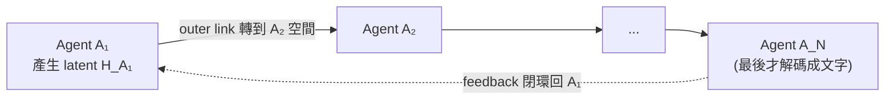

#paper

[Recursive Multi-Agent Systems](https://arxiv.org/abs/2604.25917)

> arXiv:2604.25917v1 ｜ 2026-04-28 ｜ cs.AI / cs.CL / cs.LG
> 作者:Xiyuan Yang、Jiaru Zou、Pan Lu、Hanghang Tong、Tong Zhang、James Zou 等
> 提出 **RecursiveMAS** 框架

---

# 一、問題與定位 (Problem & Positioning)

最近「**遞迴 / 迴圈式語言模型 (Recursive / Looped LM)**」成為新的 scaling 軸:不是把模型變大,而是**讓同一份模型計算在 latent state 上反覆迭代**,以加深推理。

本文把這個原則**從單一模型推廣到多代理系統**,問一個問題:
> **「代理之間的協作」本身,能不能也透過遞迴來 scale?**

**RecursiveMAS 的定位**:把整個多代理系統視為**一個統一的 latent-space 遞迴計算**。代理之間不再靠**文字**來回傳訊息,而是靠**latent state**直接傳遞 —— 省掉「解碼成文字 → 再編碼回來」的來回,既快又省 token。

---

# 二、背景:遞迴語言模型 (RLM)

RLM 把同一疊 transformer 層**重複套用 n 次**:
$$H^{(0)}=E,\quad H^{(r)}=f_\theta(H^{(r-1)}),\quad r=1,\dots,n$$
同一份權重迭代精修 latent state。RecursiveMAS 的核心類比是:**把「每個代理」當成 RLM 裡的「一層」** —— 整個多代理系統 = 一個被展開 n 輪的遞迴計算。

---

# 三、RecursiveLink:讓代理用 latent 溝通的橋

這是全篇最關鍵的輕量模組,負責兩種「狀態轉移」:

## Inner Link(代理內部)
$$\mathcal{R}_{in}(h) = h + W_2\,\sigma(W_1 h)$$
在**單一代理自迴歸生成時**,把上一步最後一層 embedding 轉換後**回饋進下一次 forward**。這讓代理產生「**latent thoughts**」—— 用連續 embedding 思考,**不必解碼成 token**。

**實際機制(取代 token 路徑)**:正常自迴歸是「`h_{t-1}` → 投影詞表 → argmax 取 token → token embedding → 當 `input_t`」;Inner Link 直接拿第 $t-1$ 步的 hidden vector $h$,經過上式轉換後**當作第 $t$ 步的輸入向量**注入,**跳過 token 這一關**。

注意那個轉換**不是純 linear,而是「residual + 一層非線性 MLP」**:$W_1 h$ 過非線性 $\sigma$ 再 $W_2$ 是個 bottleneck MLP(對 $h$ 的一點修正),前面的 $+h$ 是 **residual 跳接**(保留原向量)。residual 不只是慣例 —— 它保證 $\partial\mathcal{R}_{in}/\partial h$ 不會塌到 0,**梯度能穿過多輪遞迴不消失**(對應第六節 Thm 4.1);純 linear 或 token 路徑都做不到。

> 一句話記:**用一個帶 residual 的小 MLP,把上一步的 latent 直接接到下一步的輸入,繞掉 token 那道「不可微 + 會丟資訊」的牆。**

## Outer Link(代理之間)
$$\mathcal{R}_{out}(h) = W_3 h + W_2\,\sigma(W_1 h)$$
把**異質代理**的 latent 表徵映射到**彼此的 embedding 空間**。
- **residual 分支 ($W_3 h$)**:保留原本語意。
- **非線性分支**:對齊不同代理之間的分布差異。

**直觀理解(和一般 LLM 的差別)**:LLM B **本身完全沒改**(權重凍結),它跟任何 transformer 一樣,吃的就是「**一串輸入向量 (input embedding seq)**」。差別只在這串向量的**來源**:
- 一般 LLM:`文字 → tokenize → 查 embedding 表 → 一串 token embedding` → 餵進去
- 這裡:`A 產生的 latent thoughts(純 vector seq)→ Outer Link 投影到 B 的空間 → 另一串 vector seq` → 直接當 B 的輸入注入,**跳過 tokenize + 查表**

換句話說:**A 和 B 都是普通 LLM,RecursiveMAS 只是把「代理間本來要過文字」這段,換成「vector seq —Outer Link→ vector seq」直接灌進 B**。B 不在乎這串向量是真 token 查表來的、還是 Outer Link 算出來的,因為它本來就只吃連續向量。

> Inner vs Outer 的公式差異**正源於此**:Inner 待在**同一空間**,residual 用 identity($+h$)做微調就好;Outer 要**跨到 B 的空間**,identity 講不通,所以把 residual 換成**可學投影 $W_3 h$**(負責換空間的主幹)+ 非線性分支(對齊分布)。

> **「in-distribution latent thoughts」是什麼意思**:因為 B 是顆正常 LLM,它預期收到的向量要**長得像合法的 token embedding**。所以 Outer Link 吐出的 latent 必須**待在 B 的 embedding 語意分布內**(例如用與標準答案 embedding 的 cosine 相似度衡量),一旦飄到 out-of-distribution,對 B 來說就是沒看過的亂碼向量 → 輸出垃圾。

---

# 四、系統級遞迴架構 (System Recursion)

每個代理就像 RLM 的一層,資訊這樣流動:

- 中間各輪**全在 latent space 運作**,只有最後一輪、由 $A_N$ **解碼成文字**。
- 形成遞迴輪次 $r=1,2,3,\dots$,每輪精修整個系統狀態 $\mathcal{H}^{(r)} = \{H_1^{(r)},\dots,H_N^{(r)}\}$。

---

# 五、Inner-Outer Loop 學習演算法

兩層訓練,**只更新 RecursiveLink 參數,凍結底層 LLM**:

## Inner Loop(模型級暖身)
為每個代理訓練 $\mathcal{R}_{in}$,用 **cosine 相似度 loss** 對齊「產生的 latent thought」與「標準答案文字的 embedding」:
$$\mathcal{L}_{in} = 1 - \cos\big(\mathcal{R}_{in}(H),\ \text{Emb}_{\theta_i}(y)\big)$$
目的:先讓每個代理學會產生**待在分布內**的 latent thought。

## Outer Loop(系統級協同優化)
把系統**展開 n 輪**,算出最終文字預測,再對**整個遞迴計算圖**反傳 cross-entropy:
$$\mathcal{L}_{out} = \text{CE}\big(\mathcal{S}^{(n)}(\dots\mathcal{S}^{(1)}(x)),\ y\big)$$
**一條計算軌跡**就把 credit 分配給所有 outer RecursiveLink —— 這就是「**gradient-based credit assignment across recursion rounds**」:整個系統當成一個可微分整體共同優化,而非各代理各訓各的。

---

# 六、理論宣稱 (Theory)

| 命題 | 內容 |
| --- | --- |
| **執行時間 (Prop 3.1)** | 文字式遞迴 MAS 每代理要付**詞表投影**成本 $\Theta(N\cdot m\lvert V\rvert d_h)$;RecursiveMAS 用 latent 轉換取代詞表投影,降到 $\Theta(N\cdot m d_h^2)$。因 $d_h \ll \lvert V\rvert$ → 顯著加速 |
| **梯度穩定 (Thm 4.1)** | 當 token 預測很有把握(熵 $\le\epsilon\ll1$)時,文字式遞迴會**梯度消失** $\lVert\partial\mathcal{R}_{text}/\partial h\rVert_2\le O(\epsilon)$;RecursiveLink 因 residual 連接,梯度維持 $\ge\Omega(1-\sqrt{\frac1{d_h}\log\frac1\delta})$,跨輪穩定 |

> 直覺:文字式溝通把連續 latent **塌縮成離散 token**,這一步幾乎不可微(很有把握時梯度趨近 0)→ 多代理沒法端到端一起訓。latent 溝通保住梯度流,才能整體優化。

---

# 七、實驗 (Experiments)

## 四種協作模式 (collaboration patterns)
- **Sequential**:Planner → Critic → Solver
- **Mixture**:領域專家(Math/Code/Science)+ Summarizer
- **Distillation**:Expert agent ↔ Learner agent
- **Deliberation**:Reflector + Tool-Caller(可呼叫 Python / search API)

## 九個 benchmark(五領域)
- 數學:MATH500、AIME2025、AIME2026
- 科學/醫學:GPQA-Diamond、MedQA
- 程式:LiveCodeBench-v6、MBPP Plus
- 檢索:HotpotQA、Bamboogle

## 主要結果(遞迴輪次 r=3)
- **準確率**:平均 **+8.3%**(vs 最強基線)
- **推論加速**:**1.2×–2.4×**(vs 文字式遞迴 MAS)
- **token 用量**:**減少 34.6%–75.6%**
- **scaling law**:訓練時遞迴越深 → 表現前緣上移;推論時的遞迴把學到的結構轉成 test-time 增益。

**基線**:單代理 LoRA / full-SFT、Mixture-of-Agents、TextGrad、LoopLM、Recursive-TextMAS、各領域專家。
**關鍵發現**:同一套 RecursiveMAS 在**四種協作模式上都通用**,且同時保住效率與表現。

---

# 八、限制 (Limitations)

> 原文未專節討論,以下為隱含限制:

- 需要**角色專屬的訓練資料**(換新協作模式要重新整理資料,成本不低)。
- latent thoughts 必須**維持在分布內**,否則代理間傳的是無意義向量。
- 複雜度分析假設**標準 transformer 架構**。
- 只在**九個 benchmark**上評測,跨域泛化未驗。
- 未與**最新的 latent 通訊方法**對比。

---

# 九、重點摘要 (Takeaways)

- **把「協作」當成新的 scaling 軸**:RLM 在單模型上「同層迭代加深推理」,RecursiveMAS 把「每個代理當一層」展開成系統級遞迴。
- **核心是 latent 溝通取代文字溝通**:RecursiveLink(inner 產生 latent thought、outer 跨代理對齊空間),省掉「解碼→再編碼」的損耗。
- **能端到端訓練的關鍵在梯度**:文字溝通會梯度消失,latent + residual 保住梯度流,才有 inner-outer loop 的整體優化。
- **效益三贏**:+8.3% 準確率、1.2–2.4× 加速、省 34–76% token,且跨四種協作模式通用。

---

# 十、這篇研究可能的啟發 (Inspirations)

## 1. 多代理系統設計層面
- **「代理間用 latent 而非文字溝通」是值得追的方向**:目前主流 MAS(含 [[Agent Laboratory]])都靠**自然語言**在代理間傳訊,可讀、可除錯,但每次「解碼成文字→再編碼」都是損耗 + token 成本。RecursiveMAS 指出:若願意犧牲可讀性,latent 溝通能同時換到**速度、token、可端到端訓練**三項好處。→ 一個明確的取捨軸:**可解釋性 vs 效率/可訓練性**。
- **把 MAS 整體當一個可微分系統**:gradient-based credit assignment 跨輪分配 credit,是對「多代理各自為政、難以整體優化」痛點的乾淨解。任何想**端到端訓練一群協作代理**的人都該注意這個 inner-outer loop 範式。

## 2. 與其他研究的連結
- **和 [[Latent Context Language Models (LCLM)]] 同源的「latent 即一等公民」思路**:LCLM 把長上下文壓成 latent 再餵 decoder;RecursiveMAS 把代理間訊息也保持在 latent。兩者都在主張「**很多本來要過文字/token 的環節,留在 latent space 更划算**」—— 可對照閱讀,思考「latent 化」還能套到 pipeline 的哪些環節。
- **梯度消失的論點很關鍵**:Thm 4.1 點出「文字溝通在模型很有把握時幾乎不可微」是文字式 MAS **無法端到端訓練**的根因。這對任何想訓練「會 tool-use / 多步協作」agent 的人是重要警訊:**只要中間夾了 argmax/解碼,梯度就斷了**。

## 3. 開放問題 / 風險
- **可解釋性的代價**:latent 溝通讓「代理之間到底傳了什麼」變黑箱,難以稽核 —— 在高風險領域(醫療、法律)可能反成阻礙。**latent 溝通 + 可選擇性還原成文字**(類似 [[Latent Context Language Models (LCLM)]] 的 `EXPAND`)或許是折衷。
- **in-distribution 假設的脆弱性**:若 latent thought 飄出分布,整條協作鏈會崩。**如何偵測/約束 latent 漂移**是值得深入的子題。
- **協作模式的可遷移性**:目前換新協作模式要重訓 RecursiveLink。能否做出**模式無關**的通用 link,是讓這套方法真正實用的關鍵。
