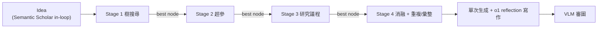

#paper

[The AI Scientist-v2: Workshop-Level Automated Scientific Discovery via Agentic Tree Search (Yamada et al., 2025)](https://arxiv.org/abs/2504.08066)

> arXiv:2504.08066v1 ｜ 2025-04-10 ｜ cs.AI
> 作者:Yutaro Yamada、Robert Tjarko Lange、Cong Lu、Shengran Hu、Chris Lu、Jakob Foerster、Jeff Clune、David Ha
> 單位:Sakana AI、UBC、Vector Institute、FLAIR(Oxford)
> Code:github.com/SakanaAI/AI-Scientist-v2

---

# 一、問題與定位

自動化科學發現的目標:讓 AI 端到端**提假設 → 設計並執行實驗 → 分析視覺化 → 寫論文**。前作 **The AI Scientist-v1**(Lu et al., 2024)證明可行,但有兩大硬傷:

1. **依賴人寫的程式碼模板 (template)**:每換一個主題,人就得先手刻一份 baseline 實驗程式碼 → 自主性差、無法開箱即用。
2. **線性且淺的實驗流程**:嚴格照「一步接一步」測假設,無法深入探索複雜研究問題。

**v2 的定位**:直接解掉這兩點 —— **移除模板依賴**(跨 ML 領域開箱即用)、用**漸進式 agentic 樹搜尋**(由專責的 experiment manager 管理)做更深的探索,並在審查階段加入 **VLM 回饋**改善圖表。

> **里程碑**:v2 產生的三篇全自動論文投稿 ICLR workshop,其中**一篇平均分 6.33、超過人類錄取門檻**(約前 45%)—— **史上第一篇通過同儕審查的全 AI 生成論文**。

---

# 二、背景

- **v1**:給定 baseline 模板 → 自動寫碼、跑實驗、視覺化、寫成完整論文。侷限如上。
- **AIDE(Jiang et al., 2025)**:把「寫實驗碼」formulate 成**樹搜尋** —— 每個 node 是一個候選解 + 純量評分(如 val accuracy),依分數選 node 繼續 debug/refine,在 MLE-Bench 上 SOTA。**v2 借用這套樹搜尋,並改造成「多階段科學實驗」版**。

> 與 [[Agent Laboratory]] 對照:兩者都是「多階段自動研究 + solver 迴圈」家族。Agent Lab 定位是「執行人給的 idea」;v2 更激進,連 idea 都自己生、連模板都不要。

---

# 三、方法

## 3.1 更通用的 Idea Generation(§3.1)
v1 只在既有 codebase 上提「增量修改」;v2 從**更高抽象層**開始開放式發想 —— 像先寫研究 abstract / grant proposal,再決定實作。**關鍵:literature review 工具(Semantic Scholar)在迴圈內** —— 發想時就即時查文獻評估新穎性、找相關前作,而非事後補查。

## 3.2 移除模板依賴(§3.2)
不再需要人寫 baseline 程式碼。靠下面兩個機制從零生成、精修實驗碼:**experiment progress manager**(粗粒度階段管理)+ **agentic 樹搜尋**(細粒度探索)。

## 3.3 Experiment Progress Manager —— 四階段(§3.2.1)
模擬真實科研從「可行性」到「消融」的推進,一個 manager agent 協調四階段,**各有明確停止條件**:

| 階段 | 目標 | 停止條件 |
| --- | --- | --- |
| **Stage 1 Preliminary Investigation** | 最小可行原型,驗證可行性/正確性 | 基本原型成功執行 |
| **Stage 2 Hyperparameter Tuning** | 調關鍵超參,建穩健 baseline | 訓練曲線收斂 + 至少兩個資料集成功跑通 |
| **Stage 3 Research Agenda Execution** | 系統性實作核心研究議程 | 算力預算耗盡(跑太快則提示加複雜度) |
| **Stage 4 Ablation Studies** | 系統性評估各組件重要性 | 算力預算耗盡 |

每階段結束:用 **LLM evaluator 選最佳 node** 帶到下一階段當種子、存 checkpoint,並**跑多次重複實驗**取 mean/std 供圖表與結果。

## 3.4 Parallelized Agentic Tree Search(§3.2.2)—— 核心
每個 node = 一份實驗(script + 高層計畫 + 錯誤 trace + runtime + 指標 + LLM 回饋 + 視覺化 script + 圖路徑 + VLM 回饋 + 狀態)。單 node 執行週期:

```
LLM 生成「實驗計畫 + Python 碼」→ 直接執行
  ├─ 執行報錯 → 記錄錯誤,標為 buggy,結束此週期
  └─ 執行成功 → 進入 plotting → 存 numpy 結果 → 畫圖 → 交 VLM 批改
        ├─ VLM 挑出問題(標籤不清/缺圖例/誤導) → 標 buggy,記錄回饋供 debug
        └─ VLM 通過 → 標 non-buggy
```

每次迭代**平行**選數個 node 展開:
- **以預設機率選 buggy node**(優先修錯);否則選 non-buggy node 精修。
- 選 non-buggy 時用 **best-first search**,由 LLM 依「指標 / 訓練動態 / 圖品質」評分挑候選。
- 新 child node 全部**並行執行**,大幅加速。

**特化 node 類型**:
- **Hyperparameter node**(Stage 2):試不同超參,記錄已試過的避免重複。
- **Ablation node**(Stage 4):評估各組件重要性,同樣去重。
- **Replication node**:用不同隨機種子重跑,算 mean/std。
- **Aggregation node**:**不做新實驗**,只寫 script 彙整 replication 結果、產出帶 mean±std 的圖。



## 3.5 Vision-Language Model Reviewer(§3.4)
VLM 用在**兩個階段**:
1. **實驗中**:對生成的圖即時回饋(是否清楚傳達結果)→ 不合格的 node 標 buggy。
2. **寫作 reflection**:抽出「圖截圖 + caption + 內文引用該圖處(`Figure X`)」交 VLM,檢查圖文對齊、視覺清晰度(缺圖例/標籤不清)、正文與附錄圖是否重複。

## 3.6 寫作(§3)
把 v1 的 Aider 增量寫作,改成**單次生成 (single-pass) + 獨立 reflection 階段**(用 o1 等 reasoning model),更簡潔。reflection 時餵目標頁數 + 當前 PDF 長度 → 自動符合投稿頁數限制。

## 3.7 資料集載入(§3.3)
盡量用 HuggingFace Hub 的 `datasets.load_dataset` 一行下載(作者承認稍嫌 ad-hoc,非所有 repo 支援)。

---

# 四、實驗:真人同儕審查(§4)

## 4.1 方法
與 ICLR 2025 workshop **ICBINB**(“I Can't Believe It's Not Better”,主打負面/意外結果)合作:
- 從 workshop 主題生成約 20 + 20 個 idea,**人選 3 個最契合的當起點**(只選、不改 idea),各跑多個隨機種子,**每個 idea 選一篇最佳投稿**。
- 3 篇 AI 論文混進 workshop 共 43 篇。審稿人**事先被告知可能有 AI 論文**、但不知是哪幾篇,可選擇不審。

## 4.2 結果
- **一篇平均 6.33**(個別 6/6/7)超過錄取門檻、約**前 45%**;另兩篇未達標。
- **審後撤稿**:事先與 ICLR/organizer 約定,錄取的 AI 論文審後即撤,不進正式紀錄(取得 UBC IRB 核准 H24-02652)。
- 「人選 idea + 跑多種子 + 選最佳 + 自動控頁數」屬**高層流程管理(meta-selection)**;**單次 run 內的假設精修/寫碼/執行/分析/視覺化/寫作全自主**,無人編輯內容。

## 4.3 被錄取的論文 + 作者自評(值得注意)
- **內容**:對序列模型加「compositional regularization」(懲罰相鄰時間步 embedding 的大變動)想改善組合泛化 —— **結果是負面的**:沒顯著改善、有時反而更糟。審稿人欣賞它清楚呈現負面結果。
- **作者自己抓到的問題**(誠實揭露 v2 的弱點):
  - **citation 幻覺 / 漏引**(如漏引 Hochreiter & Schmidhuber 1997,改引教科書)。
  - **圖表/描述不準**:Fig 3 caption 誤讀 val loss;Fig 5 attention 模型其實勝過 LSTM,與作者結論矛盾。
  - **資料洩漏**:train/test **約 57% 重疊**,嚴重影響結果可信度。
  - regularization 到底作用在 embedding 還是 hidden state 描述不清。

---

# 五、限制與倫理(§5)

- **只到 workshop 層級**:workshop 錄取率通常 60–80%,遠高於主會 20–30%(ICLR/ICML/NeurIPS);且**3 篇只中 1 篇**,連 workshop 水準都**尚不穩定**。
- **真正的科學創新仍難**:提出「真正新穎、高影響」的假設、設計創新方法、以深厚領域知識嚴謹辯護設計 —— 純自動系統仍力有未逮。
- **倫理**:主張把 AI 論文送進**同一套同儕審查**來研究其品質,但需**全程透明**(告知審稿人、可 opt-out、審後撤稿、明確標示 AI 生成),並警惕系統演化成**專門 game peer review** 或灌水 CV。

---

# 六、重點摘要 (Takeaways)

- **v2 vs v1 三大改進**:① 移除模板依賴(跨領域開箱即用);② experiment manager + **agentic 樹搜尋**(取代線性淺實驗);③ **VLM 回饋**(實驗中審圖 + 寫作審圖文對齊)。
- **樹搜尋是引擎**:node 分 buggy/non-buggy + 特化(hyperparameter/ablation/replication/aggregation),best-first 選點、並行展開;四階段 manager 管粗粒度推進。
- **史上第一篇通過同儕審查的全 AI 論文**(6.33、前 45%),但**只在 workshop、3 中 1、且不穩定**。
- **作者誠實揭露弱點**:citation 幻覺、圖表誤述、**57% 資料洩漏** —— 說明「能過 workshop」≠「方法嚴謹」。

---

# 七、這篇研究可能的啟發 (Inspirations)

- **「多階段 manager + 樹搜尋」是自動研究/自動寫碼 agent 的可複用骨架**:與 [[Agent Laboratory]] 的 `mle-solver`(程式空間樹搜尋 + reward + 自反思 + top 池)、[[Crafter]] 的 harness 迴圈同一家族 —— 本質都是「**生成 → 執行/驗證 → 評分 → 保留 best-so-far → 精修**」。v2 的貢獻是把它**拆成有停止條件的四階段**,並用特化 node 類型(replication/aggregation)把「科學嚴謹性(mean±std)」也 baked-in。
- **VLM 當「圖表守門員」是聰明的一招**:把「圖清不清楚、圖文對不對齊」交給 VLM 即時把關,是純文字 pipeline 抓不到的品質維度。任何會產出圖表的 agent 都可借。
- **評估用真實同儕審查、但要透明**:呼應 [[Agents' Last Exam (ALE)]] 對「評測要貼近真實、可驗證」的追求。但也暴露風險 —— **審查可被 game**:v2 明說要防「演化成專攻刷 peer review」。這對任何用「LLM/人審分數」當 reward 的系統都是警訊(對照 [[Agent Laboratory]] 的自動審稿高估 −2.3 分)。
- **「能過門檻」≠「做得對」**:v2 錄取論文有 57% 資料洩漏、citation 幻覺,卻仍過 workshop review。提示**表面通過與實質嚴謹的落差** —— 未來系統需要內建「自我審計」(抓資料洩漏、驗 citation、查圖文一致)而非只優化「過審機率」。
- **開放問題**:① 從「3 中 1」到**穩定產出**;② 從 workshop 到**主會等級**的深度與新穎性;③ 如何讓系統**提出真正新穎的假設**(目前 idea 雖新但可行性/嚴謹度弱,呼應 Si et al. 2025 的發現);④ 內建誠信檢查(資料洩漏、幻覺引用)。
