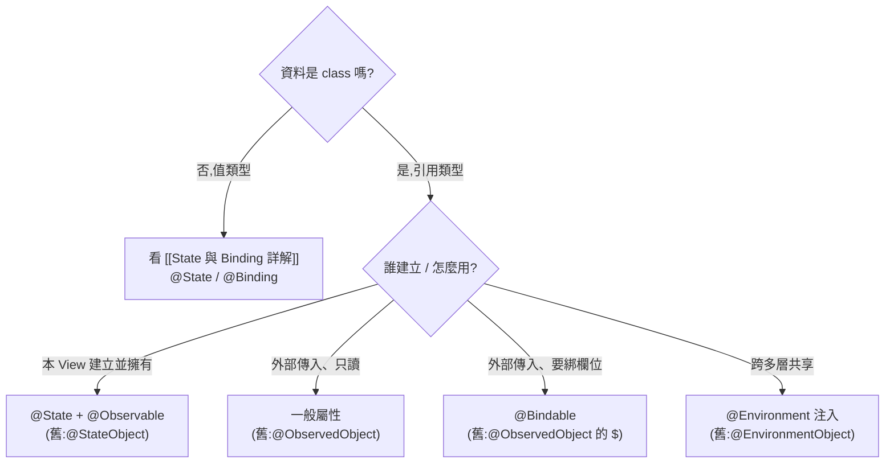

#note

# Observable 與 ObservableObject 對比

> [[State 與 Binding 詳解]] 講的是**值類型**狀態;這篇接「引用類型 (class)」這條線:當狀態是共享的、有邏輯、生命週期較長的物件時,該怎麼讓 SwiftUI 觀察它。涵蓋新做法 `@Observable`(iOS 17+)與舊做法 `ObservableObject`,以及它們的對應包裝器。承接 [[核心架構與機制#五、狀態管理 (State Management) — 核心中的核心|核心架構第五節]]。

---

# 一、什麼時候才需要 class?

`@State` 的值類型(`struct`/`Bool`/`Int`…)適合「本 View 自己的簡單狀態」。但有些情況更適合用 **class(引用類型)**:

- 這份資料要**被多個 View 共享**(它們要看到同一份、改了彼此同步)。
- 它有自己的**邏輯與方法**(載入、計算、商業規則),不只是一袋資料。
- 它的**生命週期比單一畫面長**(跨頁面存活)。

class 是[[Swift 型別與關鍵字基礎#三、`struct` vs `class` —— 值類型 vs 引用類型|引用類型]],傳遞時共用同一個物件 —— 正好符合「共享」需求。但 SwiftUI 預設不會知道「class 內部某個屬性變了」,所以需要額外機制讓它**可被觀察 (observable)**。

---

# 二、新做法:`@Observable`(iOS 17+,推薦)

在 class 前面加一個 `@Observable` 巨集,SwiftUI 就會自動追蹤它的屬性變化。

```swift
@Observable
class CartModel {
    var items: [Item] = []
    var coupon: String?
    var total: Double { items.reduce(0) { $0 + $1.price } }   // 計算屬性也能觀察
    func add(_ item: Item) { items.append(item) }
}
```

## 怎麼持有它

- **本 View 建立並擁有** → 用 `@State` 持有(對,值類型/引用類型現在都用 `@State`):

```swift
struct CartView: View {
    @State private var cart = CartModel()        // 由本 View 建立、負責生命週期
    var body: some View { Text("總計 \(cart.total)") }
}
```

- **從外部傳進來、只是讀** → 直接當一般屬性接:

```swift
struct CartSummary: View {
    let cart: CartModel                          // 別人傳進來的,不持有生命週期
    var body: some View { Text("\(cart.items.count) 件") }
}
```

- **要對物件的欄位做雙向綁定**(`$`)→ 用 `@Bindable`:

```swift
struct CartEditor: View {
    @Bindable var cart: CartModel                // 才能對欄位取 $
    var body: some View {
        TextField("優惠碼", text: $cart.coupon.bound)   // 綁到物件欄位
    }
}
```

## 最大優點:屬性級的精準追蹤

`@Observable` 會記錄「**這個 View 的 body 實際讀了哪幾個屬性**」,只有那些屬性變動時才重繪。

```swift
// 這個 View 只讀了 cart.coupon → items 變動時它不會重繪
Text(cart.coupon ?? "無優惠")
```

這比舊的 `ObservableObject` 精準很多(舊的只要任何 `@Published` 變了,所有觀察者都被通知)。呼應 [[核心架構與機制#三、SwiftUI 如何更新畫面 (Render Loop)|Render Loop]] 的「只重算真正依賴的」。

---

# 三、舊做法:`ObservableObject`(iOS 13–16,仍常見)

iOS 17 之前的標準寫法。class 遵循 `ObservableObject` 協定,要通知 SwiftUI 的屬性加上 `@Published`:

```swift
class CartModel: ObservableObject {
    @Published var items: [Item] = []        // 變動會通知觀察者
    @Published var coupon: String?
    var note = ""                            // 沒有 @Published → 變動不通知
}
```

對應**三個包裝器**,差別在「**誰擁有這個物件的生命週期**」—— 這是最容易出錯的地方:

| 包裝器 | 擁有權 | 重點 |
| --- | --- | --- |
| `@StateObject` | **本 View 建立並擁有** | 只初始化一次;View 重建時**不會**重新 `new`(✅ 正確選擇) |
| `@ObservedObject` | 由外部傳入,本 View **不擁有** | View 重建時若上層重給可能重置;**不該用它來建立物件** |
| `@EnvironmentObject` | 從環境注入 | 跨多層共享,不必一層層手動傳 |

```swift
struct CartView: View {
    @StateObject private var cart = CartModel()      // 本 View 建立 → StateObject
    var body: some View { ChildView(cart: cart) }
}
struct ChildView: View {
    @ObservedObject var cart: CartModel              // 接收上層的 → ObservedObject
    var body: some View { Text("\(cart.items.count)") }
}
```

## ⚠️ 經典 bug:該用 `@StateObject` 卻用了 `@ObservedObject`

```swift
struct CartView: View {
    @ObservedObject var cart = CartModel()   // ❌ 用 ObservedObject 來「建立」物件
    ...
}
```

問題:`@ObservedObject` **不負責保管生命週期**。每當父層重繪、`CartView` 被 [[核心架構與機制#重建 struct ≠ 重算 body(常見誤解)|重建]],這行就**重新 `new` 一個 CartModel**,先前的狀態(購物車內容)被清空。

✅ 規則:**「在哪個 View 第一次建立這個物件,那個 View 就用 `@StateObject`(新版用 `@State`)」**;其它只是收到它的 View 用 `@ObservedObject`(新版直接當屬性接)。

---

# 四、跨多層共享:Environment 注入

當很多層、很多畫面都要同一個物件(如登入狀態、購物車),不想一層層手動傳,就「注入環境」讓子樹自取。

## 新做法(`@Observable`)

```swift
// 注入
ContentView()
    .environment(cart)               // 把 @Observable 物件放進環境

// 子樹任一層取用
struct DeepChild: View {
    @Environment(CartModel.self) private var cart    // 用型別取回
    var body: some View { Text("\(cart.items.count)") }
}
```

## 舊做法(`ObservableObject`)

```swift
ContentView()
    .environmentObject(cart)

struct DeepChild: View {
    @EnvironmentObject var cart: CartModel
    var body: some View { Text("\(cart.items.count)") }
}
```

> 注意:用 environment 注入卻**忘了真的注入**,執行時會崩潰(找不到物件)。確保在使用的子樹「上方」有 `.environment(...)` / `.environmentObject(...)`。

---

# 五、新舊對照速查表

| 概念 | 舊 (iOS 13–16) | 新 (iOS 17+) |
| --- | --- | --- |
| 宣告可觀察 class | `class X: ObservableObject` + `@Published` | `@Observable class X` |
| 要通知的屬性 | 每個都加 `@Published` | **不用**(預設全部追蹤) |
| 本 View 建立並擁有 | `@StateObject` | `@State` |
| 外部傳入、只讀 | `@ObservedObject` | 一般屬性 (`let` / `var`) |
| 對物件欄位取 `$` 綁定 | `@ObservedObject` 的 `$` | `@Bindable` |
| 環境注入 | `.environmentObject()` / `@EnvironmentObject` | `.environment()` / `@Environment(X.self)` |
| 觀察精細度 | 任一 `@Published` 變 → 全部通知 | **屬性級**,只通知真正讀到的 |

> 能用 iOS 17+ 就**優先用 `@Observable`**:寫法更乾淨(不用到處 `@Published`)、效能更好(屬性級追蹤)、心智更一致(持有都用 `@State`)。維護舊專案時才需要熟悉 `ObservableObject` 那套。

---

# 六、選擇指南(整合值類型那條線)



## 一句話總結

- **值類型、簡單、私有** → `@State`(見 [[State 與 Binding 詳解]])。
- **class、共享、有邏輯** → `@Observable`(舊:`ObservableObject`)。
- **持有的關鍵問題永遠是「誰建立它」**:建立者用 `@State`/`@StateObject`,使用者用一般屬性/`@ObservedObject`。
- **跨多層** → 注入 environment。

---

# 延伸閱讀

- [[核心架構與機制]] —— 第五節狀態管理總表、Render Loop
- [[State 與 Binding 詳解]] —— 值類型那條線(本篇的姊妹篇)
- [[Swift 型別與關鍵字基礎]] —— `class` vs `struct`、值/引用類型基礎
