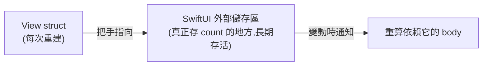

#note

# State 與 Binding 詳解

> 這篇深入 SwiftUI 最基礎、也最常用錯的兩個屬性包裝器:`@State` 與 `@Binding`。承接 [[核心架構與機制#五、狀態管理 (State Management) — 核心中的核心|核心架構]],聚焦「值類型的狀態」這條線;引用類型(`@Observable` / `ObservableObject`)留到另一篇。

---

# 一、為什麼需要 `@State`?

先看一個**不能動**的例子:

```swift
struct Counter: View {
    var count = 0                 // 普通屬性
    var body: some View {
        Button("count = \(count)") { count += 1 }  // ❌ 編譯錯誤
    }
}
```

兩個問題:

1. **不能改**:View 是 `struct`([[Swift 型別與關鍵字基礎|值類型]]),而 `body` 是唯讀計算屬性,在裡面改 `self` 的屬性是不允許的 → 編譯就過不了。
2. **就算能改也會丟失**:View struct 會被 SwiftUI [[核心架構與機制#重建 struct ≠ 重算 body(常見誤解)|頻繁重建]],每次重建都是「重新跑 init」,普通屬性會被重設回初始值。

`@State` 同時解決這兩件事。

```swift
struct Counter: View {
    @State private var count = 0
    var body: some View {
        Button("count = \(count)") { count += 1 }  // ✅ 可以改,也記得住
    }
}
```

---

# 二、`@State` 到底做了什麼?

關鍵觀念:**`@State` 把資料的「真正儲存位置」搬到 View struct 的外面**,由 SwiftUI 在背後的「儲存區」保管。View struct 本身只留一個「指向那塊儲存區的把手」。

於是:

- View struct 被重建(init 重跑)時,把手會**重新連回同一塊儲存區** → 值不會遺失。
- 你「改 `count`」其實是改外部那塊儲存區,不是改 struct 自己 → 繞過了「struct 在 body 裡不可變」的限制。
- 那塊儲存區一變動,SwiftUI 就知道「依賴它的 View 該重算了」→ 觸發 [[核心架構與機制#三、SwiftUI 如何更新畫面 (Render Loop)|Render Loop]]。



## 使用準則

- **只放本 View 自己擁有的、簡單的、暫時的狀態**:`Bool`、`Int`、`String`、小 `struct`、enum 狀態。
- **一律 `private`**:`@State` 代表「這份狀態是我這個 View 的私事」,別人不該直接碰。要分享出去請用 `@Binding`(往下傳)。
- **不要拿來存「外面傳進來的資料」**:那種應該用一般屬性 (`let`) 或 `@Binding`。`@State` 的初始值只在第一次建立時採用,之後外部再傳新值也不會更新它。

```swift
@State private var isOn = false          // ✅ 開關
@State private var text = ""             // ✅ 輸入框暫存
@State private var selectedTab = 0       // ✅ 目前分頁
```

---

# 三、`@Binding` —— 把「修改權」借給別人

`@State` 是私有的,但常常會遇到:**子 View 想要能讀、也能改父 View 的某個狀態**。這時不該在子 View 再開一個 `@State`(那會變成各存一份、不同步),而是用 `@Binding`。

**`@Binding` 不擁有資料,它只是一條「通到真實來源的雙向通道」**:讀它 = 讀來源,寫它 = 寫來源。

```swift
struct Parent: View {
    @State private var isOn = false          // 真實來源在這裡
    var body: some View {
        VStack {
            Toggle("開關", isOn: $isOn)        // 把 binding 傳給內建的 Toggle
            ChildLamp(isOn: $isOn)            // 也傳給自訂子 View
            Text(isOn ? "亮" : "暗")          // 同一來源驅動另一個畫面
        }
    }
}

struct ChildLamp: View {
    @Binding var isOn: Bool                   // 不是自己的資料,是 Parent 的
    var body: some View {
        Button("切換") { isOn.toggle() }       // 改它 = 改 Parent 的 isOn
    }
}
```

`Parent` 裡 `isOn` 一變,**三個地方(Toggle、ChildLamp、Text)同時同步**,因為它們本質上都指向同一塊儲存區。這就是 [[核心架構與機制#六、狀態傳遞 (Data Flow)|Single Source of Truth]] 的實作方式。

---

# 四、`$` 符號是什麼?(投影值)

每個 `@State`(以及多數屬性包裝器)其實同時提供**三種存取方式**:

| 寫法 | 拿到的東西 | 用途 |
| --- | --- | --- |
| `count` | 包裝起來的**值**本身(`Int`) | 讀寫值 |
| `$count` | **投影值 (projected value)** = 一個 `Binding<Int>` | 傳給需要 binding 的地方 |
| `_count` | 包裝器本體(`State<Int>`) | 很少用,通常在 `init` 自訂時 |

所以 `$count` 的意思就是:「**把這個 State 包成一個 Binding 交出去**」。

```swift
@State private var name = ""
TextField("姓名", text: $name)   // TextField 需要 Binding<String>,所以給 $name
```

> 記法:**`$` = 「我要的是綁定 (binding),不是當下的值」**。凡是參數型別是 `Binding<...>` 的(`Toggle`、`TextField`、`Slider`、`Stepper`、你自己的 `@Binding`…),就傳 `$`。

---

# 五、Binding 的衍生與進階

## 把 Binding 再往下傳

`@Binding` 也有 `$`,可以繼續往更深的子 View 傳,通道一路接到底,全程指向同一個真實來源:

```swift
struct A: View { @State private var n = 0; var body: some View { B(n: $n) } }
struct B: View { @Binding var n: Int;     var body: some View { C(n: $n) } }
struct C: View { @Binding var n: Int;     var body: some View { Stepper("\(n)", value: $n) } }
```

## 綁到物件的某個欄位

Binding 可以指向結構裡的某個屬性,SwiftUI 會自動幫你做「讀寫轉發」:

```swift
@State private var user = User(name: "", isVIP: false)
TextField("名字", text: $user.name)     // 綁到 user 的 name 欄位
Toggle("VIP", isOn: $user.isVIP)        // 綁到 user 的 isVIP 欄位
```

## 手動建立 Binding(get / set)

先釐清一件事:**`Binding` 本身是一個型別(泛型 struct),`Binding<Double>` = 「一個指向 `Double` 的綁定」。** 你其實一直在用它,只是沒寫出型別 —— 前面 `@Binding var n: Int` 的完整型別就是 `Binding<Int>`,`$isOn` 的型別就是 `Binding<Bool>`。`$` 平常會**自動**幫你生出這個綁定。

而 `Binding(get:set:)` 是這個型別的**建構式**:當你需要「在讀寫之間插一層轉換」、無法靠 `$` 直接生成時,就用兩個閉包**親手組一個綁定**:

- `get`:有人**讀**它時回傳什麼。
- `set`:有人**寫**它時(`$0` 是新值),你要怎麼寫回真實來源。

```swift
@State private var celsius = 0.0                 // 真實來源永遠存攝氏

// 一個「假裝成華氏、底層其實是攝氏」的綁定
var fahrenheit: Binding<Double> {
    Binding(
        get: { celsius * 9 / 5 + 32 },          // 被讀 → 攝氏換算成華氏給出去
        set: { celsius = ($0 - 32) * 5 / 9 }    // 被寫(新華氏值 $0)→ 換算回攝氏存回來
    )
}
// 用法:Slider(value: fahrenheit, in: 32...212) — 使用者拖華氏,celsius 仍是攝氏
```

> 平常用 `$變數` 就夠了(讀寫直接打在來源上);**只有需要轉換或攔截讀寫時**,才需要這樣手動建 `Binding`。

## `.constant(...)` —— 假的、不可變的 Binding

預覽 (Preview) 或測試時很好用:給一個固定值、寫了也不會變。

```swift
ChildLamp(isOn: .constant(true))   // 永遠是亮的,適合做畫面預覽
```

---

# 六、常見錯誤與陷阱

| 症狀 | 原因 | 修正 |
| --- | --- | --- |
| 改了值但畫面不更新 | 用了普通屬性而非 `@State` | 改用 `@State` |
| 子 View 改了,父 View 沒跟著變 | 子 View 自己開了 `@State` 存同一份資料 | 改用 `@Binding`,共用同一來源 |
| 外部傳新值進來,畫面卻沒更新 | 把「外部資料」存進 `@State`(初始值只採用一次) | 用 `let` 或 `@Binding` 接外部資料 |
| 「Cannot assign to property」編譯錯 | 在 `body` 裡改普通屬性 | 該狀態改用 `@State` |
| 多處資料不同步 | 同一份資料存了好幾份 | 留一個真實來源,其餘用 `$` 綁過去 |

> 一句總結:**`@State` = 我擁有的狀態;`@Binding` = 我借來改的別人的狀態。** 一份資料永遠只有一個 `@State` 真實來源,其它地方都用 `@Binding` 接過去。

---

# 七、和其它包裝器的關係

- 這篇講的是**值類型**狀態。當狀態是 `class`(共享、有邏輯)時,改用 `@Observable` + `@State` 持有(或舊的 `@StateObject` / `@ObservedObject`)—— 見 [[核心架構與機制#五、狀態管理 (State Management) — 核心中的核心|狀態管理總表]]。
- `@Bindable`(iOS 17+)則是「對 `@Observable` 物件取 `$` 綁定欄位」用的,角色類似這裡的 `@Binding` 但對象是物件。

---

# 延伸閱讀

- [[核心架構與機制]] —— SwiftUI 整體架構
- [[Swift 型別與關鍵字基礎]] —— 值類型 / 引用類型、`struct` 等語言基礎
