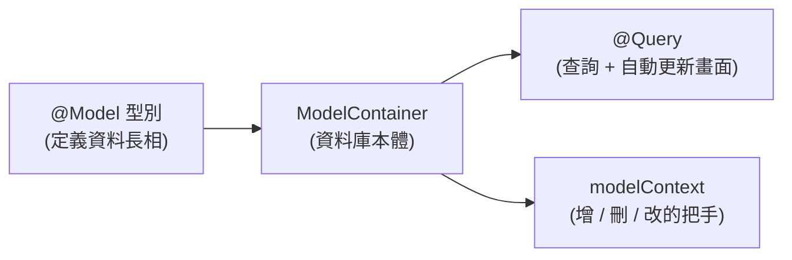

#note

# SwiftData 與 @Query

> SwiftData 是 Apple 在 iOS 17 推出的**本地資料持久化框架**(把資料存進裝置、App 重開仍在),用來取代 Core Data。它和 SwiftUI 深度整合:用 `@Query` 撈資料,資料一變畫面自動更新。本篇講 `@Model` / `@Query` / `modelContext` / `modelContainer` 這四件套的關係與用法。前提:熟悉 [[Observable 與 ObservableObject 對比|@Observable]] 與 [[列表與 ForEach Identity|List]]。

---

# 一、它解決什麼問題?

前面筆記的狀態(`@State`、`@Observable`)都是**暫時的** —— App 一關就消失。當你需要「**資料留在裝置上、下次打開還在**」(待辦清單、筆記、收藏),就需要持久化。

SwiftData 的賣點:**用幾乎和 `@Observable` 一樣的寫法定義資料,就自動獲得「存進資料庫 + 查詢 + 畫面自動更新」**,不用手寫 SQL、不用自己管載入。



---

# 二、四件套總覽

| 關鍵字 | 角色 | 對應你已知的 |
| --- | --- | --- |
| `@Model` | 把一個 class 標成「可被持久化的資料型別」 | 像 [[Observable 與 ObservableObject 對比|@Observable]],但會存進資料庫 |
| `@Query` | 在 View 裡查詢資料,並訂閱變化自動刷新 | 像「綁定到資料庫的 `@State` 陣列」,省掉手動 `.task` 載入 |
| `modelContext` | 對資料庫做**增/刪/改**的操作把手 | 透過 `@Environment(\.modelContext)` 取得 |
| `modelContainer` | 資料庫本體;在 App 進入點建立 | 整個 App 的資料儲存所 |

順序:**先用 `@Model` 定義型別 → 在 App 掛 `modelContainer` → 在 View 用 `@Query` 讀、用 `modelContext` 寫。**

---

# 三、`@Model` —— 定義可儲存的型別

在一個 `class` 前加 `@Model`,它就變成「會被存進資料庫」的型別。寫法幾乎和普通 class 一樣:

```swift
import SwiftData

@Model
class Task {
    var title: String
    var isDone: Bool
    var createdAt: Date
    init(title: String, isDone: Bool = false, createdAt: Date = .now) {
        self.title = title
        self.isDone = isDone
        self.createdAt = createdAt
    }
}
```

重點:

- 它是 **class(引用型別)**,且自動具備 [[Observable 與 ObservableObject 對比|可觀察]]能力 —— 改它的屬性,顯示它的畫面會自動更新。
- 每個屬性預設都會被存起來。屬性型別要是 SwiftData 支援的(基本型別、`Date`、`Data`、其它 `@Model`、陣列等)。
- 不用寫任何資料表 / SQL —— SwiftData 依這個型別自動建立底層儲存。

## 關係 (Relationships)

`@Model` 之間可以互相參照,SwiftData 自動處理關聯:

```swift
@Model class Project {
    var name: String
    @Relationship(deleteRule: .cascade) var tasks: [Task] = []   // 刪 Project 連帶刪其 tasks
    init(name: String) { self.name = name }
}
```

---

# 四、`modelContainer` —— 建立資料庫

在 App 進入點用 `.modelContainer(for:)` 建立資料庫,並注入整個 View 樹(這樣底下的 `@Query` / `modelContext` 才找得到它):

```swift
@main
struct MyApp: App {
    var body: some Scene {
        WindowGroup {
            ContentView()
        }
        .modelContainer(for: Task.self)      // 建立 + 注入資料庫
    }
}
```

> 機制上,這和 [[Observable 與 ObservableObject 對比#四、跨多層共享:Environment 注入|environment 注入]]是同一套:container 被放進環境,子樹的 `@Query`、`@Environment(\.modelContext)` 從環境取用。**忘了掛 `.modelContainer` → 執行時會崩潰**(找不到資料庫)。

多個型別一起:`.modelContainer(for: [Task.self, Project.self])`。

---

# 五、`@Query` —— 讀取資料(會自動更新)

在 View 裡宣告 `@Query`,它就**撈出該型別的資料,並在資料變動時自動讓畫面刷新**:

```swift
struct TaskListView: View {
    @Query private var tasks: [Task]        // 撈出所有 Task,自動更新
    var body: some View {
        List(tasks) { task in
            Text(task.title)
        }
    }
}
```

對比你之前的做法:不用 `@State private var tasks` + `.task { tasks = await load() }`。`@Query` 把「查詢 + 訂閱變化 + 更新」一次包好,概念上是**「綁定到資料庫的 `@State`」**。

## 排序與過濾

```swift
@Query(sort: \Task.createdAt, order: .reverse)      // 依建立時間新到舊
private var tasks: [Task]

@Query(filter: #Predicate<Task> { !$0.isDone },     // 只要未完成的
       sort: \Task.title)
private var pendingTasks: [Task]
```

- `#Predicate` 是 SwiftData 的查詢條件語法(編譯期檢查,會被翻成底層查詢)。
- 排序、過濾都在資料庫層做,比撈全部再用 Swift 過濾更有效率。

## 條件需要隨參數變化時

`@Query` 的條件在屬性宣告時就固定了。若要「依外部傳入的參數動態查詢」,在 `init` 裡建立 query:

```swift
struct TaskListView: View {
    @Query private var tasks: [Task]
    init(showDone: Bool) {
        _tasks = Query(filter: #Predicate { $0.isDone == showDone })
    }
}
```

---

# 六、`modelContext` —— 增 / 刪 / 改

寫入操作透過 `modelContext`(從環境取得):

```swift
struct AddTaskView: View {
    @Environment(\.modelContext) private var context
    @State private var title = ""

    var body: some View {
        TextField("標題", text: $title)
        Button("新增") {
            let task = Task(title: title)
            context.insert(task)        // 新增(通常不必手動 save,SwiftData 自動存)
        }
    }
}
```

常用操作:

```swift
context.insert(task)        // 新增
context.delete(task)        // 刪除
task.isDone = true          // 修改:直接改 @Model 物件的屬性即可(會自動持久化 + 更新畫面)
try? context.save()         // 通常自動存;需要「立刻確定寫入」時才手動呼叫
```

> 關鍵直覺:**「改」不需要特別 API —— 直接改 `@Model` 物件的屬性,SwiftData 會自動偵測、存檔、並更新所有顯示它的畫面。** 只有「新增」「刪除」需要透過 context。

## 搭配 List 的滑動刪除

```swift
List {
    ForEach(tasks) { task in
        Text(task.title)
    }
    .onDelete { offsets in
        for i in offsets { context.delete(tasks[i]) }   // 刪除選中的
    }
}
```

(`ForEach` 的 identity 規則照樣適用,見 [[列表與 ForEach Identity]]。)

---

# 七、一個最小完整範例

把四件套串起來:

```swift
// 1. 定義型別
@Model class Task {
    var title: String; var isDone: Bool
    init(title: String, isDone: Bool = false) { self.title = title; self.isDone = isDone }
}

// 2. App 掛資料庫
@main struct MyApp: App {
    var body: some Scene {
        WindowGroup { TaskListView() }.modelContainer(for: Task.self)
    }
}

// 3. View:讀(@Query)+ 寫(modelContext)
struct TaskListView: View {
    @Query(sort: \Task.title) private var tasks: [Task]
    @Environment(\.modelContext) private var context

    var body: some View {
        NavigationStack {
            List {
                ForEach(tasks) { task in
                    Button(task.title) { task.isDone.toggle() }   // 改:直接改屬性
                }
                .onDelete { $0.forEach { context.delete(tasks[$0]) } }   // 刪
            }
            .toolbar {
                Button("加一筆") { context.insert(Task(title: "新任務")) }  // 增
            }
        }
    }
}
```

這段就具備了完整的「增刪改查 + 持久化 + 畫面自動更新」,而你沒寫任何資料庫程式碼。

---

# 八、和 SwiftUI 其它機制的關係

- `@Model` ≈ 持久化版的 [[Observable 與 ObservableObject 對比|@Observable]] —— 一樣自動驅動畫面,只是多了「存進資料庫」。
- `@Query` 是**讀**的入口(自動更新),`modelContext` 是**寫**的入口。
- `.modelContainer` 走的是 [[核心架構與機制#五、狀態管理 (State Management) — 核心中的核心|environment 注入]]那一套。
- 顯示資料多半搭 [[列表與 ForEach Identity|List / ForEach]];導覽到詳情頁搭 [[導覽 Navigation|NavigationStack]]。

## 它和 MVVM 的取捨

`@Query` 只能用在 View 裡(它是屬性包裝器),所以「View 直接用 `@Query`」是 SwiftData 的官方預設風格,某種程度上**和把資料層完全藏進 ViewModel 的 [[架構模式 MVVM|MVVM]] 有張力**。常見折衷:簡單畫面直接 `@Query`;複雜查詢/邏輯則在外層用 `modelContext` 包成 repository。這沒有標準答案,看複雜度取捨(呼應 [[架構模式 MVVM#八、什麼時候「不需要」ViewModel?|別過度工程]])。

---

# 九、總結

- **SwiftData = iOS 17+ 的本地持久化框架**(取代 Core Data),和 SwiftUI 深度整合。
- 四件套:`@Model`(定義型別)、`modelContainer`(建資料庫、掛在 App)、`@Query`(讀+自動更新)、`modelContext`(增/刪/改)。
- **讀**:`@Query`,像「綁到資料庫的 `@State`」,可 `sort` / `filter`(`#Predicate`)。
- **寫**:`context.insert` / `context.delete`;**改**直接改 `@Model` 屬性即可(自動存+更新)。
- 別忘了在 App 掛 `.modelContainer`,否則崩潰。

---

# 延伸閱讀

- [[Observable 與 ObservableObject 對比]] —— `@Model` 的觀察機制基礎
- [[列表與 ForEach Identity]] —— 顯示 `@Query` 結果、滑動刪除
- [[並行與資料載入]] —— 遠端資料載入(對照:SwiftData 是本地、自動;網路是遠端、手動)
- [[架構模式 MVVM]] —— `@Query` 放 View 還是包進資料層的取捨
- [[核心架構與機制]] —— environment 注入、狀態驅動更新的根源
