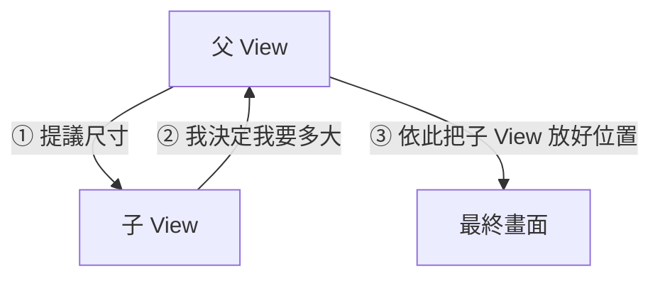

#note

# 佈局系統 Layout

> 這篇展開 [[核心架構與機制#七、佈局機制速覽 (Layout)|核心架構第七節]]:SwiftUI 怎麼決定每個元件擺哪、要多大。理解「父子尺寸協商」這個核心機制,就能解掉大部分「版面為什麼跑掉」的問題。

---

# 一、核心機制:父子尺寸協商三步驟

SwiftUI 佈局**不是靠約束條件求解**(沒有「衝突的約束」這種事),而是一輪由上而下、再由下而上的對話。每一層父子之間都重複這三步:

1. **父 View 提議一個尺寸 (proposed size)** 給子 View:「我這裡有這麼大的空間,你要嗎?」
2. **子 View 自己決定要多大 (its own size)**:可以全收、可以只取一部分、也可以完全不理(堅持自己的大小)。
3. **父 View 依子 View 回報的大小,把它擺到位置上 (placement)**。



**關鍵心法:子 View 永遠是「自己大小的最終決定者」。** 父層只能「提議」和「擺放」,不能強迫子層變大或變小。很多「為什麼這個東西沒有變大/被切掉」的困惑,都源自忘了這條。

## 三種典型的子 View 反應

| 元件 | 對提議尺寸的反應 |
| --- | --- |
| `Text` / `Image`(預設) | **只取自己需要的大小**(內容多大就多大),不會撐滿父層 |
| `Color` / `Rectangle` / `Spacer` | **盡量撐滿**父層提議的全部空間 |
| `.frame(...)` 包過的 View | 變成你指定的固定/範圍大小 |

---

# 二、堆疊容器:VStack / HStack / ZStack

最常用的三個排版容器,本身也是「父 View」,負責把提議的空間分給子們。

```swift
VStack { A(); B() }    // 垂直疊(上到下)
HStack { A(); B() }    // 水平排(左到右)
ZStack { A(); B() }    // 前後疊(B 蓋在 A 上面)
```

## 對齊 (alignment) 與間距 (spacing)

```swift
VStack(alignment: .leading, spacing: 8) { ... }   // 靠左、子間距 8
HStack(alignment: .top, spacing: 12) { ... }
ZStack(alignment: .topTrailing) { ... }
```

- `VStack` 的 `alignment` 控制**水平**怎麼對齊(`.leading` / `.center` / `.trailing`)。
- `HStack` 的 `alignment` 控制**垂直**怎麼對齊(`.top` / `.center` / `.bottom` / `.firstTextBaseline`)。
- `spacing` 是子元件之間的固定間距;不給就用系統預設值。

## Stack 怎麼分配空間

Stack 會把可用空間「依子 View 的彈性」分配:**先滿足不可壓縮的(如 `Text`),剩下的給能伸縮的(如 `Spacer`、`Color`)**。需要調整誰優先搶空間時,用 `.layoutPriority`(見第五節)。

---

# 三、`Spacer` —— 把東西推開的彈簧

`Spacer()` 是一個「**盡量撐大**」的空白,常用來推擠對齊:

```swift
HStack {
    Text("左")
    Spacer()          // 把兩邊推到最遠
    Text("右")
}

HStack {
    Spacer()
    Text("置中靠右推")  // 前面放 Spacer = 整體被推到右邊
}
```

> 心智:Spacer 是彈簧,會吃掉所有剩餘空間。兩個 `Text` 中間放一個 → 各自被推到兩端;一邊放一個 → 另一邊被推到底。

---

# 四、`.frame` —— 指定大小與對齊

`.frame` 是最常用、也最常被誤解的 modifier。它**不是「設定這個 View 的大小」,而是「在外面套一個指定大小的框,再把 View 放進去對齊」**。

```swift
Text("Hi")
    .frame(width: 200, height: 100)            // 固定大小的框
    .frame(maxWidth: .infinity)                // 寬度盡量撐滿父層
    .frame(minHeight: 44)                       // 至少 44 高
    .frame(maxWidth: .infinity, alignment: .leading)  // 撐滿寬 + 內容靠左
```

幾個關鍵點:

- **`maxWidth: .infinity`** 是「讓這個框盡量撐滿父層給的寬」——超常用,例如讓按鈕變整行寬。
- **`.frame` 的 `alignment`** 決定「裡面那個原本的 View」在這個框裡擺哪。`Text` 本身不會撐滿框,所以常需要指定對齊,否則預設置中。
- **`.frame` 套出來的是一個新 View**(框),原本的 View 變成它的子層 —— 又回到第一節的協商:框向父層要空間,再把內容擺進自己裡面。

```swift
// 經典:整行寬、靠左的列
Text("項目名稱")
    .frame(maxWidth: .infinity, alignment: .leading)
    .padding()
    .background(.gray.opacity(0.1))
```

---

# 五、控制協商結果的工具

當預設分配不如預期時,這幾個 modifier 用來「干預協商」:

| Modifier | 作用 |
| --- | --- |
| `.padding(...)` | 在 View 四周加內距(其實是「套一個更大的框」) |
| `.layoutPriority(_:)` | 提高某子 View 搶空間的優先序(預設 0,越大越優先) |
| `.fixedSize()` | 「不要壓縮我」——讓 View 用它的理想大小,不被父層擠小(常用來修文字被截斷成 `…`) |
| `.frame(...)` | 指定大小/範圍/對齊(見第四節) |

## `.layoutPriority` 範例

```swift
HStack {
    Text("這段很長很長很長很長很長的文字")
        .layoutPriority(1)        // 優先拿空間,不被擠掉
    Text("短")
}
```

## `.fixedSize` 範例

```swift
Text("這段文字不想被換行或截斷")
    .fixedSize(horizontal: true, vertical: false)   // 水平方向用理想寬度,不壓縮
```

> `.fixedSize` 很常救「文字莫名被截成 `…`」或「元件被擠扁」的情況 —— 等於告訴父層「這部分請給我足夠空間」。

---

# 六、`.padding` 與 modifier 順序

`.padding` 的本質是「**把 View 包進一個四周更大的框**」,所以它和其它 modifier 的**順序會改變結果**(呼應 [[核心架構與機制#八、Modifier 的運作機制|Modifier 機制]]):

```swift
Text("A").padding().background(.blue)   // 先撐大再上色 → 藍色含內距,較大
Text("B").background(.blue).padding()   // 先上色再撐大 → 藍色只貼著文字,外圍留白
```

每個 modifier 都回傳一層新的包裝 View,佈局協商是一層層往外進行的,所以「先 padding 再 background」≠「先 background 再 padding」。

---

# 七、`GeometryReader` —— 取得實際可用空間

當你需要「知道父層實際給了多大」才能算出尺寸(例如「寬度的 1/3」)時,用 `GeometryReader`。

```swift
GeometryReader { geo in
    Rectangle()
        .frame(width: geo.size.width * 0.33)   // 拿到實際寬度再計算
}
```

**注意它的兩個脾氣**:

1. **它會盡量撐滿父層提議的全部空間**(像 `Color` 那樣貪心),不像 `Text` 只取所需 → 放錯地方會把版面撐開。
2. 它的子 View 預設對齊在 `.topLeading`(左上),不是置中。

> 建議:**能不用就不用**。多數佈局靠 Stack + `.frame(maxWidth:)` + Spacer 就能完成;`GeometryReader` 留給「真的需要實際數值來計算」的場合,而且盡量包在小範圍裡用。iOS 16+ 也可改用 `Layout` 協定或 `containerRelativeFrame` 等更精準的工具。

---

# 八、除錯小技巧

版面跑掉時,最快的定位方式:

- **加 `.border(.red)`**:把每個可疑 View 框起來,立刻看出誰佔了多大、誰被擠掉。
- **加 `.background(.blue.opacity(0.3))`**:看實際填滿的範圍。
- 問三個問題:① 父層提議了多大?② 這個子 View 是「貪心型」還是「只取所需型」?③ 是不是少了 `Spacer` / `maxWidth: .infinity` / `.fixedSize`?

```swift
SomeView()
    .border(.red)        // 暫時加上,debug 完移除
```

---

# 九、總結

- 佈局是**父提議 → 子決定大小 → 父擺放**的逐層協商;**子 View 是自己大小的最終決定者**。
- 元件分兩類:**只取所需**(`Text`、`Image`)vs **盡量撐滿**(`Color`、`Spacer`、`GeometryReader`)。
- 排版主力:`VStack` / `HStack` / `ZStack` + `alignment` / `spacing` + `Spacer`。
- 控大小:`.frame`(尤其 `maxWidth: .infinity` 與 `alignment`)、`.padding`、`.layoutPriority`、`.fixedSize`。
- `.padding` / `.background` 等的**順序會影響結果**。
- `GeometryReader` 是最後手段,小範圍使用。

---

# 延伸閱讀

- [[核心架構與機制]] —— 第七節佈局、第八節 Modifier 機制的展開
- [[列表與 ForEach Identity]] —— List / LazyVStack 等捲動容器的佈局(規劃中)
