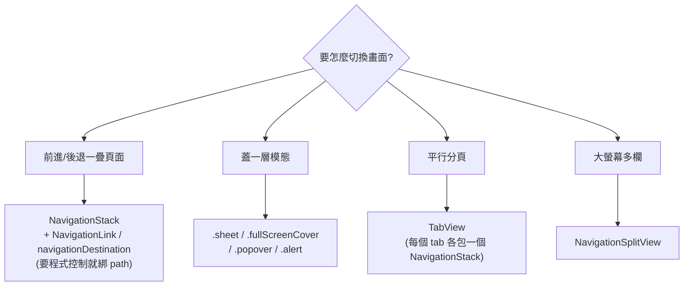

#note

# 導覽 Navigation

> 怎麼在畫面之間切換 —— 推進下一頁、返回、彈出視窗、分頁切換。SwiftUI 的導覽同樣是 [[核心架構與機制#一、宣告式 UI 範式 (Declarative)|宣告式]]的:**你不「命令它 push 一頁」,而是用「狀態」描述「現在應該顯示哪些頁」**,框架據此推導出畫面。本篇以 iOS 16+ 的 `NavigationStack` 為主。

---

# 一、心智轉換:導覽也是狀態驅動

命令式框架裡你會寫 `navigationController.push(vc)`,一步步操作堆疊。SwiftUI 反過來:

- 你維護一個**代表「導覽堆疊」的狀態**(一個陣列 `path`)。
- 陣列裡有什麼,畫面就堆了哪幾頁。
- 想 push → 往陣列加一個值;想 pop → 移除;想回到根 → 清空。

```
path = []              → 只有根畫面
path = [A]             → 根 → A
path = [A, B]          → 根 → A → B
path = []  (清空)       → 回到根
```

> 核心:**導覽 = 一個陣列狀態**。理解這點,後面所有 API 都只是「怎麼讀寫這個陣列」的不同寫法。

---

# 二、`NavigationStack` 基礎

`NavigationStack` 是承載「一疊可前進/後退畫面」的容器(iOS 16+,取代舊的 `NavigationView`)。

```swift
NavigationStack {
    RootView()
        .navigationTitle("首頁")
}
```

裡面任何畫面都共用這一個堆疊。標題、工具列用 modifier 掛:

```swift
.navigationTitle("詳情")
.navigationBarTitleDisplayMode(.inline)
.toolbar {
    ToolbarItem(placement: .topBarTrailing) {
        Button("編輯") { ... }
    }
}
```

---

# 三、`NavigationLink` —— 點擊前往

最簡單的前進方式:點一下就 push 到目標畫面。

## 寫法 A:直接給目標 View

```swift
NavigationStack {
    NavigationLink("看詳情") {
        DetailView()          // 點了就 push 這個畫面
    }
}
```

適合「目標固定、簡單」的情況。

## 寫法 B:給「值」+ `navigationDestination`(推薦)

把「連結帶的值」和「值要對應到哪個畫面」分開 —— 這是比較有彈性、也是搭配程式化導覽的標準做法:

```swift
NavigationStack {
    List(products) { product in
        NavigationLink(product.name, value: product)   // 連結只帶一個「值」
    }
    .navigationDestination(for: Product.self) { product in
        ProductDetail(product: product)                // 收到 Product → 顯示這個畫面
    }
}
```

- `NavigationLink(value:)`:點擊時把這個值丟進導覽堆疊。
- `.navigationDestination(for: 型別)`:宣告「**當堆疊裡出現這個型別的值,就顯示對應畫面**」。
- 帶的值型別需可被識別/編碼(常見要 `Hashable`,程式化還原時需 `Codable`)。

> 為什麼分開比較好?畫面之間只靠「值」溝通,不直接持有彼此的 View,耦合更低;而且能用程式控制(下一節)。

---

# 四、程式化導覽:用 `path` 控制堆疊

把堆疊狀態自己拿在手上,就能用程式碼任意 push / pop / 跳轉。

```swift
struct ContentView: View {
    @State private var path = NavigationPath()        // 導覽堆疊狀態

    var body: some View {
        NavigationStack(path: $path) {                // 綁定堆疊
            RootView()
                .navigationDestination(for: Product.self) { p in
                    ProductDetail(product: p)
                }
        }
    }
}
```

有了 `$path`,常見操作都變成「改陣列」:

```swift
path.append(product)        // push 一頁
path.removeLast()           // pop 回上一頁
path.removeLast(path.count) // 一路回到根
```

## `NavigationPath` vs 型別化陣列

| 寫法 | 適用 |
| --- | --- |
| `NavigationPath()` | 堆疊裡會混**多種型別**的目標(Product、User、Setting…) |
| `[Product]`(自訂陣列) | 堆疊只放**單一型別**,更直觀、好操作 |

```swift
@State private var path: [Product] = []     // 只放 Product 時更簡單
// path.append(p) / path.removeAll() ...
```

> 程式化導覽常見用途:登入成功後直接跳到主頁、處理深層連結 (deep link)、表單完成後「跳過好幾頁回到某處」。這些都只是對 `path` 陣列做運算。

---

# 五、返回:`dismiss`

子畫面想「自己關掉/返回」時,不需要拿到上層的 path,用環境值 `dismiss`:

```swift
struct DetailView: View {
    @Environment(\.dismiss) private var dismiss
    var body: some View {
        Button("完成") { dismiss() }     // 返回上一頁(或關閉 sheet)
    }
}
```

`dismiss` 很通用:在導覽堆疊裡 = pop 回上一頁;在 sheet/cover 裡 = 關閉那個彈出視窗。

---

# 六、彈出式呈現:sheet / fullScreenCover / popover

「前進到下一頁」之外的另一類:**蓋一層上來**(模態)。同樣由狀態(布林或 optional)驅動。

```swift
struct ContentView: View {
    @State private var showSettings = false
    @State private var editing: Item? = nil

    var body: some View {
        VStack {
            Button("設定") { showSettings = true }
            Button("編輯") { editing = someItem }
        }
        // 布林驅動
        .sheet(isPresented: $showSettings) {
            SettingsView()
        }
        // optional 驅動:有值才彈出,並把值傳進去
        .sheet(item: $editing) { item in
            EditView(item: item)
        }
    }
}
```

| Modifier | 效果 |
| --- | --- |
| `.sheet(...)` | 由下往上滑出的半/全頁卡片,可下滑關閉 |
| `.fullScreenCover(...)` | 蓋滿全螢幕(不能下滑關,需自己 `dismiss`) |
| `.popover(...)` | 氣泡式彈出(iPad 常見) |
| `.alert(...)` / `.confirmationDialog(...)` | 警示框 / 動作清單 |

- `isPresented: $bool` → 開關式;`item: $optional` → 「有資料才彈,並把資料帶進去」(更安全,避免「彈出時資料還沒準備好」)。
- 關閉用 `dismiss`(第五節)或把綁定設回 `false` / `nil`。

---

# 七、`TabView` —— 分頁

底部分頁切換,每個分頁通常各自包一個 `NavigationStack`:

```swift
TabView(selection: $selectedTab) {
    NavigationStack { HomeView() }
        .tabItem { Label("首頁", systemImage: "house") }
        .tag(0)

    NavigationStack { ProfileView() }
        .tabItem { Label("我的", systemImage: "person") }
        .tag(1)
}
```

- `selection: $selectedTab` 讓你能**用程式切換分頁**(也是一種狀態驅動導覽)。
- 慣例:**每個 tab 各自一個 `NavigationStack`**,這樣各分頁有獨立的前進/後退堆疊。

---

# 八、`NavigationSplitView` —— 多欄(iPad / Mac）

大螢幕的側欄 + 內容（ + 細節)雙/三欄佈局:

```swift
NavigationSplitView {
    SidebarView()        // 側欄
} detail: {
    DetailView()         // 內容
}
```

在 iPhone 上會自動收合成單欄堆疊行為,所以同一份程式能適配不同尺寸。需要做「清單 + 詳情」的工具型 App 時用它。

---

# 九、總結與選擇



- **導覽 = 狀態驅動**:堆疊是一個 `path` 陣列,模態是一個布林/optional。
- **前進**:`NavigationLink`(簡單)或 `value:` + `navigationDestination`(有彈性、可程式化)。
- **程式控制**:綁 `path`,用陣列運算 push/pop/跳轉。
- **返回/關閉**:`@Environment(\.dismiss)`。
- **模態**:`isPresented:`(開關)或 `item:`(帶資料)。
- **分頁**:`TabView`;**多欄**:`NavigationSplitView`。

---

# 延伸閱讀

- [[核心架構與機制]] —— 宣告式範式、狀態驅動的根源
- [[State 與 Binding 詳解]] —— `path`、`isPresented`、`selection` 都是 `@State` / `Binding`
- [[列表與 ForEach Identity]] —— List 搭配 NavigationLink 的常見組合(規劃中)
