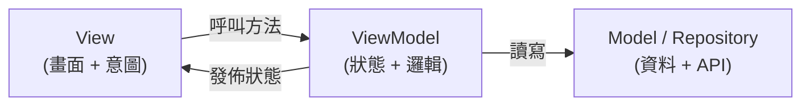

#note

# 架構模式 MVVM

> 進階篇。當畫面變多、邏輯變複雜,怎麼組織程式碼讓它好維護、好測試。本篇談 SwiftUI 下的 **MVVM** 與相關取捨:ViewModel 該放什麼、`@Observable` 時代的寫法、依賴注入、單向資料流、可測試性,以及「什麼時候其實不需要 ViewModel」。前提:熟悉 [[Observable 與 ObservableObject 對比]] 與 [[並行與資料載入]]。

---

# 一、先講結論:SwiftUI 不強迫任何架構

SwiftUI 本身已內建一套資料流(`@State` / `@Binding` / `@Observable` / `@Environment`)。**它沒有要求你用 MVVM** —— 很多官方範例是「View 直接持有 `@Observable` model」,沒有獨立的 ViewModel 層。

所以正確心態是:**架構是為了「管理複雜度」而存在,不是儀式。** 簡單畫面別硬套 MVVM;複雜畫面再引入分層。下面先講分層,最後第八節專門談「何時不需要」。

---

# 二、三層職責:Model / View / ViewModel

| 層 | 負責 | 不該做 |
| --- | --- | --- |
| **Model** | 資料結構、商業規則、與後端/DB 的存取 | 不知道 UI 存在 |
| **View** | 把狀態畫成畫面、把使用者操作轉成「意圖」往上送 | 不放商業邏輯、不直接打 API |
| **ViewModel** | 持有畫面狀態、把 Model 轉成 View 能用的形式、處理使用者意圖 | 不 import SwiftUI 的 View、不碰具體畫面元件 |

核心分界:**View 只關心「長什麼樣」,ViewModel 關心「狀態與行為」,Model 關心「資料與規則」。**



---

# 三、`@Observable` 時代的 ViewModel 寫法

iOS 17+ 的標準寫法:ViewModel 是一個 `@Observable class`,標 `@MainActor`(因為它更新會驅動畫面的狀態,需在主執行緒 —— 見 [[並行與資料載入#五、`@MainActor`:保證在主執行緒更新 UI|@MainActor]])。

```swift
@MainActor
@Observable
final class ProfileViewModel {
    // ── 對 View 公開的狀態 ──
    private(set) var state: LoadState<User> = .idle
    var draftName = ""

    // ── 依賴(由外部注入,見第五節)──
    private let api: UserAPI

    init(api: UserAPI) { self.api = api }

    // ── 使用者意圖 → 方法 ──
    func onAppear() async {
        state = .loading
        do    { state = .loaded(try await api.fetchUser()) }
        catch { state = .failed(error) }
    }

    func save() async {
        try? await api.updateName(draftName)
    }
}
```

View 變得很薄,只負責「畫狀態 + 把操作交給 VM」:

```swift
struct ProfileView: View {
    @State private var vm: ProfileViewModel        // 本 View 建立 → @State 持有

    init(api: UserAPI) { _vm = State(initialValue: ProfileViewModel(api: api)) }

    var body: some View {
        Form {
            switch vm.state {
            case .loading, .idle: ProgressView()
            case .loaded(let user): Text(user.name)
            case .failed(let e):    Text(e.localizedDescription)
            }
            TextField("新名字", text: $vm.draftName)   // @Bindable 取得欄位綁定(見下)
            Button("儲存") { Task { await vm.save() } }
        }
        .task { await vm.onAppear() }
    }
}
```

## 持有與綁定的細節

- **持有**:本 View 建立 VM → 用 `@State` 持有(取代舊的 `@StateObject`)。
- **綁定欄位**:要對 VM 的屬性取 `$`(如 `$vm.draftName`),需要 `@Bindable`。在 body 內可臨時 `@Bindable var vm = vm`,或把 VM 透過 `@Bindable` 接入。
- **唯讀狀態**用 `private(set)`,只讓 VM 自己改、View 只能讀 → 強化單向資料流。

---

# 四、單向資料流 (Unidirectional Data Flow)

好維護的關鍵不是「有沒有 ViewModel」,而是**資料只往一個方向流**:

```
使用者操作 → View 送出意圖 → VM 改狀態 → 狀態驅動 View 重繪 → (回到使用者)
```

- View **不直接改**狀態,而是呼叫 VM 的方法(`vm.save()`)表達「意圖」。
- VM 是**唯一**能改該狀態的地方(`private(set)` 強制這件事)。
- 狀態一改,SwiftUI 自動重繪([[核心架構與機制#三、SwiftUI 如何更新畫面 (Render Loop)|Render Loop]])。

這樣「狀態為什麼變成這樣」永遠只有一個來源可查,呼應 [[核心架構與機制#六、狀態傳遞 (Data Flow)|Single Source of Truth]]。

> 反模式:View 裡到處 `vm.state = ...` 直接改、或邏輯散落在多個 `.onChange` 裡 → 資料流變雙向、難追蹤。把「改狀態」收斂到 VM 的方法裡。

---

# 五、依賴注入 (Dependency Injection)

ViewModel 不該自己 `new` 出它的依賴(`URLSession`、資料庫…),而是**從外面接進來**。這是「可測試」的關鍵。

```swift
protocol UserAPI {                       // 定義「能力」的合約(見 [[Swift 型別與關鍵字基礎|protocol]])
    func fetchUser() async throws -> User
}

struct LiveUserAPI: UserAPI { /* 真打網路 */ }
struct MockUserAPI: UserAPI {            // 測試/預覽用假資料
    func fetchUser() async throws -> User { User(name: "測試") }
}

let vm = ProfileViewModel(api: LiveUserAPI())   // 正式
let vm = ProfileViewModel(api: MockUserAPI())   // 測試 / SwiftUI Preview
```

好處:

- **可測試**:注入 `MockUserAPI` 就能測 VM 邏輯,不需真網路。
- **可預覽**:SwiftUI Preview 注入假資料,不依賴後端。
- **低耦合**:VM 只依賴 `protocol`(能力),不依賴具體實作。

## 跨畫面共享的依賴:用 Environment

App 級的服務(登入狀態、資料庫)可注入 [[Observable 與 ObservableObject 對比#四、跨多層共享:Environment 注入|environment]],讓深層畫面自取,不必一層層手動傳建構參數。

---

# 六、可測試性:MVVM 最實際的回報

把邏輯抽到 VM 後,測試**完全不碰 UI**,又快又穩:

```swift
@MainActor
func test_載入成功() async {
    let vm = ProfileViewModel(api: MockUserAPI())
    await vm.onAppear()
    if case .loaded(let user) = vm.state {
        XCTAssertEqual(user.name, "測試")
    } else { XCTFail("應為 loaded") }
}
```

能這樣測,是因為:① 邏輯在 VM 不在 View；② 依賴可注入假的;③ 狀態是可讀的屬性。**這三點才是 MVVM 的真正價值**,而非「分層本身」。

---

# 七、導覽與狀態集中

複雜 App 常把**導覽狀態**也集中管理(呼應 [[導覽 Navigation#四、程式化導覽:用 `path` 控制堆疊|程式化導覽]]):用一個 `@Observable` 的 router/coordinator 持有 `NavigationPath`,讓「跳轉」也變成可測試、可程式控制的狀態變更。

```swift
@MainActor @Observable
final class Router {
    var path = NavigationPath()
    func goToDetail(_ id: Item.ID) { path.append(id) }
    func popToRoot() { path = NavigationPath() }
}
```

注入 environment 後,任何畫面都能 `router.goToDetail(...)`,而導覽邏輯集中一處 —— 對深層連結、登入後跳轉特別有用。

---

# 八、什麼時候「不需要」ViewModel?

別過度工程。以下情況直接「View + `@State`」就好,硬加 VM 反而是負擔:

- **純展示、沒有邏輯**的畫面(靜態清單、設定項)。
- 狀態**只屬於這個畫面、很簡單**(一個開關、一個輸入框)→ `@State` 足矣。
- 小型 App 或原型階段。

判斷準則:**當「邏輯多到讓 body 變髒、或想寫單元測試卻發現邏輯卡在 View 裡」時,才把它抽成 ViewModel。** 架構是用來償還複雜度的,不是預先繳的稅。

> 也有人主張在 SwiftUI 用「View + `@Observable` model(不叫 ViewModel)」的更輕量分法 —— 名稱不重要,重要的是**邏輯與畫面分離、依賴可注入、資料單向流動**這三件事。

---

# 九、總結

- SwiftUI **不強制架構**;MVVM 是「管理複雜度」的工具,按需採用。
- 三層職責:**Model**(資料規則)/ **View**(畫面+意圖)/ **ViewModel**(狀態+行為)。
- `@Observable` 時代:VM = `@MainActor @Observable class`,View 用 `@State` 持有、`@Bindable` 綁欄位、`private(set)` 守單向流。
- **單向資料流**:View 送意圖 → VM 改狀態 → 狀態驅動畫面;改狀態只在 VM。
- **依賴注入**:VM 依賴 `protocol` 而非具體實作 → 可測試、可預覽。
- **可測試性**是 MVVM 最實際的回報,不是分層本身。
- 導覽可用 router 集中成狀態。
- **簡單畫面別硬套** —— 邏輯複雜到「想測試卻測不了」時才抽 VM。

---

# 延伸閱讀

- [[Observable 與 ObservableObject 對比]] —— VM 的觀察機制基礎
- [[並行與資料載入]] —— VM 裡的 async 載入、`@MainActor`
- [[導覽 Navigation]] —— router / 程式化導覽
- [[效能與重繪優化]] —— 拆分 VM/model 與屬性級追蹤對重繪的影響
- [[核心架構與機制]] —— 單向資料流、Single Source of Truth 的根源
