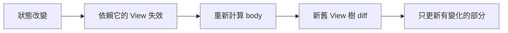

#note

# SwiftUI 核心架構與機制

> 這是 SwiftUI 的第一篇總覽筆記,目標是把「在寫任何 SwiftUI 之前你需要先理解的框架機制」一次講清楚:宣告式範式、View 的本質、生命週期、狀態管理、狀態傳遞與資料流。後續每個主題會再拆成獨立筆記深入。

---

# 一、宣告式 UI 範式 (Declarative)

SwiftUI 的核心精神:**你不「下指令一步步操作畫面」,而是「描述畫面在某個狀態下應該長什麼樣」**。

- **不是這樣 (命令式思維)**:`label.text = "Hi"`、`button.isHidden = true` —— 親手抓著某個 UI 元件去改它的屬性。
- **而是這樣 (宣告式 / Declarative)**:你寫一個「狀態 → 畫面」的純函數。狀態變了,框架自動重新計算畫面差異並更新。

```swift
struct ContentView: View {
    @State private var count = 0

    var body: some View {
        VStack {
            Text("count = \(count)")      // 畫面只是 count 的函數
            Button("加一") { count += 1 } // 你只改狀態,不直接改 UI
        }
    }
}
```

核心心法:**畫面 = f(狀態)**。你能掌控的只有「狀態」,畫面是被推導出來的結果。這也是理解後面所有機制的基礎。

> 上面這段先看整體就好,別被細節卡住:`var body: some View` 的 `some View` 是「回傳某種 View」的寫法(下一節會解釋,也可參考 [[Swift 型別與關鍵字基礎#六、常一起出現的關鍵字|some / any]]);`@State` 是狀態宣告,留到 [[#五、狀態管理 (State Management) — 核心中的核心|第五節]] 細講。

---

# 二、View 的本質

## `View` 是一個 [[Swift 型別與關鍵字基礎|protocol]],不是物件

```swift
protocol View {
    associatedtype Body: View
    var body: Body { get }
}
```

- `View` 是**值類型 (struct)**,輕量、可被頻繁建立與丟棄(這點很重要:它只是一份描述,不是畫面本體,所以建立成本極低)。
- `body` 是一個唯讀計算屬性,描述「子畫面樹」。
- [[Swift 型別與關鍵字基礎#六、常一起出現的關鍵字|`some View`]] 是**不透明回傳類型 (opaque return type)**:意思是「`body` 會回傳某一種確定的 View,但我不想把那個又臭又長的具體型別寫出來」。編譯期型別是確定且單一的,只是對外隱藏起來。它**不等於** `any View`(後者是型別抹除,有效能代價)。

## View 是「描述」而非「畫面本體」

你寫的 `struct ContentView` 只是一份**藍圖 / 配方**。SwiftUI 在背後維護一棵真正的繪製樹,並決定何時用你的藍圖去更新它。所以:

- View struct 被建立很多次是正常且廉價的 —— 不要在 `init` 或 `body` 裡做昂貴運算或副作用。
- `body` 應該是**純函數**:同樣的狀態,輸出同樣的畫面,沒有副作用。

# 三、SwiftUI 如何更新畫面 (Render Loop)

理解這個迴圈,才能理解狀態管理為什麼要那樣設計。

1. 某個**狀態 (State) 改變**。
2. SwiftUI 把所有「依賴該狀態」的 View 標記為 **invalidated (失效)**。
3. 重新呼叫這些 View 的 `body`,產生一棵新的 View 樹(藍圖)。
4. 框架把**新藍圖與舊藍圖做 diff**,只更新真正改變的部分到實際畫面。



關鍵:**只有「真正讀取了某狀態」的 View 才會在該狀態變動時重算**。SwiftUI 透過 `@State` / `@Binding` 等屬性包裝器,在 `body` 執行時自動追蹤「誰讀了什麼」,藉此建立精準的依賴關係,避免整棵樹重繪。

## 重建 struct ≠ 重算 body(常見誤解)

常見疑問:**如果子 View 自己沒依賴某 state,但它的上層 View 有依賴,子 View 會跟著更新嗎?**

要把兩件事分開看:

1. **重建 struct**:上層 state 改變 → 上層 `body` 重新執行。因為子 View 是寫在上層 `body` 裡的,所以子 View 的 struct **會被重新建立一次**(它的 `init` 會跑)。這一定會發生,但很廉價 —— 它只是一份輕量描述。
2. **重算 body**:SwiftUI 接著拿「**新建立的子 View 值**」跟「**上一次的舊值**」比較:
   - 子 View 收到的輸入(它的儲存屬性)**沒變** → **跳過**它的 `body`,畫面不更新。✅
   - 輸入**變了** → 才重算 `body` 並更新畫面。

所以答案是:**子 View 的 struct 會被重建(init 跑一次),但只要傳進去的資料沒變,它的 `body` 不會重算、畫面也不會真的更新。** 不會發生「上層一動,整棵子樹全部重繪」。

```swift
struct Parent: View {
    @State private var count = 0
    var body: some View {
        VStack {
            Text("count = \(count)")            // 依賴 count → 會更新
            Button("加一") { count += 1 }
            ChildView(title: "我不依賴 count")    // title 沒變 → body 被跳過
        }
    }
}

struct ChildView: View {
    let title: String
    var body: some View {
        // count 改變時,這個 body 不會被重新呼叫(因為 title 跟上次一樣)
        Text(title)
    }
}
```

> **例外**:SwiftUI 靠「比較新舊值」決定能不能跳過,所以當它**無法可靠比較**時會保守地重算 —— 例如子 View 的屬性帶有**閉包 (closure)** 或**無法比較的引用型別**,或你把整個會變動的物件往下傳(而非只傳子 View 真正需要的小欄位)。需要強制用值比較來省略重繪時,可讓 View 遵循 `Equatable` 並加上 `.equatable()`。

## View 的識別 (Identity)

SwiftUI 靠 **identity** 判斷「這是同一個 View 還是新的 View」,決定要更新還是重建(連帶重置其 `@State`)。

- **結構性識別 (Structural identity)**:由 View 在樹中的位置決定(預設)。
- **顯式識別 (Explicit identity)**:用 `.id(...)` 或 `ForEach` 的 `id` 手動指定。

> 陷阱:改變 `.id(...)` 會讓 SwiftUI 認為是「全新的 View」,進而**重置它的 @State**。可用來「強制重建」,也可能不小心造成狀態遺失。

---

# 四、生命週期 (Lifecycle)

SwiftUI 沒有「在某個方法裡寫初始化」那套生命週期方法,而是用**修飾器 (modifier) 把事件掛在 View 上**。

## View 層級的生命週期

| 修飾器 | 觸發時機 | 常見用途 |
| --- | --- | --- |
| `.onAppear { }` | View 出現在畫面上 | 啟動資料載入、訂閱 |
| `.onDisappear { }` | View 離開畫面 | 取消訂閱、清理 |
| `.task { }` | View 出現時啟動 async 任務,消失時**自動取消** | 非同步載入(優先用這個) |
| `.task(id:) { }` | 出現時 + 當 `id` 改變時重啟任務 | 隨參數變化重新載入 |
| `.onChange(of:) { }` | 指定值改變時 | 對狀態變化做反應 |

```swift
struct ProfileView: View {
    let userID: Int
    @State private var user: User?

    var body: some View {
        Text(user?.name ?? "載入中…")
            .task(id: userID) {          // userID 變了就自動重載,離開畫面自動取消
                user = try? await api.fetchUser(userID)
            }
    }
}
```

> 注意:`.onAppear` **不保證只呼叫一次**(捲動、切分頁、重入導覽都可能再次觸發)。需要「只做一次」的初始化,自己用旗標或把資料放到 ObservableObject 控制。

## App / Scene 層級的生命週期

SwiftUI App 的進入點與容器結構:

```swift
@main
struct MyApp: App {            // App 協定 = 程式進入點
    var body: some Scene {     // Scene = 一個視窗/場景容器
        WindowGroup {
            ContentView()      // 根 View
        }
    }
}
```

- **`App`**:整個應用程式的進入點(由 `@main` 標記)。
- **`Scene`**:一個可見的 UI 容器(視窗)。`WindowGroup`、`DocumentGroup`、`Settings` 等。
- **`@Environment(\.scenePhase)`**:觀察前景/背景狀態(`.active` / `.inactive` / `.background`),用來存檔、暫停工作。

```swift
@Environment(\.scenePhase) private var scenePhase
// .onChange(of: scenePhase) { _, phase in if phase == .background { save() } }
```

---

# 五、狀態管理 (State Management) — 核心中的核心

SwiftUI 用一組 **property wrapper** 來宣告「資料的擁有權與來源」。選錯會造成狀態遺失、不更新、或無謂重繪。先記住一個分類軸:

- **誰擁有這份資料 (Source of Truth 在哪)?**
- **是值類型還是引用類型 (class)?**

## 1. `@State` — View 私有的、值類型的真實來源

- 用於 View **自己擁有**的簡單、暫時狀態(`Bool`、`Int`、字串、小 struct)。
- SwiftUI 在背後**幫你保管**這份值(存在 View 之外的儲存區),所以 View struct 被重建時狀態不會消失。
- 一律宣告為 `private`。

```swift
@State private var isOn = false
```

## 2. `@Binding` — 對別人狀態的「可讀可寫參考」

- 不擁有資料,而是**指向上層的真實來源**,形成雙向綁定。
- 用於把「修改權」傳給子 View。用 `$` 取得 binding。

```swift
struct Parent: View {
    @State private var isOn = false
    var body: some View { Toggle("開關", isOn: $isOn) } // $ 把 State 變成 Binding
}
struct ChildToggle: View {
    @Binding var isOn: Bool   // 子 View 能改,改的是 Parent 的 isOn
}
```

## 3. 引用類型的狀態 — Observation

當資料是 `class`(共享、有邏輯、生命週期較長)時:

### 新做法 (iOS 17+,推薦):`@Observable` 巨集

```swift
@Observable
class CartModel {
    var items: [Item] = []
    var total: Double { items.reduce(0) { $0 + $1.price } }
}

struct CartView: View {
    @State private var cart = CartModel()   // 用 @State 持有,由本 View 擁有其生命週期
    var body: some View { Text("總計 \(cart.total)") }
}
```

- `@Observable` 會自動做**屬性級的依賴追蹤**:View 只在「真正讀到的那個屬性」變動時才重繪,效能比舊的 `ObservableObject` 更好、寫法更乾淨。
- 由本 View 建立並持有 → 用 `@State`;只是接收別人傳進來的 → 直接當一般屬性接,或用 `@Bindable` 取得可綁定欄位。

### 舊做法 (iOS 13–16,仍常見):`ObservableObject`

```swift
class CartModel: ObservableObject {
    @Published var items: [Item] = []     // @Published 的屬性變動才通知
}
```

對應三個 wrapper(重要區別):

| Wrapper | 擁有權 | 重點 |
| --- | --- | --- |
| `@StateObject` | **本 View 建立並擁有** | 只初始化一次,View 重建時**不會**重新 new(正確選擇) |
| `@ObservedObject` | 由外部傳入,本 View **不擁有** | View 重建可能丟失,不該用它來 `init` 物件 |
| `@EnvironmentObject` | 從環境注入 | 跨多層共享,不用一層層手動傳 |

> 經典 bug:該用 `@StateObject` 卻用了 `@ObservedObject` 來建立物件 → 父層每次重繪都把物件重新 new,狀態被重置。

## 4. `@Environment` — 從環境讀取系統或自訂值

```swift
@Environment(\.colorScheme) private var colorScheme   // 系統:深色/淺色
@Environment(\.dismiss) private var dismiss           // 系統:關閉當前畫面
```

也可注入自訂的 `@Observable` 物件:`.environment(myModel)`,子樹用 `@Environment(MyModel.self)` 取回。

## 速查:我該用哪個?

```mermaid
flowchart TD
    A{資料是 class 嗎?} -- 否,值類型 --> B{本 View 擁有?}
    B -- 是 --> C[@State]
    B -- 否,要改上層 --> D[@Binding]
    A -- 是,引用類型 --> E{本 View 建立?}
    E -- 是 --> F["@State + @Observable<br/>(舊:@StateObject)"]
    E -- 否,外部傳入 --> G["一般屬性/@Bindable<br/>(舊:@ObservedObject)"]
    E -- 跨多層共享 --> H["@Environment(注入)<br/>(舊:@EnvironmentObject)"]
```

---

# 六、狀態傳遞 (Data Flow)

SwiftUI 的資料流原則:**Single Source of Truth(單一真實來源)** + **單向資料流 + 事件向上**。

- **資料向下 (Data down)**:真實來源放在「能涵蓋所有需要它的 View」的最低共同祖先,透過參數 / `@Binding` / `@Environment` 往下傳。
- **事件向上 (Action up)**:子 View 不直接改全域狀態,而是透過 `@Binding` 寫回,或呼叫傳入的 closure,讓擁有狀態的一方去改。

```swift
struct Parent: View {
    @State private var text = ""             // 唯一真實來源在這
    var body: some View {
        VStack {
            ChildEditor(text: $text)         // 把 binding 傳下去
            Text("你輸入了:\(text)")          // 同一來源驅動另一個畫面
        }
    }
}
struct ChildEditor: View {
    @Binding var text: String                // 改它就是改 Parent 的 text
    var body: some View { TextField("輸入", text: $text) }
}
```

幾個傳遞方式的取捨:

| 方式 | 適用情境 |
| --- | --- |
| 直接傳值 (`let`) | 子 View 只需要**讀**,不需改 |
| `@Binding` | 子 View 需要**讀寫**上層的某個值 |
| closure 回呼 | 子 View 觸發事件,由父層決定怎麼處理 |
| `@Environment` 注入物件 | 跨很多層、避免「prop drilling」逐層傳遞 |

> 反模式:把同一份資料在多個地方各存一份 → 它們會不同步。永遠只留**一個**真實來源,其他地方都是它的 binding 或衍生值。

---

# 七、佈局機制速覽 (Layout)

SwiftUI 佈局是**父子協商**的三步過程,理解它能解掉大部分「為什麼版面跑掉」的問題:

1. **父 View 提議一個尺寸**給子 View(proposed size)。
2. **子 View 自己決定要多大**(可接受、可忽略、可只取部分)。
3. **父 View 依子 View 的選擇把它擺好位置**。

- 常用容器:`VStack` / `HStack` / `ZStack` / `Grid` / `LazyVStack`。
- `Spacer()`、`.frame(...)`、`.padding(...)`、`.layoutPriority(...)` 影響協商結果。
- `GeometryReader` 可取得父層給的實際空間(但會盡量撐滿,使用要小心)。

> 重點觀念:SwiftUI 佈局**不是靠一堆「約束條件」去求解**;它是一次性、由上而下提議、由下而上回報的協商,所以不存在「約束互相衝突」這種問題。

---

# 八、Modifier 的運作機制

```swift
Text("Hi")
    .padding()          // 回傳「被 padding 包起來的新 View」
    .background(.blue)  // 再包一層
```

- 每個 modifier **回傳一個全新的 View**(包裹原本的 View),不是在原地修改 —— 這就是為什麼**順序會影響結果**(先 `padding` 再 `background` ≠ 先 `background` 再 `padding`)。
- modifier 串成的是一棵**包裝樹**,最終一起參與上面的佈局協商與 render diff。

---

# 九、心智模型總結

把這幾句記住,後面學什麼都不會偏:

1. **畫面 = f(狀態)**;你只管理狀態,畫面是推導出來的。
2. **View 是廉價的值類型描述**,會被頻繁重建 → `body` 必須是純函數、別放副作用。
3. **每份資料只有一個真實來源 (Single Source of Truth)**;其他都是它的 binding 或衍生值。
4. **用對 property wrapper**:看「值/引用」與「誰擁有」兩個軸選。
5. **資料向下、事件向上**,維持單向資料流。
6. 生命週期用 **modifier 掛事件**,非同步優先用 `.task`(會自動取消)。

---

# 延伸閱讀

- [[State 與 Binding 詳解]] 
- [[Observable 與 ObservableObject 對比]] 
- [[生命週期與 task]] 
- [[佈局系統 Layout]] 
- [[導覽 Navigation]] 
- [[列表與 ForEach Identity]] 

## 進階主題

- [[效能與重繪優化]] —— body 何時重算、消除無謂重繪、量測
- [[並行與資料載入]] —— async/await、Task 取消、@MainActor、actor、載入骨架
- [[架構模式 MVVM]] —— ViewModel 設計、依賴注入、單向資料流、可測試性
