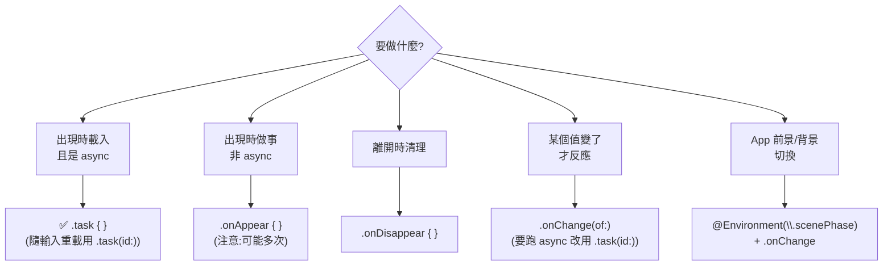

#note

# 生命週期與 task

> 這篇展開 [[核心架構與機制#四、生命週期 (Lifecycle)|核心架構第四節]]:SwiftUI 沒有「在某個方法裡寫初始化」那套生命週期,而是用**修飾器 (modifier) 把事件掛在 View 上**。重點放在 `.onAppear` / `.onDisappear` / `.task` / `.onChange`,以及為什麼非同步載入優先用 `.task`。

---

# 一、心智轉換:沒有「生命週期方法」

關鍵前提:**View 是 [[Swift 型別與關鍵字基礎|值類型 struct]],會被 [[核心架構與機制#重建 struct ≠ 重算 body(常見誤解)|頻繁重建]]**。所以「View 物件的誕生與死亡」這個概念在 SwiftUI 很模糊 —— struct 本身建立/丟棄很多次,你不該把邏輯掛在它的 `init` 上。

SwiftUI 真正讓你關心的是另一組事件:**這塊畫面「出現在螢幕上」與「離開螢幕」的時機**。這些用 modifier 表達:

```swift
SomeView()
    .onAppear { /* 出現時 */ }
    .onDisappear { /* 離開時 */ }
    .task { /* 出現時啟動 async,離開時自動取消 */ }
```

> 對照心智模型:不是「在 `init` 做事」,而是「**在畫面出現的那一刻做事**」。資料載入、訂閱、計時器都掛在這裡,而不是 struct 的建構過程。

---

# 二、View 層級的生命週期 modifier

| 修飾器 | 觸發時機 | 自動取消? | 常見用途 |
| --- | --- | --- | --- |
| `.onAppear { }` | View 出現在畫面上 | ❌ | 非 async 的初始化、埋點 |
| `.onDisappear { }` | View 離開畫面 | — | 清理、取消訂閱、停計時器 |
| `.task { }` | 出現時啟動 async,**離開時自動取消** | ✅ | 非同步載入(**優先用這個**) |
| `.task(id:) { }` | 出現時 + 當 `id` 改變時重啟 | ✅ | 隨參數變化重新載入 |
| `.onChange(of:) { }` | 指定值改變時 | — | 對某個狀態變化做反應 |

## `.onAppear` / `.onDisappear`

最直觀的一對,但有兩個**重要陷阱**:

```swift
List(items) { ... }
    .onAppear { print("出現") }
    .onDisappear { print("離開") }
```

1. **`.onAppear` 不保證只呼叫一次。** 捲動把 View 移出再移回、切換分頁 (`TabView`)、導覽 push/pop 回來,都可能再次觸發。需要「整個 App 只做一次」的初始化,要自己用旗標,或把資料放到長期存活的物件(`@Observable` model)裡控制。
2. **它在 `body` 計算「之後」才呼叫**,不是「之前」。不要指望在 `onAppear` 裡準備好第一次 `body` 要用的資料 —— 第一次 `body` 跑的時候資料還是空的(所以畫面要先能顯示「載入中」狀態)。

```swift
@State private var didLoad = false
.onAppear {
    guard !didLoad else { return }   // 自己保證只做一次
    didLoad = true
    load()
}
```

## `.task` —— 非同步載入的首選

`.task` 是專為 `async/await` 設計的,**它做了 `.onAppear` 做不到的兩件事**:

1. 提供一個 **async 環境**,可以直接 `await`,不用自己包 `Task { }`。
2. **View 離開畫面時,自動取消這個任務**(透過結構化並行的取消機制)。

```swift
struct ProfileView: View {
    @State private var user: User?
    var body: some View {
        Group {
            if let user { Text(user.name) }
            else { ProgressView() }            // 載入中先顯示轉圈
        }
        .task {
            user = try? await api.fetchUser()  // 離開畫面會自動取消這個 await
        }
    }
}
```

> 為什麼「自動取消」很重要?使用者還沒載完就離開頁面時,你不希望那個網路請求繼續跑、回來還去更新一個已經消失的畫面。`.task` 幫你免費處理掉這件事;用 `.onAppear { Task { ... } }` 則要自己管理取消,很容易漏。

## `.task(id:)` —— 參數變了就重載

當畫面依賴某個輸入(例如 `userID`),希望「輸入一變就重新載入」時,把它當成 `id`:

```swift
struct ProfileView: View {
    let userID: Int
    @State private var user: User?
    var body: some View {
        Text(user?.name ?? "載入中…")
            .task(id: userID) {                 // userID 變 → 取消舊任務、用新值重跑
                user = try? await api.fetchUser(userID)
            }
    }
}
```

機制:`id` 改變時,SwiftUI **先取消上一個任務**,再用新的 `id` 啟動一個新任務。等於「綁定輸入的自動重載」。

## `.onChange(of:)` —— 對狀態變化做反應

當某個值改變、你想跟著做點事(存檔、重算、回報)時用它。注意它是**反應變化**,不是「出現時」:

```swift
@State private var query = ""
TextField("搜尋", text: $query)
    .onChange(of: query) { oldValue, newValue in
        runSearch(newValue)        // query 每次變動都會進來
    }
```

> iOS 17 起 closure 提供 `(oldValue, newValue)` 兩個參數(舊版只有 newValue)。若只是要在某值變動時重跑一段 **async**,用 `.task(id:)` 通常比 `.onChange` 再自己開 `Task` 更乾淨。

---

# 三、補充:async / await 與 Task 的最小認識

`.task` 背後是 Swift 的**結構化並行 (Structured Concurrency)**。這裡只講看懂 SwiftUI 程式碼需要的最小集合:

- **`async`**:標記一個函式「會花時間、過程中可以被暫停」。`func fetchUser() async throws -> User`。
- **`await`**:呼叫 async 函式時要加,意思是「**這裡可能暫停**,等結果回來再繼續」;期間不會卡住畫面。
- **`Task { }`**:手動開一個並行工作(`.task` modifier 是它的「綁定 View 生命週期」版本)。
- **取消 (cancellation)**:取消是**合作式**的 —— 系統只是「設一個已取消的旗標」,不會硬殺。長時間運算要自己檢查 `Task.isCancelled` 或呼叫 `try Task.checkCancellation()` 才會真的停。網路 API(如 `URLSession`)通常已內建對取消的反應。

```swift
.task {
    for await line in stream {           // 一邊收一邊處理
        if Task.isCancelled { break }    // 被取消就主動收手
        append(line)
    }
}
```

> 重點:`.task` 幫你「在離開畫面時送出取消訊號」,但**你的程式碼要願意理會這個訊號**才會真的停。多數情況下 `await` 的系統 API 已經幫你處理好了。

---

# 四、App / Scene 層級的生命週期

除了單一 View，整個 App 也有「前景 / 背景」的狀態變化,用 `@Environment(\.scenePhase)` 觀察。

```swift
@main
struct MyApp: App {
    @Environment(\.scenePhase) private var scenePhase
    var body: some Scene {
        WindowGroup { ContentView() }
            .onChange(of: scenePhase) { _, phase in
                switch phase {
                case .active:    print("回到前景、可互動")
                case .inactive:  print("過渡狀態(如多工切換中)")
                case .background: save()      // 進背景 → 存檔、釋放資源
                @unknown default: break
                }
            }
    }
}
```

| scenePhase | 意義 | 常見動作 |
| --- | --- | --- |
| `.active` | 在前景、可互動 | 恢復計時器、刷新資料 |
| `.inactive` | 短暫過渡(來電、多工預覽) | 暫停動畫 |
| `.background` | 進入背景 | **存檔**、停止昂貴工作 |

> `App` 是進入點(由 `@main` 標記)、`Scene` 是視窗容器,這部分概念見 [[核心架構與機制#App / Scene 層級的生命週期|核心架構]]。

---

# 五、選擇指南



## 一句話總結

- **非同步載入 → `.task`**(會自動取消,優先選它)。
- **隨參數重載 → `.task(id:)`**。
- **同步初始化 / 埋點 → `.onAppear`**(記得它可能被呼叫多次)。
- **清理 → `.onDisappear`**。
- **對值變化反應 → `.onChange(of:)`**。
- **App 前景/背景 → `scenePhase`**。

---

# 延伸閱讀

- [[核心架構與機制]] —— 第四節生命週期的展開來源
- [[State 與 Binding 詳解]] —— `.onChange`、`.task(id:)` 觀察的對象多半是這些狀態
- [[Swift 型別與關鍵字基礎]] —— View 為何是 struct、值類型基礎
