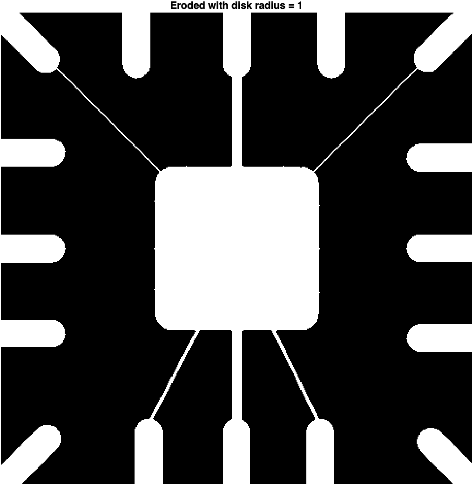
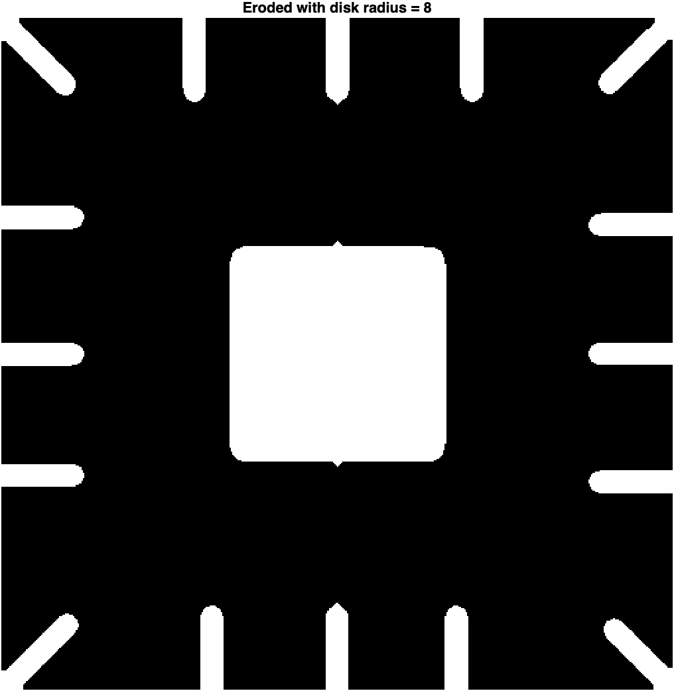
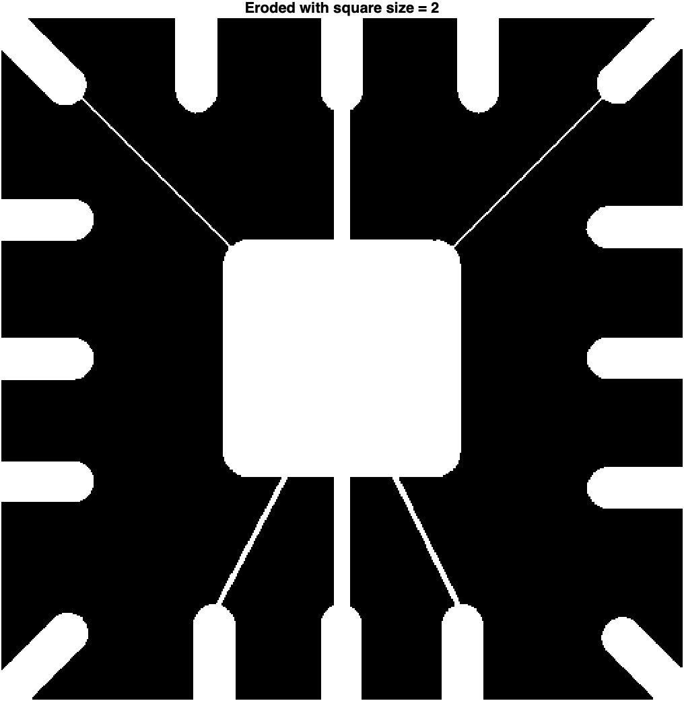
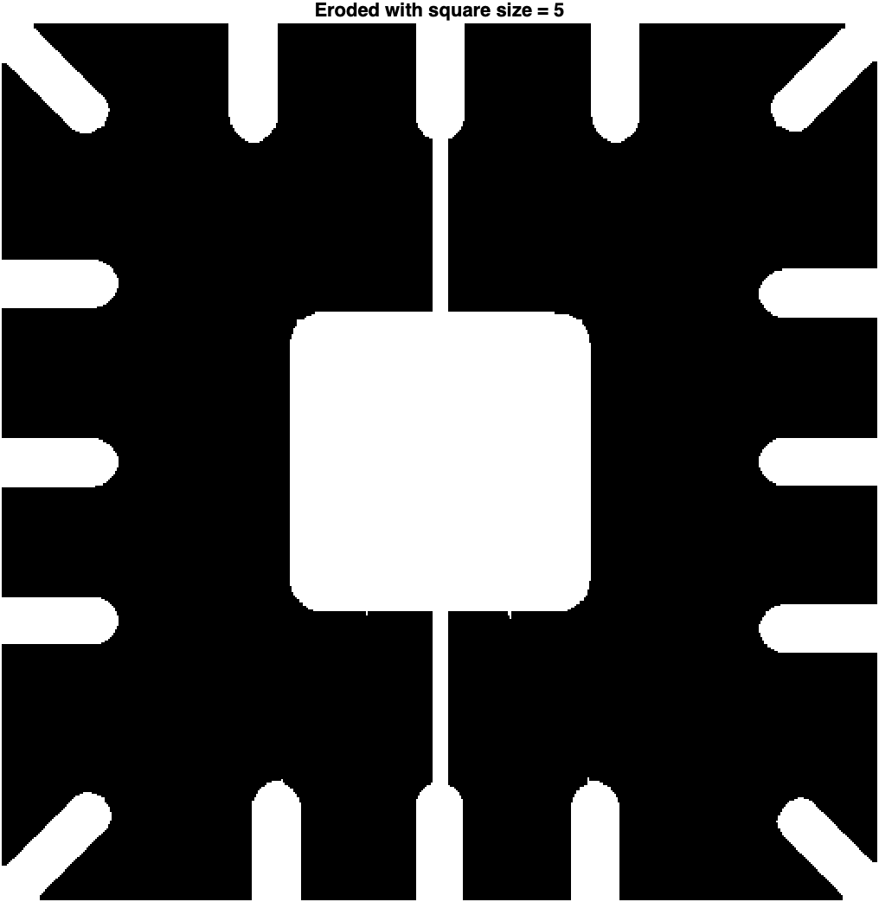
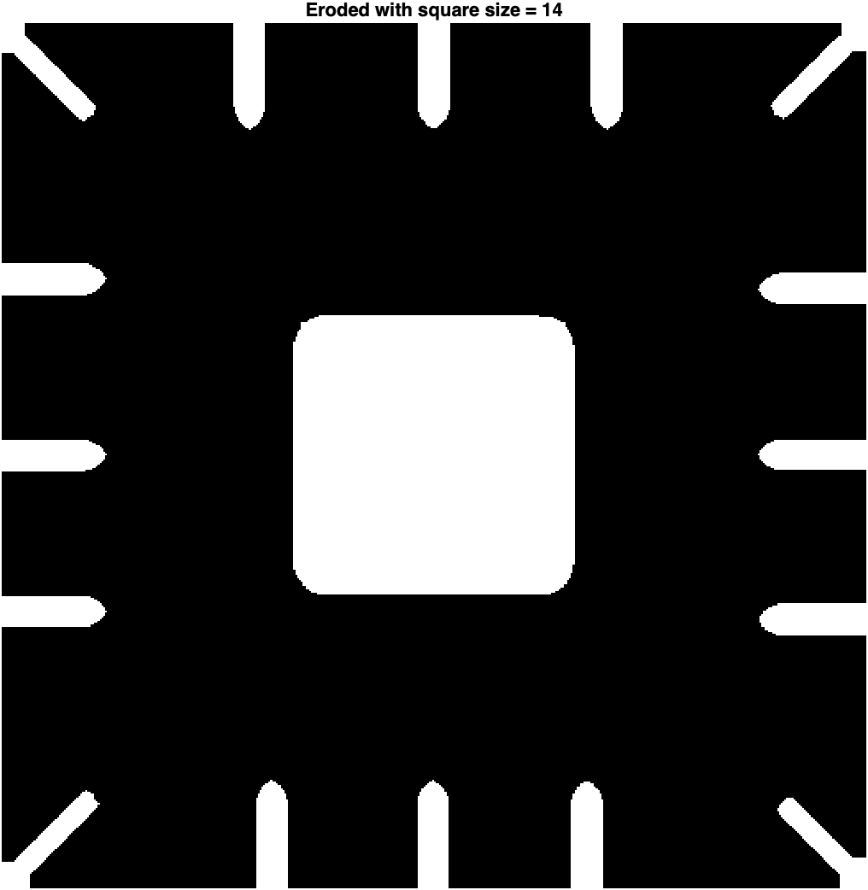

#homework

### Erosion

a. 

b.

### Opening and Closing
Opening for disk SE size 1, close for disk SE size 2

![[finger_open.png]]
![[finger_close.png]]
### Hit-or-Miss Transformation

![[hit_n_miss.png]]
### Function bwmorph
![[finger_thin.png]]
![[nowirebond_thin.png]]

### Grayscale Dilation and Erosion
![[g_k_3.png]]
![[g_k_5.png]]
![[g_k_7.png]]
![[g_s.png]]

我覺得，核心大小超過三的算法都太平滑了，有點被模糊掉，但還是看得出大致輪廓
### Granulometry (60%)

##### a
![[f_reduce.png]]
![[f_diff.png]]

![[only_b.png]]
![[only_s.png]]

##### b
![[c_reduce.png]]
![[c_diff.png]]
![[c_b_only.png]]
![[c_s_only.png]]

##### c
使用 5\*5 Wiener Filter

![[w_o_reduce.png]]
![[w_o_diff.png]]![[w_b_only.png]]
![[w_s_only.png]]